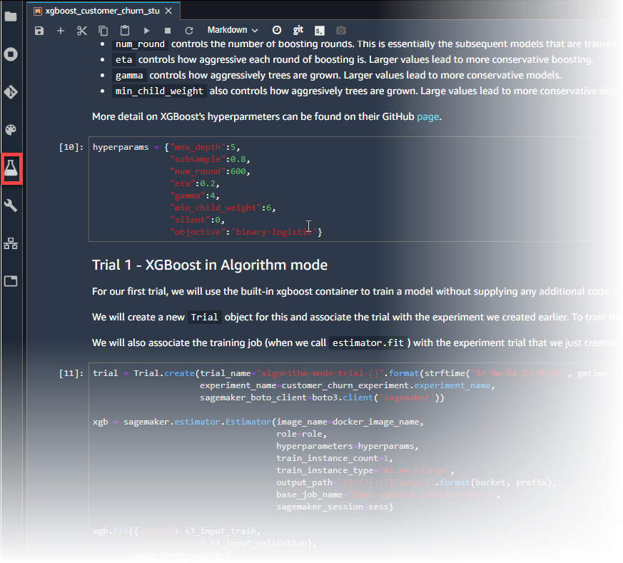
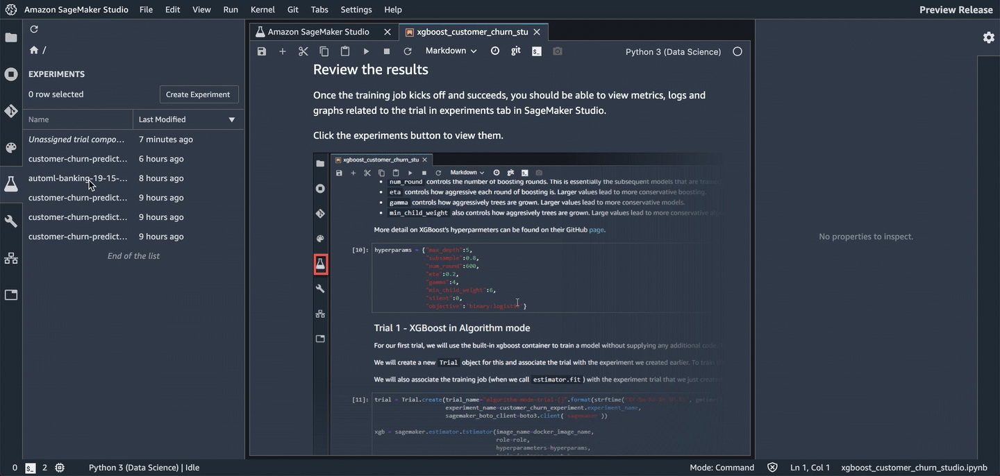
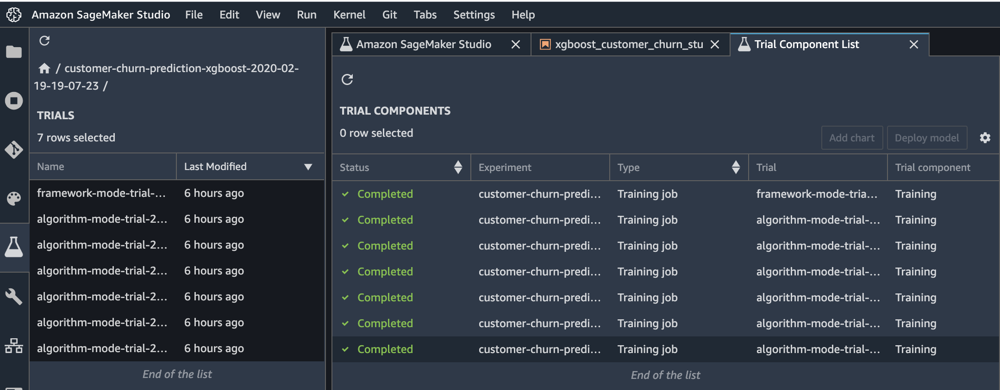
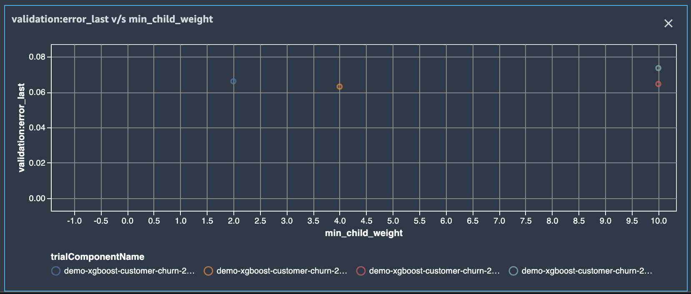
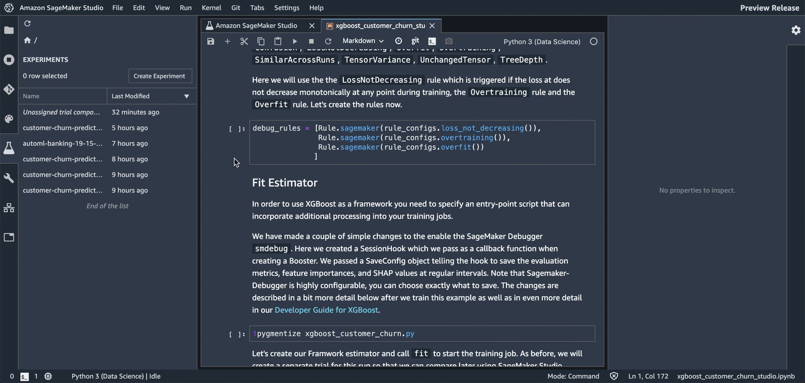
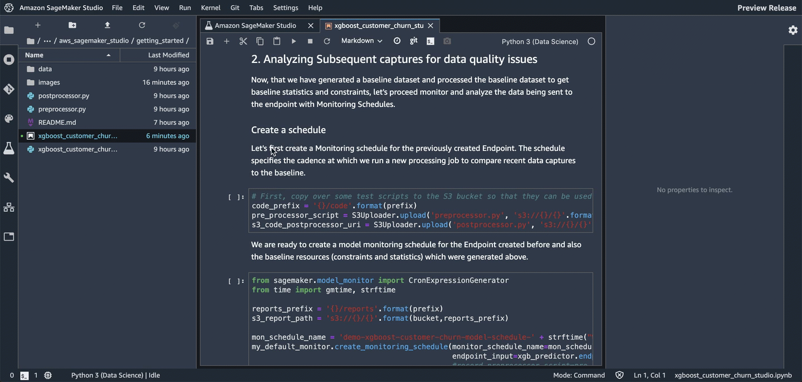

Amazon SageMaker Studio Walkthrough
===================================

**Using Gradient Boosted Trees to Predict Mobile Customer Departure**

--------------

This notebook walks you through some of the main features of Amazon
SageMaker Studio.

-  `Amazon SageMaker
   Experiments <https://docs.aws.amazon.com/sagemaker/latest/dg/experiments.html>`__

   -  Manage multiple trials
   -  Experiment with hyperparameters and charting

-  `Amazon SageMaker
   Debugger <https://docs.aws.amazon.com/sagemaker/latest/dg/train-debugger.html>`__

   -  Debug your model

-  `Model
   hosting <https://docs.aws.amazon.com/sagemaker/latest/dg/how-it-works-hosting.html>`__

   -  Set up a persistent endpoint to get predictions from your model

-  `SageMaker Model
   Monitor <https://docs.aws.amazon.com/sagemaker/latest/dg/model-monitor.html>`__

   -  Monitor the quality of your model
   -  Set alerts for when model quality deviates

You must run this walkthrough in Amazon SageMaker Studio. For Studio
onboarding and setup instructions, see the `README <README.md>`__.

--------------

Contents
--------

1. `Background <#Background>`__ - Predict customer churn with XGBoost
2. `Data <#Data>`__ - Prep the dataset and upload it to Amazon S3
3. `Train <#Train>`__ - Train with the Amazon SageMaker XGBoost
   algorithm

-  `Amazon SageMaker Experiments <#Amazon-SageMaker-Experiments>`__
-  `Amazon SageMaker Debugger <#Amazon-SageMaker-Debugger>`__

1. `Host <#Host>`__
2. `SageMaker Model Monitor <#SageMaker-Model-Monitor>`__

--------------

Background
----------

\_This notebook has been adapted from an `AWS blog
post <https://aws.amazon.com/blogs/ai/predicting-customer-churn-with-amazon-machine-learning/>`__.

Losing customers is costly for any business. Identifying unhappy
customers early on gives you a chance to offer them incentives to stay.
This notebook describes using machine learning (ML) for automated
identification of unhappy customers, also known as customer churn
prediction. It uses Amazon SageMaker features for managing experiments,
training and debugging the model, and monitoring it after it has been
deployed.

Import the Python libraries we’ll need for this walkthrough.

.. code:: ipython3

    import sys
    !{sys.executable} -m pip install -qU awscli boto3 "sagemaker>=1.71.0,<2.0.0"
    !{sys.executable} -m pip install sagemaker-experiments

.. code:: ipython3

    import pandas as pd
    import numpy as np
    import matplotlib.pyplot as plt
    import io
    import os
    import sys
    import time
    import json
    from IPython.display import display
    from time import strftime, gmtime
    import boto3
    import re
    
    
    import sagemaker
    from sagemaker import get_execution_role
    from sagemaker.predictor import csv_serializer
    from sagemaker.debugger import rule_configs, Rule, DebuggerHookConfig
    from sagemaker.model_monitor import DataCaptureConfig, DatasetFormat, DefaultModelMonitor
    from sagemaker.s3 import S3Uploader, S3Downloader
    
    from smexperiments.experiment import Experiment
    from smexperiments.trial import Trial
    from smexperiments.trial_component import TrialComponent
    from smexperiments.tracker import Tracker

.. code:: ipython3

    sess = boto3.Session()
    sm = sess.client('sagemaker')
    role = sagemaker.get_execution_role()

--------------

Data
----

Mobile operators have historical records that tell them which customers
ended up churning and which continued using the service. We can use this
historical information to train an ML model that can predict customer
churn. After training the model, we can pass the profile information of
an arbitrary customer (the same profile information that we used to
train the model) to the model to have the model predict whether this
customer will churn.

The dataset we use is publicly available and was mentioned in
`Discovering Knowledge in
Data <https://www.amazon.com/dp/0470908742/>`__ by Daniel T. Larose. It
is attributed by the author to the University of California Irvine
Repository of Machine Learning Datasets. The ``data`` folder that came
with this notebook contains the dataset, which we’ve already
preprocessed for this walkthrough. The dataset has been split into
training and validation sets. To see how the dataset was preprocessed,
see this notebook: `XGBoost customer churn notebook that starts with the
original
dataset <https://github.com/awslabs/amazon-sagemaker-examples/blob/master/introduction_to_applying_machine_learning/xgboost_customer_churn/xgboost_customer_churn.ipynb>`__.

We’ll train on a .csv file without the header. But for now, the
following cell uses ``pandas`` to load some of the data from a version
of the training data that has a header.

Explore the data to see the dataset’s features and the data that will be
used to train the model.

.. code:: ipython3

    # Set the path we can find the data files that go with this notebook
    %cd /root/amazon-sagemaker-examples/aws_sagemaker_studio/getting_started
    local_data_path = './data/training-dataset-with-header.csv'
    data = pd.read_csv(local_data_path)
    pd.set_option('display.max_columns', 500)     # Make sure we can see all of the columns
    pd.set_option('display.max_rows', 10)         # Keep the output on one page
    data

Now we’ll upload the files to S3 for training but first we will create
an S3 bucket for the data if one does not already exist.

.. code:: ipython3

    account_id = sess.client('sts', region_name=sess.region_name).get_caller_identity()["Account"]
    bucket = 'sagemaker-studio-{}-{}'.format(sess.region_name, account_id)
    prefix = 'xgboost-churn'
    
    try:
        if sess.region_name == "us-east-1":
            sess.client('s3').create_bucket(Bucket=bucket)
        else:
            sess.client('s3').create_bucket(Bucket=bucket, 
                                            CreateBucketConfiguration={'LocationConstraint': sess.region_name})
    except Exception as e:
        print("Looks like you already have a bucket of this name. That's good. Uploading the data files...")
    
    # Return the URLs of the uploaded file, so they can be reviewed or used elsewhere
    s3url = S3Uploader.upload('data/train.csv', 's3://{}/{}/{}'.format(bucket, prefix,'train'))
    print(s3url)
    s3url = S3Uploader.upload('data/validation.csv', 's3://{}/{}/{}'.format(bucket, prefix,'validation'))
    print(s3url)

--------------

Train
-----

We’ll use the XGBoost library to train a class of models known as
gradient boosted decision trees on the data that we just uploaded.

Because we’re using XGBoost, we first need to specify the locations of
the XGBoost algorithm containers.

.. code:: ipython3

    from sagemaker.amazon.amazon_estimator import get_image_uri
    docker_image_name = get_image_uri(boto3.Session().region_name, 'xgboost', repo_version='0.90-2')

Then, because we’re training with the CSV file format, we’ll create
``s3_input``\ s that our training function can use as a pointer to the
files in S3.

.. code:: ipython3

    s3_input_train = sagemaker.s3_input(s3_data='s3://{}/{}/train'.format(bucket, prefix), content_type='csv')
    s3_input_validation = sagemaker.s3_input(s3_data='s3://{}/{}/validation/'.format(bucket, prefix), content_type='csv')

Amazon SageMaker Experiments
~~~~~~~~~~~~~~~~~~~~~~~~~~~~

Amazon SageMaker Experiments allows us to keep track of model training;
organize related models together; and log model configuration,
parameters, and metrics to reproduce and iterate on previous models and
compare models. We’ll create a single experiment to keep track of the
different approaches we’ll try to train the model.

Each approach or block of training code that we run will be an
experiment trial. Later, we’ll be able to compare different trials in
Amazon SageMaker Studio.

Let’s create the experiment.

.. code:: ipython3

    sess = sagemaker.session.Session()
    
    create_date = strftime("%Y-%m-%d-%H-%M-%S", gmtime())
    customer_churn_experiment = Experiment.create(experiment_name="customer-churn-prediction-xgboost-{}".format(create_date), 
                                                  description="Using xgboost to predict customer churn", 
                                                  sagemaker_boto_client=boto3.client('sagemaker'))

Hyperparameters
^^^^^^^^^^^^^^^

Now we can specify our XGBoost hyperparameters. Among them are these key
hyperparameters: - ``max_depth`` Controls how deep each tree within the
algorithm can be built. Deeper trees can lead to better fit, but are
more computationally expensive and can lead to overfitting. Typically,
you need to explore some trade-offs in model performance between a large
number of shallow trees and a smaller number of deeper trees. -
``subsample`` Controls sampling of the training data. This
hyperparameter can help reduce overfitting, but setting it too low can
also starve the model of data. - ``num_round`` Controls the number of
boosting rounds. This value specifies the models that are subsequently
trained using the residuals of previous iterations. Again, more rounds
should produce a better fit on the training data, but can be
computationally expensive or lead to overfitting. - ``eta`` Controls how
aggressive each round of boosting is. Larger values lead to more
conservative boosting. - ``gamma`` Controls how aggressively trees are
grown. Larger values lead to more conservative models. -
``min_child_weight`` Also controls how aggresively trees are grown.
Large values lead to a more conservative model.

For more information about these hyperparameters, see `XGBoost’s
hyperparameters GitHub
page <https://github.com/dmlc/xgboost/blob/master/doc/parameter.rst>`__.

.. code:: ipython3

    hyperparams = {"max_depth":5,
                   "subsample":0.8,
                   "num_round":600,
                   "eta":0.2,
                   "gamma":4,
                   "min_child_weight":6,
                   "silent":0,
                   "objective":'binary:logistic'}

Trial 1 - XGBoost in algorithm mode
^^^^^^^^^^^^^^^^^^^^^^^^^^^^^^^^^^^

For our first trial, we’ll use the built-in XGBoost algorithm to train a
model without supplying any additional code. This way, we can use
XGBoost to train and deploy a model as we would with other Amazon
SageMaker built-in algorithms.

We’ll create a new ``Trial`` object and associate the trial with the
experiment that we created earlier. To train the model, we’ll create an
estimator and specify a few parameters, like the type of training
instances we’d like to use and how many, and where the artifacts of the
trained model should be stored.

We’ll also associate the training job with the experiment trial that we
just created when we call the ``fit`` method of the ``estimator``.

.. code:: ipython3

    trial = Trial.create(trial_name="algorithm-mode-trial-{}".format(strftime("%Y-%m-%d-%H-%M-%S", gmtime())), 
                         experiment_name=customer_churn_experiment.experiment_name,
                         sagemaker_boto_client=boto3.client('sagemaker'))
    
    xgb = sagemaker.estimator.Estimator(image_name=docker_image_name,
                                        role=role,
                                        hyperparameters=hyperparams,
                                        train_instance_count=1, 
                                        train_instance_type='ml.m4.xlarge',
                                        output_path='s3://{}/{}/output'.format(bucket, prefix),
                                        base_job_name="demo-xgboost-customer-churn",
                                        sagemaker_session=sess)
    
    xgb.fit({'train': s3_input_train,
             'validation': s3_input_validation}, 
            experiment_config={
                "ExperimentName": customer_churn_experiment.experiment_name, 
                "TrialName": trial.trial_name,
                "TrialComponentDisplayName": "Training",
            }
           )

Review the results
^^^^^^^^^^^^^^^^^^

After the training job completes successfully, you can view metrics,
logs, and graphs related to the trial on the **Experiments** tab in
Amazon SageMaker Studio.

To see the experiments, choose the **Experiments** button.

   experiments_button

To see an experiment’s components, in the **Experiments** list,
double-click it. To see the componenets for multiple experiments, hold
down the Crtl key and choose the experiments, then open the context menu
(by right-clicking on an experiment). To see the compenents together,
choose “Open in trial component list”. This enables charting across
experiments.

   studio_experiments_list

The components are sorted so that the best model is at the top.

   studio_trial_list

Download the model
^^^^^^^^^^^^^^^^^^

You can find and download the model in Amazon SageMaker Studio. To find
the model, choose the **Experiments** button in the left tray, and keep
drilling down through the experiment, the most recent trial listed, and
its most recent component until you see the **Describe Trial
Components** page. Choose the **Artifacts** tab. It contains links to
the training and validation data in the **Input Artifacts** section, and
the generated model artifact in the **Output Artifacts** section.

.. figure:: ./images/find_the_model_artifact.gif
   :alt: find the model artifact

   find the model artifact

Trying other hyperparameter values
^^^^^^^^^^^^^^^^^^^^^^^^^^^^^^^^^^

To improve a model, you typically try other hyperparameter values to see
if they affect the final validation error. Let’s vary the
``min_child_weight`` parameter and start other training jobs with those
different values to see how they affect the validation error. For each
value, we’ll create a separate trial so that we can compare the results
in Amazon SageMaker Studio later.

.. code:: ipython3

    min_child_weights = [1, 2, 4, 8, 10]
    
    for weight in min_child_weights:
        hyperparams["min_child_weight"] = weight
        trial = Trial.create(trial_name="algorithm-mode-trial-{}-weight-{}".format(strftime("%Y-%m-%d-%H-%M-%S", gmtime()), weight), 
                             experiment_name=customer_churn_experiment.experiment_name,
                             sagemaker_boto_client=boto3.client('sagemaker'))
    
        t_xgb = sagemaker.estimator.Estimator(image_name=docker_image_name,
                                              role=role,
                                              hyperparameters=hyperparams,
                                              train_instance_count=1, 
                                              train_instance_type='ml.m4.xlarge',
                                              output_path='s3://{}/{}/output'.format(bucket, prefix),
                                              base_job_name="demo-xgboost-customer-churn",
                                              sagemaker_session=sess)
    
        t_xgb.fit({'train': s3_input_train,
                   'validation': s3_input_validation},
                    wait=False,
                    experiment_config={
                        "ExperimentName": customer_churn_experiment.experiment_name, 
                        "TrialName": trial.trial_name,
                        "TrialComponentDisplayName": "Training",
                    }
                   )

Create charts
^^^^^^^^^^^^^

To create a chart, multi-select the components. Because this is a sample
training run and the data is sparse, there’s not much to chart in a time
series. However, we can create a scatter plot for the parameter sweep.
The following image is an example.

   scatter plot example

How to create a scatter plot
''''''''''''''''''''''''''''

Multi-select components, then choose **Add chart**. In the **Chart
Properties** panel, choose **Summary Statistics** as the **Data type**.
For **Chart type**, choose **Scatter plot**. Choose the hyperparameter
``min_child_weight`` as the X-axis (because this is the hyperparameter
that you are iterating on in this notebook). For Y-axis metrics, choose
either ``validation:error_last`` or ``validation:error_avg``. Color them
by choosing ``trialComponentName``.

.. figure:: ./images/create_a_scatter_plot.gif
   :alt: create a scatter plot

   create a scatter plot

You can also adjust the chart at any time by changing the components
that are selected. And you can zoom in and out. Each item on the graph
displays contextual information.

.. figure:: ./images/adjust_a_scatter_plot.gif
   :alt: adjust a scatter plot

   adjust a scatter plot

Amazon SageMaker Debugger
~~~~~~~~~~~~~~~~~~~~~~~~~

Amazon SageMaker Debugger lets you debug a model during training. As you
train, Debugger periodicially saves tensors, which fully specify the
state of the model at that point in time. Debugger saves the tensors to
an Amazon S3 bucket. You can then use Amazon SageMaker Studio for
analysis and visualization to diagnose training issues.

Specify SageMaker Debugger Rules
^^^^^^^^^^^^^^^^^^^^^^^^^^^^^^^^

To enable automated detection of common issues during training, Amazon
SageMaker Debugger also allows you to attach a list of rules to evaluate
the training job against.

Some rules that apply to XGBoost include ``AllZero``,
``ClassImbalance``, ``Confusion``, ``LossNotDecreasing``, ``Overfit``,
``Overtraining``, ``SimilarAcrossRuns``, ``TensorVariance``,
``UnchangedTensor``, and ``TreeDepth``.

We’ll use the ``LossNotDecreasing`` rule–which is triggered if the loss
doesn’t decrease monotonically at any point during training–the
``Overtraining`` rule, and the ``Overfit`` rule. Let’s create the rules.

.. code:: ipython3

    debug_rules = [Rule.sagemaker(rule_configs.loss_not_decreasing()),
                   Rule.sagemaker(rule_configs.overtraining()),
                   Rule.sagemaker(rule_configs.overfit())
                  ]

Trial 2 - XGBoost in framework mode
^^^^^^^^^^^^^^^^^^^^^^^^^^^^^^^^^^^

For the next trial, we’ll train a similar model, but use XGBoost in
framework mode. If you’ve worked with the open source XGBoost, using
XGBoost this way will be familiar to you. Using XGBoost as a framework
provides more flexibility than using it as a built-in algorithm because
it enables more advanced scenarios that allow incorporating
preprocessing and post-processing scripts into your training script.
Specifically, we’ll be able to specify a list of rules that we want
Amazon SageMaker Debugger to evaluate our training against.

Fit estimator
^^^^^^^^^^^^^

To use XGBoost as a framework, you need to specify an entry-point script
that can incorporate additional processing into your training jobs.

We’ve made a couple of simple changes to enable the Amazon SageMaker
Debugger ``smdebug`` library. We created a ``SessionHook``, which we
pass as a callback function when creating a ``Booster``. We passed a
``SaveConfig`` object that tells the hook to save the evaluation
metrics, feature importances, and SHAP values at regular intervals.
(Debugger is highly configurable. You can choose exactly what to save.)
We describe the changes in more detail after we train this example. For
even more detail, see the `Developer Guide for
XGBoost <https://github.com/awslabs/sagemaker-debugger/tree/master/docs/xgboost>`__.

.. code:: ipython3

    !pygmentize xgboost_customer_churn.py

Let’s create our framwork estimator and call ``fit`` to start the
training job. As before, we’ll create a separate trial for this run so
that we can use Amazon SageMaker Studio to compare it with other trials
later. Because we are running in framework mode, we also need to pass
additional parameters, like the entry point script and the framework
version, to the estimator.

As training progresses, you’ll be able to see Amazon SageMaker Debugger
logs that evaluate the rule against the training job.

.. code:: ipython3

    entry_point_script = "xgboost_customer_churn.py"
    
    trial = Trial.create(trial_name="framework-mode-trial-{}".format(strftime("%Y-%m-%d-%H-%M-%S", gmtime())), 
                         experiment_name=customer_churn_experiment.experiment_name,
                         sagemaker_boto_client=boto3.client('sagemaker'))
    
    framework_xgb = sagemaker.xgboost.XGBoost(image_name=docker_image_name,
                                              entry_point=entry_point_script,
                                              role=role,
                                              framework_version="0.90-2",
                                              py_version="py3",
                                              hyperparameters=hyperparams,
                                              train_instance_count=1, 
                                              train_instance_type='ml.m4.xlarge',
                                              output_path='s3://{}/{}/output'.format(bucket, prefix),
                                              base_job_name="demo-xgboost-customer-churn",
                                              sagemaker_session=sess,
                                              rules=debug_rules
                                              )
    
    framework_xgb.fit({'train': s3_input_train,
                       'validation': s3_input_validation}, 
                      experiment_config={
                          "ExperimentName": customer_churn_experiment.experiment_name, 
                          "TrialName": trial.trial_name,
                          "TrialComponentDisplayName": "Training",
                      })

After the training has been running for a while you can view debug info
in the Debugger panel. To get to this panel you must click through the
experiment, trial, and then component. |view_debugger panel|

--------------

Host the model
--------------

Now that we’ve trained the model, let’s deploy it to a hosted endpoint.
To monitor the model after it’s hosted and serving requests, we’ll also
add configurations to capture data that is being sent to the endpoint.

.. code:: ipython3

    data_capture_prefix = '{}/datacapture'.format(prefix)
    
    endpoint_name = "demo-xgboost-customer-churn-" + strftime("%Y-%m-%d-%H-%M-%S", gmtime())
    print("EndpointName = {}".format(endpoint_name))

.. code:: ipython3

    xgb_predictor = xgb.deploy(initial_instance_count=1, 
                               instance_type='ml.m4.xlarge',
                               endpoint_name=endpoint_name,
                               data_capture_config=DataCaptureConfig(enable_capture=True,
                                                                     sampling_percentage=100,
                                                                     destination_s3_uri='s3://{}/{}'.format(bucket, data_capture_prefix)
                                                                    )
                               )

Invoke the deployed model
~~~~~~~~~~~~~~~~~~~~~~~~~

Now that we have a hosted endpoint running, we can make real-time
predictions from our model by making an http POST request. But first, we
need to set up serializers and deserializers for passing our
``test_data`` NumPy arrays to the model behind the endpoint.

.. code:: ipython3

    xgb_predictor.content_type = 'text/csv'
    xgb_predictor.serializer = csv_serializer
    xgb_predictor.deserializer = None

Now, we’ll loop over our test dataset and collect predictions by
invoking the XGBoost endpoint:

.. code:: ipython3

    print("Sending test traffic to the endpoint {}. \nPlease wait for a minute...".format(endpoint_name))
    
    with open('data/test_sample.csv', 'r') as f:
        for row in f:
            payload = row.rstrip('\n')
            response = xgb_predictor.predict(data=payload)
            time.sleep(0.5)

Verify that data is captured in Amazon S3
~~~~~~~~~~~~~~~~~~~~~~~~~~~~~~~~~~~~~~~~~

When we made some real-time predictions by sending data to our endpoint,
we should have also captured that data for monitoring purposes.

Let’s list the data capture files stored in Amazon S3. Expect to see
different files from different time periods organized based on the hour
in which the invocation occurred. The format of the Amazon S3 path is:

``s3://{destination-bucket-prefix}/{endpoint-name}/{variant-name}/yyyy/mm/dd/hh/filename.jsonl``

.. code:: ipython3

    from time import sleep
    
    current_endpoint_capture_prefix = '{}/{}'.format(data_capture_prefix, endpoint_name)
    for _ in range(12): # wait up to a minute to see captures in S3
        capture_files = S3Downloader.list("s3://{}/{}".format(bucket, current_endpoint_capture_prefix))
        if capture_files:
            break
        sleep(5)
    
    print("Found Data Capture Files:")
    print(capture_files)

All the data captured is stored in a SageMaker specific json-line
formatted file. Next, Let’s take a quick peek at the contents of a
single line in a pretty formatted json so that we can observe the format
a little better.

.. code:: ipython3

    capture_file = S3Downloader.read_file(capture_files[-1])
    
    print("=====Single Data Capture====")
    print(json.dumps(json.loads(capture_file.split('\n')[0]), indent=2)[:2000])

As you can see, each inference request is captured in one line in the
jsonl file. The line contains both the input and output merged together.
In our example, we provided the ContentType as ``text/csv`` which is
reflected in the ``observedContentType`` value. Also, we expose the
enconding that we used to encode the input and output payloads in the
capture format with the ``encoding`` value.

To recap, we have observed how you can enable capturing the input and/or
output payloads to an Endpoint with a new parameter. We have also
observed how the captured format looks like in S3. Let’s continue to
explore how SageMaker helps with monitoring the data collected in S3.

--------------

Amazon SageMaker Model Monitor
------------------------------

Amazon SageMaker Model Monitor lets you monitor and evaluate the data
observed by endpoints. It works like this: 1. We need to create a
baseline that we can use to compare real-time traffic against. 1. When a
baseline is ready, we can set up a schedule to continously evaluate and
compare against the baseline. 1. We can send synthetic traffic to
trigger alarms.

**Important**: It takes an hour or more to complete this section because
the shortest monitoring polling time is one hour. The following graphic
shows how the monitoring results look after running for a few hours and
some of the errors triggered by synthetic traffic.

   model monitor example

Baselining and continous monitoring
~~~~~~~~~~~~~~~~~~~~~~~~~~~~~~~~~~~

1. Constraint suggestion with the baseline (training) dataset
^^^^^^^^^^^^^^^^^^^^^^^^^^^^^^^^^^^^^^^^^^^^^^^^^^^^^^^^^^^^^

The training dataset that you use to train a model is usually a good
baseline dataset. Note that the training dataset data schema and the
inference dataset schema must match exactly (for example, they should
have the same number and type of features).

Using our training dataset, let’s ask Amazon SageMaker Model Monitor to
suggest a set of baseline ``constraints`` and generate descriptive
``statistics`` so we can explore the data. For this example, let’s
upload the training dataset, which we used to train model. We’ll use the
dataset file with column headers so we have descriptive feature names.

.. code:: ipython3

    baseline_prefix = prefix + '/baselining'
    baseline_data_prefix = baseline_prefix + '/data'
    baseline_results_prefix = baseline_prefix + '/results'
    
    baseline_data_uri = 's3://{}/{}'.format(bucket,baseline_data_prefix)
    baseline_results_uri = 's3://{}/{}'.format(bucket, baseline_results_prefix)
    print('Baseline data uri: {}'.format(baseline_data_uri))
    print('Baseline results uri: {}'.format(baseline_results_uri))
    baseline_data_path = S3Uploader.upload("data/training-dataset-with-header.csv", baseline_data_uri)

Create a baselining job with the training dataset
'''''''''''''''''''''''''''''''''''''''''''''''''

Now that we have the training data ready in S3, let’s start a job to
``suggest`` constraints. To generate the constraints, the convenient
helper starts a ``ProcessingJob`` using a ProcessingJob container
provided by Amazon SageMaker.

.. code:: ipython3

    my_default_monitor = DefaultModelMonitor(role=role,
                                             instance_count=1,
                                             instance_type='ml.m5.xlarge',
                                             volume_size_in_gb=20,
                                             max_runtime_in_seconds=3600,
                                            )
    
    baseline_job = my_default_monitor.suggest_baseline(baseline_dataset=baseline_data_path,
                                                       dataset_format=DatasetFormat.csv(header=True),
                                                       output_s3_uri=baseline_results_uri,
                                                       wait=True
    )

Once the job succeeds, we can explore the ``baseline_results_uri``
location in s3 to see what files where stored there.

.. code:: ipython3

    print("Found Files:")
    S3Downloader.list("s3://{}/{}".format(bucket, baseline_results_prefix))

We have a\ ``constraints.json`` file that has information about
suggested constraints. We also have a ``statistics.json`` which contains
statistical information about the data in the baseline.

.. code:: ipython3

    baseline_job = my_default_monitor.latest_baselining_job
    schema_df = pd.io.json.json_normalize(baseline_job.baseline_statistics().body_dict["features"])
    schema_df.head(10)

.. code:: ipython3

    constraints_df = pd.io.json.json_normalize(baseline_job.suggested_constraints().body_dict["features"])
    constraints_df.head(10)

2. Analyzing subsequent captures for data quality issues
^^^^^^^^^^^^^^^^^^^^^^^^^^^^^^^^^^^^^^^^^^^^^^^^^^^^^^^^

Now that we’ve generated a baseline dataset and processed it to get
baseline statistics and constraints, let’s monitor and analyze the data
being sent to the endpoint with monitoring schedules.

Create a schedule
'''''''''''''''''

First, let’s create a monitoring schedule for the endpoint. The schedule
specifies the cadence at which we want to run a new processing job so
that we can compare recent data captures to the baseline.

.. code:: ipython3

    # First, copy over some test scripts to the S3 bucket so that they can be used for pre and post processing
    code_prefix = '{}/code'.format(prefix)
    pre_processor_script = S3Uploader.upload('preprocessor.py', 's3://{}/{}'.format(bucket,code_prefix))
    s3_code_postprocessor_uri = S3Uploader.upload('postprocessor.py', 's3://{}/{}'.format(bucket,code_prefix))

We are ready to create a model monitoring schedule for the Endpoint
created before and also the baseline resources (constraints and
statistics) which were generated above.

.. code:: ipython3

    from sagemaker.model_monitor import CronExpressionGenerator
    from time import gmtime, strftime
    
    reports_prefix = '{}/reports'.format(prefix)
    s3_report_path = 's3://{}/{}'.format(bucket,reports_prefix)
    
    mon_schedule_name = 'demo-xgboost-customer-churn-model-schedule-' + strftime("%Y-%m-%d-%H-%M-%S", gmtime())
    my_default_monitor.create_monitoring_schedule(monitor_schedule_name=mon_schedule_name,
                                                  endpoint_input=xgb_predictor.endpoint,
                                                  #record_preprocessor_script=pre_processor_script,
                                                  post_analytics_processor_script=s3_code_postprocessor_uri,
                                                  output_s3_uri=s3_report_path,
                                                  statistics=my_default_monitor.baseline_statistics(),
                                                  constraints=my_default_monitor.suggested_constraints(),
                                                  schedule_cron_expression=CronExpressionGenerator.hourly(),
                                                  enable_cloudwatch_metrics=True,
                                                 )

3. Start generating some artificial traffic
^^^^^^^^^^^^^^^^^^^^^^^^^^^^^^^^^^^^^^^^^^^

The following block starts a thread to send some traffic to the
endpoint. This allows us to continue to send traffic to the endpoint so
that we’ll have data continually captured for analysis. If there is no
traffic, the monitoring jobs will start to fail later.

To terminate this thread, you need to stop the kernel.

.. code:: ipython3

    from threading import Thread
    
    runtime_client = boto3.client('runtime.sagemaker')
    
    # (just repeating code from above for convenience/ able to run this section independently)
    def invoke_endpoint(ep_name, file_name, runtime_client):
        with open(file_name, 'r') as f:
            for row in f:
                payload = row.rstrip('\n')
                response = runtime_client.invoke_endpoint(EndpointName=ep_name,
                                              ContentType='text/csv', 
                                              Body=payload)
                response['Body'].read()
                sleep(1)
                
    def invoke_endpoint_forever():
        while True:
            invoke_endpoint(endpoint_name, 'data/test-dataset-input-cols.csv', runtime_client)
            
    thread = Thread(target = invoke_endpoint_forever)
    thread.start()
    
    # Note that you need to stop the kernel to stop the invocations

List executions
'''''''''''''''

Once the schedule is set up, jobs start at the specified intervals. The
following code lists the last five executions. If you run this code soon
after creating the hourly schedule, you might not see any executions
listed. To see executions, you might have to wait until you cross the
hour boundary (in UTC). The code includes the logic for waiting.

.. code:: ipython3

    mon_executions = my_default_monitor.list_executions()
    if len(mon_executions) == 0:
        print("We created a hourly schedule above and it will kick off executions ON the hour.\nWe will have to wait till we hit the hour...")
    
    while len(mon_executions) == 0:
        print("Waiting for the 1st execution to happen...")
        time.sleep(60)
        mon_executions = my_default_monitor.list_executions()  

Evaluate the latest execution and list the generated reports
''''''''''''''''''''''''''''''''''''''''''''''''''''''''''''

.. code:: ipython3

    latest_execution = mon_executions[-1]
    latest_execution.wait()

.. code:: ipython3

    print("Latest execution result: {}".format(latest_execution.describe()['ExitMessage']))
    report_uri = latest_execution.output.destination
    
    print("Found Report Files:")
    S3Downloader.list(report_uri)

List violations
'''''''''''''''

If there are any violations compared to the baseline, they will be
generated here. Let’s list the violations.

.. code:: ipython3

    violations = my_default_monitor.latest_monitoring_constraint_violations()
    pd.set_option('display.max_colwidth', -1)
    constraints_df = pd.io.json.json_normalize(violations.body_dict["violations"])
    constraints_df.head(10)

You can plug in the processing job arn for a single execution of the
monitoring into `this
notebook <https://github.com/awslabs/amazon-sagemaker-examples/blob/master/sagemaker_model_monitor/visualization/SageMaker-Model-Monitor-Visualize.ipynb>`__
to see more detailed visualizations of the violations and distribution
statistics of the data captue that was processed in that execution

.. code:: ipython3

    latest_execution.describe()['ProcessingJobArn']

Clean up
--------

If you no longer need this notebook, clean up your environment by
running the following cell. It removes the hosted endpoint that you
created for this walkthrough and prevents you from incurring charges for
running an instance that you no longer need. It also cleans up all
artifacts related to the experiments.

You might also want to delete artifacts stored in the S3 bucket used in
this notebook. To do so, open the Amazon S3 console, find the
``sagemaker-studio-<region-name>-<account-name>`` bucket, and delete the
files associated with this notebook.

.. code:: ipython3

    try:
        sess.delete_monitoring_schedule(mon_schedule_name)
    except:
        pass
    while True:
        try:
            print("Waiting for schedule to be deleted")
            sess.describe_monitoring_schedule(mon_schedule_name)
            sleep(15)
        except:
            print("Schedule deleted")
            break
    
    sess.delete_endpoint(xgb_predictor.endpoint)
    
    def cleanup(experiment):
        '''Clean up everything in the given experiment object'''
        for trial_summary in experiment.list_trials():
            trial = Trial.load(trial_name=trial_summary.trial_name)
            
            for trial_comp_summary in trial.list_trial_components():
                trial_step=TrialComponent.load(trial_component_name=trial_comp_summary.trial_component_name)
                print('Starting to delete TrialComponent..' + trial_step.trial_component_name)
                sm.disassociate_trial_component(TrialComponentName=trial_step.trial_component_name, TrialName=trial.trial_name)
                trial_step.delete()
                time.sleep(1)
             
            trial.delete()
        
        experiment.delete()
    
    cleanup(customer_churn_experiment)
