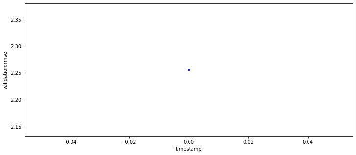

Regression with Amazon SageMaker XGBoost (Parquet input)
========================================================

This notebook exhibits the use of a Parquet dataset for use with the
SageMaker XGBoost algorithm. The example here is almost the same as
`Regression with Amazon SageMaker XGBoost
algorithm <xgboost_abalone.ipynb>`__.

This notebook tackles the exact same problem with the same solution, but
has been modified for a Parquet input. The original notebook provides
details of dataset and the machine learning use-case.

This notebook has been tested using the Python 3 (Data Science) kernel.

.. code:: ipython3

    import os
    import boto3
    import re
    import sagemaker
    from sagemaker import get_execution_role
    
    role = get_execution_role()
    region = boto3.Session().region_name
    
    # S3 bucket for saving code and model artifacts.
    # Feel free to specify a different bucket here if you wish.
    bucket = sagemaker.Session().default_bucket()
    prefix = 'sagemaker/DEMO-xgboost-parquet'
    bucket_path = 'https://s3-{}.amazonaws.com/{}'.format(region, bucket)

We will use `PyArrow <https://arrow.apache.org/docs/python/>`__ library
to store the Abalone dataset in the Parquet format.

.. code:: ipython3

    !python -m pip install pyarrow==0.15

.. parsed-literal::

    Collecting pyarrow==0.15
      Downloading pyarrow-0.15.0-cp37-cp37m-manylinux2010_x86_64.whl (60.5 MB)
         |████████████████████████████████| 60.5 MB 61 kB/s  eta 0:00:01     |█████████████████▍              | 32.9 MB 3.0 MB/s eta 0:00:10     |███████████████████▊            | 37.2 MB 3.0 MB/s eta 0:00:08███████████████▉          | 41.2 MB 3.0 MB/s eta 0:00:07
    [?25hRequirement already satisfied: six>=1.0.0 in /opt/conda/lib/python3.7/site-packages (from pyarrow==0.15) (1.14.0)
    Requirement already satisfied: numpy>=1.14 in /opt/conda/lib/python3.7/site-packages (from pyarrow==0.15) (1.18.1)
    Installing collected packages: pyarrow
    Successfully installed pyarrow-0.15.0

.. code:: ipython3

    %%time
    
    import numpy as np
    import pandas as pd
    import urllib.request
    from sklearn.datasets import load_svmlight_file
    
    # Download the dataset and load into a pandas dataframe
    FILE_NAME = 'abalone.csv'
    urllib.request.urlretrieve("https://archive.ics.uci.edu/ml/machine-learning-databases/abalone/abalone.data", FILE_NAME)
    feature_names=['Sex', 
                   'Length', 
                   'Diameter', 
                   'Height', 
                   'Whole weight', 
                   'Shucked weight', 
                   'Viscera weight', 
                   'Shell weight', 
                   'Rings']
    data = pd.read_csv(FILE_NAME, 
                       header=None, 
                       names=feature_names)
    
    # SageMaker XGBoost has the convention of label in the first column
    data = data[feature_names[-1:] + feature_names[:-1]]
    data["Sex"] = data["Sex"].astype("category").cat.codes
    
    # Split the downloaded data into train/test dataframes
    train, test = np.split(data.sample(frac=1), [int(.8*len(data))])
    
    # requires PyArrow installed
    train.to_parquet('abalone_train.parquet')
    test.to_parquet('abalone_test.parquet')

.. parsed-literal::

    CPU times: user 265 ms, sys: 35.8 ms, total: 300 ms
    Wall time: 974 ms

.. code:: ipython3

    %%time
    sagemaker.Session().upload_data('abalone_train.parquet', 
                                    bucket=bucket, 
                                    key_prefix=prefix+'/'+'train')
    
    sagemaker.Session().upload_data('abalone_test.parquet', 
                                    bucket=bucket, 
                                    key_prefix=prefix+'/'+'test')

.. parsed-literal::

    CPU times: user 201 ms, sys: 12.7 ms, total: 214 ms
    Wall time: 366 ms

.. parsed-literal::

    's3://sagemaker-us-east-2-900597767885/sagemaker/DEMO-xgboost-parquet/test/abalone_test.parquet'

We obtain the new container by specifying the framework version
(0.90-1). This version specifies the upstream XGBoost framework version
(0.90) and an additional SageMaker version (1). If you have an existing
XGBoost workflow based on the previous (0.72) container, this would be
the only change necessary to get the same workflow working with the new
container.

.. code:: ipython3

    from sagemaker.amazon.amazon_estimator import get_image_uri
    container = get_image_uri(region, 'xgboost', '0.90-1')

After setting training parameters, we kick off training, and poll for
status until training is completed, which in this example, takes between
5 and 6 minutes.

.. code:: ipython3

    %%time
    import time
    from time import gmtime, strftime
    
    job_name = 'xgboost-parquet-example-training-' + strftime("%Y-%m-%d-%H-%M-%S", gmtime())
    print("Training job", job_name)
    
    #Ensure that the training and validation data folders generated above are reflected in the "InputDataConfig" parameter below.
    
    create_training_params = {
        "AlgorithmSpecification": {
            "TrainingImage": container,
            "TrainingInputMode": "Pipe"
        },
        "RoleArn": role,
        "OutputDataConfig": {
            "S3OutputPath": bucket_path + "/" + prefix + "/single-xgboost"
        },
        "ResourceConfig": {
            "InstanceCount": 1,
            "InstanceType": "ml.m5.24xlarge",
            "VolumeSizeInGB": 20
        },
        "TrainingJobName": job_name,
        "HyperParameters": {
            "max_depth":"5",
            "eta":"0.2",
            "gamma":"4",
            "min_child_weight":"6",
            "subsample":"0.7",
            "silent":"0",
            "objective":"reg:linear",
            "num_round":"10"
        },
        "StoppingCondition": {
            "MaxRuntimeInSeconds": 3600
        },
        "InputDataConfig": [
            {
                "ChannelName": "train",
                "DataSource": {
                    "S3DataSource": {
                        "S3DataType": "S3Prefix",
                        "S3Uri": bucket_path + "/" + prefix + "/train",
                        "S3DataDistributionType": "FullyReplicated"
                    }
                },
                "ContentType": "application/x-parquet",
                "CompressionType": "None"
            },
            {
                "ChannelName": "validation",
                "DataSource": {
                    "S3DataSource": {
                        "S3DataType": "S3Prefix",
                        "S3Uri": bucket_path + "/" + prefix + "/test",
                        "S3DataDistributionType": "FullyReplicated"
                    }
                },
                "ContentType": "application/x-parquet",
                "CompressionType": "None"
            }
        ]
    }
    
    
    client = boto3.client('sagemaker', region_name=region)
    client.create_training_job(**create_training_params)
    
    status = client.describe_training_job(TrainingJobName=job_name)['TrainingJobStatus']
    print(status)
    while status !='Completed' and status!='Failed':
        time.sleep(60)
        status = client.describe_training_job(TrainingJobName=job_name)['TrainingJobStatus']
        print(status)

.. parsed-literal::

    Training job xgboost-parquet-example-training-2020-05-12-22-22-23
    InProgress
    InProgress
    InProgress
    Completed
    CPU times: user 89.2 ms, sys: 6.95 ms, total: 96.1 ms
    Wall time: 3min

.. code:: ipython3

    %matplotlib inline
    from sagemaker.analytics import TrainingJobAnalytics
    
    metric_name = 'validation:rmse'
    
    metrics_dataframe = TrainingJobAnalytics(training_job_name=job_name, metric_names=[metric_name]).dataframe()
    plt = metrics_dataframe.plot(kind='line', figsize=(12,5), x='timestamp', y='value', style='b.', legend=False)
    plt.set_ylabel(metric_name);

