Debugging Amazon SageMaker training jobs in real time with Debugger
===================================================================

Overview
--------

Debugger is a new capability of Amazon SageMaker that allows debugging
machine learning training. It lets you go beyond just looking at scalars
like losses and accuracies during training and gives you full visibility
into all tensors ‘flowing through the graph’ during training. Debugger
helps you to monitor your training in near real time using rules and
would provide you alerts, once it has detected inconsistency in training
flow.

Using Debugger is a two step process: Saving tensors and Analysis. Let’s
look at each one of them closely.

Saving tensors
~~~~~~~~~~~~~~

Tensors define the state of the training job at any particular instant
in its lifecycle. Debugger exposes a library which allows you to capture
these tensors and save them for analysis.

Analysis
~~~~~~~~

There are two ways to get to tensors and run analysis on them. One way
is to use concept called **Rules**. For more information about a
rules-based approach to analysis, see
`Rules <https://github.com/awslabs/sagemaker-debugger/blob/master/docs/analysis.md#Rules>`__.
The focus of this notebook is on another way of analysis: **Manual**.

Manual analysis is what you use when there are no rules available to
detect type of an issue you are running into and you need to get to raw
tensors in order to understand what data is travelling through your
model duing training and, hopefully, root cause a problem or two with
your training job.

Manual analysis is powered by Debugger API - a framework that allows to
retrieve tensors and scalas (e.g. debugging data) saved during training
job via few lines of code. One of the most powerful features provided by
it is real time access to data - you can get tensors and scalars **while
your training job is running**.

This example guides you through installing required components for
emitting tensors in an Amazon SageMaker training job and using Debugger
API to access those tensors while training is running. Use a small gluon
CNN model and train it on the FashionMNIST dataset. While the job is
running, you retrieve activations of the first convolutional layer from
each of 100 batches and visualize them. Also we will visualize weights
of that level after the job is done.

Before we proceed let us install the smdebug binary which allows us to
perform interactive analysis in this notebook. After installing it,
please restart the kernel, and when you come back skip this cell.

Installing smdebug
~~~~~~~~~~~~~~~~~~

.. code:: ipython3

     !python -m pip install smdebug

.. parsed-literal::

    Requirement already satisfied: smdebug in /usr/local/lib/python3.6/site-packages (0.7.1)
    Requirement already satisfied: numpy in /usr/local/lib/python3.6/site-packages (from smdebug) (1.17.2)
    Requirement already satisfied: protobuf>=3.6.0 in /usr/local/lib/python3.6/site-packages (from smdebug) (3.11.3)
    Requirement already satisfied: boto3>=1.10.32 in /usr/local/lib/python3.6/site-packages (from smdebug) (1.12.35)
    Requirement already satisfied: packaging in /usr/local/lib/python3.6/site-packages (from smdebug) (20.3)
    Requirement already satisfied: six>=1.9 in /usr/local/lib/python3.6/site-packages (from protobuf>=3.6.0->smdebug) (1.14.0)
    Requirement already satisfied: setuptools in /usr/local/lib/python3.6/site-packages (from protobuf>=3.6.0->smdebug) (46.1.3)
    Requirement already satisfied: botocore<1.16.0,>=1.15.35 in /usr/local/lib/python3.6/site-packages (from boto3>=1.10.32->smdebug) (1.15.35)
    Requirement already satisfied: jmespath<1.0.0,>=0.7.1 in /usr/local/lib/python3.6/site-packages (from boto3>=1.10.32->smdebug) (0.9.5)
    Requirement already satisfied: s3transfer<0.4.0,>=0.3.0 in /usr/local/lib/python3.6/site-packages (from boto3>=1.10.32->smdebug) (0.3.3)
    Requirement already satisfied: pyparsing>=2.0.2 in /usr/local/lib/python3.6/site-packages (from packaging->smdebug) (2.4.6)
    Requirement already satisfied: urllib3<1.26,>=1.20; python_version != "3.4" in /usr/local/lib/python3.6/site-packages (from botocore<1.16.0,>=1.15.35->boto3>=1.10.32->smdebug) (1.25.8)
    Requirement already satisfied: python-dateutil<3.0.0,>=2.1 in /usr/local/lib/python3.6/site-packages (from botocore<1.16.0,>=1.15.35->boto3>=1.10.32->smdebug) (2.8.0)
    Requirement already satisfied: docutils<0.16,>=0.10 in /usr/local/lib/python3.6/site-packages (from botocore<1.16.0,>=1.15.35->boto3>=1.10.32->smdebug) (0.15.2)
    WARNING: You are using pip version 19.3.1; however, version 20.0.2 is available.
    You should consider upgrading via the 'pip install --upgrade pip' command.

Training MXNet models in Amazon SageMaker with Debugger
-------------------------------------------------------

Train a small MXNet CNN model with the FashonMNIST dataset in this
notebook, with Debugger enabled. This is done using an Amazon SageMaker
MXNet 1.6.0 container with script mode. Debugger currently works with
Python3, so be sure to set ``py_version='py3'`` when creating the Amazon
SageMaker Estimator.

First, train a simple training script
mnist_gluon_realtime_visualize_demo.py with Debugger enabled in Amazon
SageMaker using the Amazon SageMaker Estimator API. In this example, for
simplicity sake, Debugger captures all tensors as specified in its
configuration every 100 steps (one step is one batch). While training
job is running, use Debugger API to access saved tensors in real time
and visualize them. Rely on Debugger to take care of downloading fresh
set of tensors every time you query for them.

Enable Debugger in Estimator object
-----------------------------------

Enabling Debugger in training job can be accomplished by adding its
configuration into Estimator object constructor:

::

   sagemaker_simple_estimator = MXNet(...,
       debugger_hook_config = DebuggerHookConfig(
           s3_output_path="s3://{bucket_name}/{location_in_bucket}",  # Required
           collection_configs=[
               CollectionConfig(
                   name="conv0_tensors",
                   parameters={
                       "include_regex": "conv0.*",
                       "save_interval": "100"
                   }
               )
           ]
       )
   )

Consider this almost “magical” config object. Its purpose is to instruct
Estimator (and CreateTrainingJob API method that is called) with what
debugging data you are interested in for the debugging and visualization
exercise. Here are two parameters: - ``s3_output_path``: it points to S3
bucket where you intend to store the debugging tensors. The amount of
data saved depends on multiple factors. Major ones are training job,
dataset, model, and frequency of saving tensors. This bucket should be
in your AWS account and you have full access control over it.
**Important**: This S3 bucket should be originally created in the same
Region where your training job will be running, otherwise you might run
into problems with cross-Region access. - ``collection_configs``
enumerates named collections of tensors to save. Collections are a
convenient way to organize relevant tensors under same umbrella to make
it easy to navigate them during analysis. In this particular case create
a single collection with name ‘conv0_tensors’ and ask it to save all
tensors whose name matches ‘conv0.\*’ regex. You know this name based on
the structure of the model defined in `model training
script <./scripts/mnist_gluon_realtime_visualize_demo.py>`__. You also
instructed Debugger to save tensors every 100 steps, where one step is
one batch during a training job. Also, see
`Collection <https://github.com/awslabs/sagemaker-debugger/blob/master/docs/API.md#collection>`__
documentation for all parameters that are supported by Collections and
DebuggerConfig

Configuring the inputs for the training job
~~~~~~~~~~~~~~~~~~~~~~~~~~~~~~~~~~~~~~~~~~~

Now call the Amazon SageMaker MXNet Estimator to kick off a training job
along with enabling Debugger functionality.

-  ``entry_point_script`` points to the simple MXNet training script
   that is ran by training job
-  ``hyperparameters`` are the parameters that will be passed to the
   training script
-  ``train_volume_size`` with value *400* ensures enough EBS volume is
   provisioned to collect tensors emitted by the training job

.. code:: ipython3

    %load_ext autoreload
    %autoreload 2
    
    import sagemaker
    import boto3
    import os
    import sagemaker
    
    from sagemaker.mxnet import MXNet
    from sagemaker.debugger import rule_configs, DebuggerHookConfig, CollectionConfig
    from smdebug.mxnet import modes
    
    sagemaker_session = sagemaker.Session()
    
    entry_point_script = './scripts/mnist_gluon_realtime_visualize_demo.py'
    hyperparameters = {'batch-size': 256, 'learning_rate': 0.1, 'epochs': 10}
    base_job_name = 'mxnet-realtime-analysis-example'
    
    # Make sure to set this to your bucket and location
    BUCKET_NAME = sagemaker_session.default_bucket()
    LOCATION_IN_BUCKET = 'smdebug-real-time-demo'
    
    s3_bucket_for_tensors = 's3://{BUCKET_NAME}/{LOCATION_IN_BUCKET}'.format(BUCKET_NAME=BUCKET_NAME, LOCATION_IN_BUCKET=LOCATION_IN_BUCKET)

.. code:: ipython3

    sagemaker_simple_estimator = MXNet(
        role=sagemaker.get_execution_role(),
        base_job_name=base_job_name,
        train_instance_count=1,
        train_instance_type='ml.m4.xlarge',
        train_volume_size=400,
        entry_point=entry_point_script,
        hyperparameters=hyperparameters,
        framework_version='1.6.0',
        py_version='py3',
        train_max_run=3600,
        sagemaker_session=sagemaker_session,
        debugger_hook_config = DebuggerHookConfig(
            s3_output_path=s3_bucket_for_tensors,  # Required
            collection_configs=[
                CollectionConfig(
                    name="conv0_tensors",
                    parameters={
                        "include_regex": "conv0.*",
                        "save_interval": "100"
                    }
                )
            ]
        )
    )

With the next step, start a training job using the Estimator object you
created above. This job is started in an asynchronous, non-blocking way.
This means that control is passed back to notebook and further commands
are run while training job is progressing.

.. code:: ipython3

    # This is a fire and forget event. By setting wait=False, we just submit the job to run in the background.
    # SageMaker will spin off one training job and release control to next cells in the notebook.
    # Please follow this notebook to see status of the training job.
    sagemaker_simple_estimator.fit(wait=False)

.. parsed-literal::

    INFO:sagemaker:Creating training-job with name: mxnet-realtime-analysis-example-2020-04-27-23-46-12-338

Result
~~~~~~

As a result of the above command, Amazon SageMaker starts one training
job for you and it produces the tensors to be analyzed. This job runs in
a background without you having to wait for it to complete in order to
continue with the rest of the notebook. Because of this asynchronous
nature of the training job, monitor its status so that you don’t start
to request debugging tensors too early. Tensors are only produced during
training phase of the Amazon SageMaker training job, so wait until that
begins.

Analysis and Visualization
--------------------------

Checking on the training job status
~~~~~~~~~~~~~~~~~~~~~~~~~~~~~~~~~~~

Check the status of the training job by running the following code. It
checks on the status of an Amazon SageMaker training job every 15
seconds. After a job has started its training cycle, control is released
to the next cells in the notebook. That means a training job started to
tune the model and, in parallel, emit debugging tensors.

.. code:: ipython3

    # some helper method first, to render status status updates
    import time
    import sys
    from time import gmtime, strftime
    
    def print_same_line(s):
        sys.stdout.write('\r{}: {}'.format(strftime('%X', gmtime()), s))
        sys.stdout.flush()
        
    # Below command will give the status of training job
    # Note: In the output of below command you will see DebugConfig parameter 
    # which describes what, where and how debugging data is to be collected
    job_name = sagemaker_simple_estimator.latest_training_job.name
    print('Training job name: ' + job_name)
    
    client = sagemaker_simple_estimator.sagemaker_session.sagemaker_client
    
    description = client.describe_training_job(TrainingJobName=job_name)
    
    if description['TrainingJobStatus'] != 'Completed':
        while description['SecondaryStatus'] not in {'Training', 'Completed'}:
            description = client.describe_training_job(TrainingJobName=job_name)
            primary_status = description['TrainingJobStatus']
            secondary_status = description['SecondaryStatus']
            print_same_line('Current job status: [PrimaryStatus: {}, SecondaryStatus: {}]'.format(primary_status, secondary_status))
            time.sleep(15)

.. parsed-literal::

    Training job name: mxnet-realtime-analysis-example-2020-04-27-23-46-12-338

Retrieving and Analyzing tensors
~~~~~~~~~~~~~~~~~~~~~~~~~~~~~~~~

Before getting to analysis, here are some notes on concepts being used
in Debugger that help with analysis. - **Trial** - object that is a
center piece of Debugger API when it comes to getting access to tensors.
It is a top level abstract that represents a single run of a training
job. All tensors emitted by training job are associated with its
*trial*. - **Step** - object that represents next level of abstraction.
In Debugger - *step* is a representation of a single batch of a training
job. Each trial has multiple steps. Each tensor is associated with
multiple steps - having a particular value at each of the steps. -
**Tensor** - object that represent actual *tensor* saved during training
job. *Note* - it could be a scalar as well (for example, losses are
saved as scalars).

For more details on aforementioned concepts as well as on Debugger API
in general (including examples) please refer to `Debugger Analysis
API <https://github.com/awslabs/sagemaker-debugger/blob/master/docs/analysis.md>`__
documentation.

Below, you can find several methods to help with retrieving and plotting
tensors. In *get_data* you use concepts described above to retrieve
data. You can expect to get steps_range that has one or more steps
(batches) for which you want to get tensors. Two other methods are
helpers to plot tensors.

.. code:: ipython3

    import numpy as np
    import matplotlib.pyplot as plt
    
    def get_data(trial, tname, batch_index, steps_range, mode=modes.GLOBAL):
        tensor = trial.tensor(tname)
        vals = []
        for s in steps_range:
            val = tensor.value(step_num=s, mode=mode)[batch_index][0]
            vals.append(val)
        return vals
    
    def create_plots(steps_range):
        fig, axs = plt.subplots(nrows=1, ncols=len(steps_range), constrained_layout=True, figsize=(2*len(steps_range), 2),
                                subplot_kw={'xticks': [], 'yticks': []})
        return fig, axs
    
    def plot_tensors(trial, layer, batch_index, steps_range):
        if len(steps_range) > 0:    
            fig, axs = create_plots(steps_range)
            vals = get_data(trial, layer, batch_index, steps_range)
    
            for ax, image, step in zip(axs.flat if isinstance(axs, np.ndarray) else np.array([axs]), vals, steps_range):
                ax.imshow(image, cmap='gray')
                ax.set_title(str(step))
            plt.show()

Now that you are prepared with methods to get data and plot it, get to
it. The goal of the next block is to instantiate a **Trial**, a central
access point for all Debugger API calls to get tensors. Do that by
inspecting currently running training job and extracting necessary
parameters from its debug config to instruct Debugger where the data you
are looking for is located. Note: - Tensors are being stored in your own
S3 bucket to which you can navigate and manually inspect its content if
desired. - You might notice a slight delay before trial object is
created. It is normal as Debugger will monitor corresponding bucket with
tensors and wait until tensors appear in it. The delay is introduced by
less than instantaneous upload of tensors from training container to
your S3 bucket.

.. code:: ipython3

    import os
    from urllib.parse import urlparse
    from smdebug.trials import create_trial
    
    # this is where we create a Trial object that allows access to saved tensors
    trial = create_trial(sagemaker_simple_estimator.latest_job_debugger_artifacts_path())

.. parsed-literal::

    [2020-04-27 23:50:08.132 d0f8006b6b7c:101 INFO s3_trial.py:42] Loading trial debug-output at path s3://sagemaker-us-east-2-441510144314/smdebug-real-time-demo/mxnet-realtime-analysis-example-2020-04-27-23-46-12-338/debug-output

Using the next command you can conveniently inspect all tensors that are
produced by a model and saved by Debugger. You can do that easily
because you put them under the umbrella of one single collection.

.. code:: ipython3

    # inspect tensors saved in conv0_tensors collection (for conv0 layer of our model)
    trial.tensor_names(collection="conv0_tensors")

.. parsed-literal::

    ['conv0_bias',
     'conv0_input_0',
     'conv0_output_0',
     'conv0_relu_input_0',
     'conv0_relu_output_0',
     'conv0_weight',
     'gradient/conv0_bias',
     'gradient/conv0_weight']

Visualize tensors of a running training job
~~~~~~~~~~~~~~~~~~~~~~~~~~~~~~~~~~~~~~~~~~~

Below you wait until Debugger has downloaded initial chunk of tensors to
look at. Once that first chunk is ready, you get new chunks every 5
seconds, and can plot their tensors correspondingly one under another.

.. code:: ipython3

    # Below we select the very first tensor from every batch.
    # Feel free to modify this and select another tensor from the batch.
    batch_index = 0
    
    # This is a name of a tensor to retrieve data of.
    # Variable is called `layer` as this tensor happens to be output of first convolutional layer.
    layer = 'conv0_output_0'
    
    steps = 0
    while steps == 0:
        # trial.steps return all steps that have been downloaded by Debugger to date.
        # It doesn't represent all steps that are to be available once training job is complete -
        # it is a snapshot of a current state of the training job. If you call it after training job is done
        # you will get all tensors available at once.
        steps = trial.steps()
        print_same_line('Waiting for tensors to become available...')
        time.sleep(3)
    print('\nDone')
    
    print('Getting tensors and plotting...')
    rendered_steps = []
    
    # trial.loaded_all_steps is a way to keep monitoring for a state of a training job as seen by Debugger.
    # When SageMaker completes training job Debugger, and trial, becomes aware of it.
    
    loaded_all_steps = False
    while not loaded_all_steps:
        loaded_all_steps = trial.loaded_all_steps
        steps = trial.steps()
        # quick way to get diff between two lists
        steps_to_render = list(set(steps).symmetric_difference(set(rendered_steps)))
        # plot only tensors from newer chunk
        plot_tensors(trial, layer, batch_index, steps_to_render)
        rendered_steps.extend(steps_to_render)
        time.sleep(5)
    print('\nDone')

.. parsed-literal::

    23:51:05: Waiting for tensors to become available...
    Done
    Getting tensors and plotting...

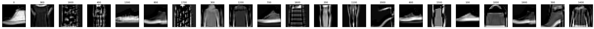

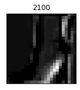

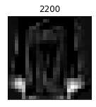

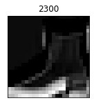

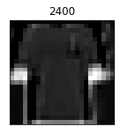

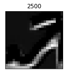

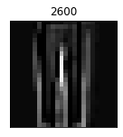

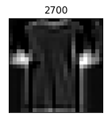

.. parsed-literal::

    [2020-04-27 23:52:00.032 d0f8006b6b7c:101 INFO trial.py:198] Training has ended, will refresh one final time in 1 sec.
    [2020-04-27 23:52:01.052 d0f8006b6b7c:101 INFO trial.py:210] Loaded all steps
    
    Done

Additional visualizations
~~~~~~~~~~~~~~~~~~~~~~~~~

Now that you completed plotting tensors showing output of first layer of
the model during training job run, plot more tensors! This time you get
all of them at once as a training job has finished and Debugger is aware
of all tensors emitted by it. You can visualize tensors representing
weights of first convolutional layer (e.g., its kernels). By inspecting
each row of plotted tensors from left to right you can notice
progression in how each kernel was “learning” its values. You will most
likely notice that most changes in kernels are happening closer to the
first steps of training. Closer toward finish of training job updates to
kernels become less and less noticeable. This suggests training job is
converging. *Note*: convergence doesn’t necessarily mean increase in
accuracy but it often accommodates that.

.. code:: ipython3

    # Let's visualize weights of the first convolutional layer as they progressively change through training.
    layer = 'conv0_weight'
    
    steps = trial.tensor(layer).steps()
    for i in range(0, trial.tensor(layer).value(step_num=steps[0]).shape[0]):
        plot_tensors(trial, layer, i, trial.tensor(layer).steps())

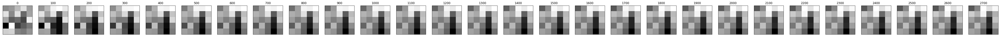

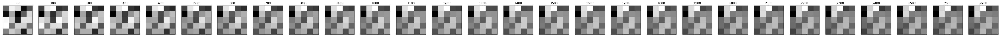

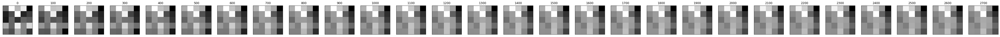

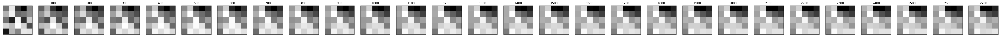

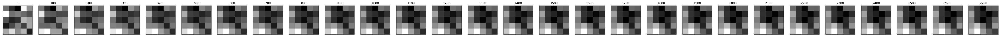

For additional example of working with debugging tensors and visualizing
them please feel free to try it out at `MNIST tensor
plot <../mnist-tensor-plot/mnist-tensor-plot.ipynb>`__ example.
