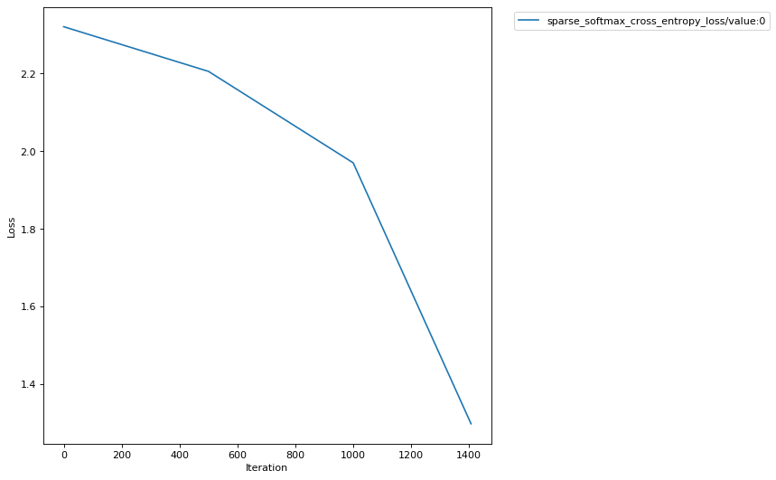

Amazon SageMaker Debugger - Using built-in rule
===============================================

`Amazon SageMaker <https://aws.amazon.com/sagemaker/>`__ is managed
platform to build, train and host maching learning models. Amazon
SageMaker Debugger is a new feature which offers the capability to debug
machine learning models during training by identifying and detecting
problems with the models in near real-time.

In this notebook you’ll be looking at how to use a SageMaker provided
built in rule during a TensorFlow training job.

How does Amazon SageMaker Debugger work?
----------------------------------------

Amazon SageMaker Debugger lets you go beyond just looking at scalars
like losses and accuracies during training and gives you full visibility
into all tensors ‘flowing through the graph’ during training.
Furthermore, it helps you monitor your training in near real-time using
rules and provides you alerts, once it has detected inconsistency in
training flow.

Concepts
~~~~~~~~

-  **Tensors**: These represent the state of the training network at
   intermediate points during its execution
-  **Debug Hook**: Hook is the construct with which Amazon SageMaker
   Debugger looks into the training process and captures the tensors
   requested at the desired step intervals
-  **Rule**: A logical construct, implemented as Python code, which
   helps analyze the tensors captured by the hook and report anomalies,
   if at all

With these concepts in mind, let’s understand the overall flow of things
that Amazon SageMaker Debugger uses to orchestrate debugging

Saving tensors during training
~~~~~~~~~~~~~~~~~~~~~~~~~~~~~~

The tensors captured by the debug hook are stored in the S3 location
specified by you. There are two ways you can configure Amazon SageMaker
Debugger to save tensors:

With no changes to your training script
^^^^^^^^^^^^^^^^^^^^^^^^^^^^^^^^^^^^^^^

If you use one of Amazon SageMaker provided `Deep Learning
Containers <https://docs.aws.amazon.com/sagemaker/latest/dg/pre-built-containers-frameworks-deep-learning.html>`__
for 1.15, then you don’t need to make any changes to your training
script for the tensors to be stored. Amazon SageMaker Debugger will use
the configuration you provide through Amazon SageMaker SDK’s Tensorflow
``Estimator`` when creating your job to save the tensors in the fashion
you specify. You can review the script we are going to use at
`src/mnist_zerocodechange.py <src/mnist_zerocodechange.py>`__. You will
note that this is an untouched TensorFlow script which uses the
``tf.estimator`` interface. Please note that Amazon SageMaker Debugger
only supports ``tf.keras``, ``tf.Estimator`` and ``tf.MonitoredSession``
interfaces. Full description of support is available at `Amazon
SageMaker Debugger with
TensorFlow <https://github.com/awslabs/sagemaker-debugger/tree/master/docs/tensorflow.md>`__

Orchestrating your script to store tensors
^^^^^^^^^^^^^^^^^^^^^^^^^^^^^^^^^^^^^^^^^^

For other containers, you need to make couple of lines of changes to
your training script. The Amazon SageMaker Debugger exposes a library
``smdebug`` which allows you to capture these tensors and save them for
analysis. It’s highly customizable and allows to save the specific
tensors you want at different frequencies and possibly with other
configurations. Refer
`DeveloperGuide <https://github.com/awslabs/sagemaker-debugger/tree/master/docs>`__
for details on how to use the Debugger library with your choice of
framework in your training script. Here we have an example script
orchestrated at `src/mnist_byoc <src/mnist_byoc.py>`__. You also need to
ensure that your container has the ``smdebug`` library installed.

Analysis of tensors
~~~~~~~~~~~~~~~~~~~

Once the tensors are saved, Amazon SageMaker Debugger can be configured
to run debugging **Rules** on them. At a very broad level, a rule is
python code used to detect certain conditions during training. Some of
the conditions that a data scientist training an algorithm may care
about are monitoring for gradients getting too large or too small,
detecting overfitting, and so on. Amazon Sagemaker Debugger will come
pre-packaged with certain first-party (1P) rules. Users can write their
own rules using Amazon Sagemaker Debugger APIs. You can also analyze raw
tensor data outside of the Rules construct in say, a Sagemaker notebook,
using Amazon Sagemaker Debugger’s full set of APIs. This notebook will
show you how to use a built in SageMaker Rule with your training job as
well as provide a sneak peak into these APIs for interactive
exploration. Please refer `Analysis Developer
Guide <https://github.com/awslabs/sagemaker-debugger/blob/master/docs/api.md>`__
for more on these APIs.

Setup
-----

Follow this one time setup to get your notebook up and running to use
Amazon SageMaker Debugger. This is only needed because we plan to
perform interactive analysis using this library in the notebook.

.. code:: ipython3

    ! pip install smdebug

.. parsed-literal::

    Requirement already satisfied: smdebug in /opt/conda/lib/python3.7/site-packages (0.7.2)
    Requirement already satisfied: boto3>=1.10.32 in /opt/conda/lib/python3.7/site-packages (from smdebug) (1.12.45)
    Requirement already satisfied: protobuf>=3.6.0 in /opt/conda/lib/python3.7/site-packages (from smdebug) (3.11.3)
    Requirement already satisfied: packaging in /opt/conda/lib/python3.7/site-packages (from smdebug) (20.1)
    Requirement already satisfied: numpy<2.0.0,>1.16.0 in /opt/conda/lib/python3.7/site-packages (from smdebug) (1.18.1)
    Requirement already satisfied: jmespath<1.0.0,>=0.7.1 in /opt/conda/lib/python3.7/site-packages (from boto3>=1.10.32->smdebug) (0.9.5)
    Requirement already satisfied: botocore<1.16.0,>=1.15.45 in /opt/conda/lib/python3.7/site-packages (from boto3>=1.10.32->smdebug) (1.15.45)
    Requirement already satisfied: s3transfer<0.4.0,>=0.3.0 in /opt/conda/lib/python3.7/site-packages (from boto3>=1.10.32->smdebug) (0.3.3)
    Requirement already satisfied: six>=1.9 in /opt/conda/lib/python3.7/site-packages (from protobuf>=3.6.0->smdebug) (1.14.0)
    Requirement already satisfied: setuptools in /opt/conda/lib/python3.7/site-packages (from protobuf>=3.6.0->smdebug) (45.2.0.post20200210)
    Requirement already satisfied: pyparsing>=2.0.2 in /opt/conda/lib/python3.7/site-packages (from packaging->smdebug) (2.4.6)
    Requirement already satisfied: python-dateutil<3.0.0,>=2.1 in /opt/conda/lib/python3.7/site-packages (from botocore<1.16.0,>=1.15.45->boto3>=1.10.32->smdebug) (2.8.1)
    Requirement already satisfied: docutils<0.16,>=0.10 in /opt/conda/lib/python3.7/site-packages (from botocore<1.16.0,>=1.15.45->boto3>=1.10.32->smdebug) (0.15.2)
    Requirement already satisfied: urllib3<1.26,>=1.20; python_version != "3.4" in /opt/conda/lib/python3.7/site-packages (from botocore<1.16.0,>=1.15.45->boto3>=1.10.32->smdebug) (1.25.8)

With the setup out of the way let’s start training our TensorFlow model
in SageMaker with the debugger enabled.

Training TensorFlow models in SageMaker with Amazon SageMaker Debugger
----------------------------------------------------------------------

SageMaker TensorFlow as a framework
~~~~~~~~~~~~~~~~~~~~~~~~~~~~~~~~~~~

We’ll train a TensorFlow model in this notebook with Amazon Sagemaker
Debugger enabled and monitor the training jobs with Amazon Sagemaker
Debugger Rules. This will be done using Amazon SageMaker `TensorFlow
1.15.0 <https://docs.aws.amazon.com/sagemaker/latest/dg/pre-built-containers-frameworks-deep-learning.html>`__
Container as a framework.

.. code:: ipython3

    import boto3
    import os
    import sagemaker
    from sagemaker.tensorflow import TensorFlow

Let’s import the libraries needed for our demo of Amazon SageMaker
Debugger.

.. code:: ipython3

    from sagemaker.debugger import Rule, DebuggerHookConfig, TensorBoardOutputConfig, CollectionConfig, rule_configs

Now we’ll define the configuration for our training to run. We’ll using
image recognition using MNIST dataset as our training example.

.. code:: ipython3

    # define the entrypoint script
    entrypoint_script='src/mnist_zerocodechange.py'
    
    hyperparameters = {
        "num_epochs": 3
    }

Setting up the Estimator
~~~~~~~~~~~~~~~~~~~~~~~~

Now it’s time to setup our TensorFlow estimator. We’ve added new
parameters to the estimator to enable your training job for debugging
through Amazon SageMaker Debugger. These new parameters are explained
below.

-  **debugger_hook_config**: This new parameter accepts a local path
   where you wish your tensors to be written to and also accepts the S3
   URI where you wish your tensors to be uploaded to. SageMaker will
   take care of uploading these tensors transparently during execution.
-  **rules**: This new parameter will accept a list of rules you wish to
   evaluate against the tensors output by this training job. For rules,
   Amazon SageMaker Debugger supports two types:
-  **SageMaker Rules**: These are rules specially curated by the data
   science and engineering teams in Amazon SageMaker which you can opt
   to evaluate against your training job.
-  **Custom Rules**: You can optionally choose to write your own rule as
   a Python source file and have it evaluated against your training job.
   To provide Amazon SageMaker Debugger to evaluate this rule, you would
   have to provide the S3 location of the rule source and the evaluator
   image.

Using Amazon SageMaker Rules
^^^^^^^^^^^^^^^^^^^^^^^^^^^^

In this example we’ll demonstrate how to use SageMaker rules to be
evaluated against your training. You can find the list of SageMaker
rules and the configurations best suited for using them
`here <https://github.com/awslabs/sagemaker-debugger-rulesconfig>`__.

The rules we’ll use are **VanishingGradient** and **LossNotDecreasing**.
As the names suggest, the rules will attempt to evaluate if there are
vanishing gradients in the tensors captured by the debugging hook during
training and also if the loss is not decreasing.

.. code:: ipython3

    rules = [
        Rule.sagemaker(rule_configs.vanishing_gradient()), 
        Rule.sagemaker(rule_configs.loss_not_decreasing())
    ]
    
    estimator = TensorFlow(
        role=sagemaker.get_execution_role(),
        base_job_name='smdebugger-demo-mnist-tensorflow',
        train_instance_count=1,
        train_instance_type='ml.m4.xlarge',
        train_volume_size=400,
        entry_point=entrypoint_script,
        framework_version='1.15',
        py_version='py3',
        train_max_run=3600,
        script_mode=True,
        hyperparameters=hyperparameters,
        ## New parameter
        rules = rules
    )

*Note that Amazon Sagemaker Debugger is only supported for
py_version=‘py3’ currently.*

Let’s start the training by calling ``fit()`` on the TensorFlow
estimator.

.. code:: ipython3

    estimator.fit(wait=True)

.. parsed-literal::

    2020-04-27 23:56:40 Starting - Starting the training job...
    2020-04-27 23:57:04 Starting - Launching requested ML instances
    ********* Debugger Rule Status *********
    *
    *  VanishingGradient: InProgress        
    *  LossNotDecreasing: InProgress        
    *
    ****************************************
    ...
    2020-04-27 23:57:36 Starting - Preparing the instances for training.........
    2020-04-27 23:59:10 Downloading - Downloading input data
    2020-04-27 23:59:10 Training - Downloading the training image...
    2020-04-27 23:59:30 Training - Training image download completed. Training in progress..WARNING:tensorflow:From /usr/local/lib/python3.6/dist-packages/tensorflow_core/__init__.py:1473: The name tf.estimator.inputs is deprecated. Please use tf.compat.v1.estimator.inputs instead.
    
    2020-04-27 23:59:36,257 sagemaker-containers INFO     Imported framework sagemaker_tensorflow_container.training
    2020-04-27 23:59:36,263 sagemaker-containers INFO     No GPUs detected (normal if no gpus installed)
    2020-04-27 23:59:36,707 sagemaker-containers INFO     No GPUs detected (normal if no gpus installed)
    2020-04-27 23:59:36,727 sagemaker-containers INFO     No GPUs detected (normal if no gpus installed)
    2020-04-27 23:59:36,746 sagemaker-containers INFO     No GPUs detected (normal if no gpus installed)
    2020-04-27 23:59:36,760 sagemaker-containers INFO     Invoking user script
    
    Training Env:
    
    {
        "additional_framework_parameters": {},
        "channel_input_dirs": {},
        "current_host": "algo-1",
        "framework_module": "sagemaker_tensorflow_container.training:main",
        "hosts": [
            "algo-1"
        ],
        "hyperparameters": {
            "model_dir": "s3://sagemaker-us-east-2-441510144314/smdebugger-demo-mnist-tensorflow-2020-04-27-23-56-39-900/model",
            "num_epochs": 3
        },
        "input_config_dir": "/opt/ml/input/config",
        "input_data_config": {},
        "input_dir": "/opt/ml/input",
        "is_master": true,
        "job_name": "smdebugger-demo-mnist-tensorflow-2020-04-27-23-56-39-900",
        "log_level": 20,
        "master_hostname": "algo-1",
        "model_dir": "/opt/ml/model",
        "module_dir": "s3://sagemaker-us-east-2-441510144314/smdebugger-demo-mnist-tensorflow-2020-04-27-23-56-39-900/source/sourcedir.tar.gz",
        "module_name": "mnist_zerocodechange",
        "network_interface_name": "eth0",
        "num_cpus": 4,
        "num_gpus": 0,
        "output_data_dir": "/opt/ml/output/data",
        "output_dir": "/opt/ml/output",
        "output_intermediate_dir": "/opt/ml/output/intermediate",
        "resource_config": {
            "current_host": "algo-1",
            "hosts": [
                "algo-1"
            ],
            "network_interface_name": "eth0"
        },
        "user_entry_point": "mnist_zerocodechange.py"
    }
    
    Environment variables:
    
    SM_HOSTS=["algo-1"]
    SM_NETWORK_INTERFACE_NAME=eth0
    SM_HPS={"model_dir":"s3://sagemaker-us-east-2-441510144314/smdebugger-demo-mnist-tensorflow-2020-04-27-23-56-39-900/model","num_epochs":3}
    SM_USER_ENTRY_POINT=mnist_zerocodechange.py
    SM_FRAMEWORK_PARAMS={}
    SM_RESOURCE_CONFIG={"current_host":"algo-1","hosts":["algo-1"],"network_interface_name":"eth0"}
    SM_INPUT_DATA_CONFIG={}
    SM_OUTPUT_DATA_DIR=/opt/ml/output/data
    SM_CHANNELS=[]
    SM_CURRENT_HOST=algo-1
    SM_MODULE_NAME=mnist_zerocodechange
    SM_LOG_LEVEL=20
    SM_FRAMEWORK_MODULE=sagemaker_tensorflow_container.training:main
    SM_INPUT_DIR=/opt/ml/input
    SM_INPUT_CONFIG_DIR=/opt/ml/input/config
    SM_OUTPUT_DIR=/opt/ml/output
    SM_NUM_CPUS=4
    SM_NUM_GPUS=0
    SM_MODEL_DIR=/opt/ml/model
    SM_MODULE_DIR=s3://sagemaker-us-east-2-441510144314/smdebugger-demo-mnist-tensorflow-2020-04-27-23-56-39-900/source/sourcedir.tar.gz
    SM_TRAINING_ENV={"additional_framework_parameters":{},"channel_input_dirs":{},"current_host":"algo-1","framework_module":"sagemaker_tensorflow_container.training:main","hosts":["algo-1"],"hyperparameters":{"model_dir":"s3://sagemaker-us-east-2-441510144314/smdebugger-demo-mnist-tensorflow-2020-04-27-23-56-39-900/model","num_epochs":3},"input_config_dir":"/opt/ml/input/config","input_data_config":{},"input_dir":"/opt/ml/input","is_master":true,"job_name":"smdebugger-demo-mnist-tensorflow-2020-04-27-23-56-39-900","log_level":20,"master_hostname":"algo-1","model_dir":"/opt/ml/model","module_dir":"s3://sagemaker-us-east-2-441510144314/smdebugger-demo-mnist-tensorflow-2020-04-27-23-56-39-900/source/sourcedir.tar.gz","module_name":"mnist_zerocodechange","network_interface_name":"eth0","num_cpus":4,"num_gpus":0,"output_data_dir":"/opt/ml/output/data","output_dir":"/opt/ml/output","output_intermediate_dir":"/opt/ml/output/intermediate","resource_config":{"current_host":"algo-1","hosts":["algo-1"],"network_interface_name":"eth0"},"user_entry_point":"mnist_zerocodechange.py"}
    SM_USER_ARGS=["--model_dir","s3://sagemaker-us-east-2-441510144314/smdebugger-demo-mnist-tensorflow-2020-04-27-23-56-39-900/model","--num_epochs","3"]
    SM_OUTPUT_INTERMEDIATE_DIR=/opt/ml/output/intermediate
    SM_HP_MODEL_DIR=s3://sagemaker-us-east-2-441510144314/smdebugger-demo-mnist-tensorflow-2020-04-27-23-56-39-900/model
    SM_HP_NUM_EPOCHS=3
    PYTHONPATH=/opt/ml/code:/usr/local/bin:/usr/lib/python36.zip:/usr/lib/python3.6:/usr/lib/python3.6/lib-dynload:/usr/local/lib/python3.6/dist-packages:/usr/lib/python3/dist-packages
    
    Invoking script with the following command:
    
    /usr/bin/python3 mnist_zerocodechange.py --model_dir s3://sagemaker-us-east-2-441510144314/smdebugger-demo-mnist-tensorflow-2020-04-27-23-56-39-900/model --num_epochs 3
    
    
    WARNING:tensorflow:From /usr/local/lib/python3.6/dist-packages/tensorflow_core/__init__.py:1473: The name tf.estimator.inputs is deprecated. Please use tf.compat.v1.estimator.inputs instead.
    
    Downloading data from https://storage.googleapis.com/tensorflow/tf-keras-datasets/mnist.npz
    #015    8192/11490434 [..............................] - ETA: 0s#010#010#010#010#010#010#010#010#010#010#010#010#010#010#010#010#010#010#010#010#010#010#010#010#010#010#010#010#010#010#010#010#010#010#010#010#010#010#010#010#010#010#010#010#010#010#010#010#010#010#010#010#010#010#010#010#010#010#010#010#015  106496/11490434 [..............................] - ETA: 5s#010#010#010#010#010#010#010#010#010#010#010#010#010#010#010#010#010#010#010#010#010#010#010#010#010#010#010#010#010#010#010#010#010#010#010#010#010#010#010#010#010#010#010#010#010#010#010#010#010#010#010#010#010#010#010#010#010#010#010#010#015  737280/11490434 [>.............................] - ETA: 1s#010#010#010#010#010#010#010#010#010#010#010#010#010#010#010#010#010#010#010#010#010#010#010#010#010#010#010#010#010#010#010#010#010#010#010#010#010#010#010#010#010#010#010#010#010#010#010#010#010#010#010#010#010#010#010#010#010#010#010#010#015 5210112/11490434 [============>.................] - ETA: 0s#010#010#010#010#010#010#010#010#010#010#010#010#010#010#010#010#010#010#010#010#010#010#010#010#010#010#010#010#010#010#010#010#010#010#010#010#010#010#010#010#010#010#010#010#010#010#010#010#010#010#010#010#010#010#010#010#010#010#010#010#015 6987776/11490434 [=================>............] - ETA: 0s#010#010#010#010#010#010#010#010#010#010#010#010#010#010#010#010#010#010#010#010#010#010#010#010#010#010#010#010#010#010#010#010#010#010#010#010#010#010#010#010#010#010#010#010#010#010#010#010#010#010#010#010#010#010#010#010#010#010#010#010#01511493376/11490434 [==============================] - 0s 0us/step
    INFO:tensorflow:Using default config.
    INFO:tensorflow:Using config: {'_model_dir': 's3://sagemaker-us-east-2-441510144314/smdebugger-demo-mnist-tensorflow-2020-04-27-23-56-39-900/model', '_tf_random_seed': None, '_save_summary_steps': 100, '_save_checkpoints_steps': None, '_save_checkpoints_secs': 600, '_session_config': allow_soft_placement: true
    graph_options {
      rewrite_options {
        meta_optimizer_iterations: ONE
      }
    }
    , '_keep_checkpoint_max': 5, '_keep_checkpoint_every_n_hours': 10000, '_log_step_count_steps': 100, '_train_distribute': None, '_device_fn': None, '_protocol': None, '_eval_distribute': None, '_experimental_distribute': None, '_experimental_max_worker_delay_secs': None, '_session_creation_timeout_secs': 7200, '_service': None, '_cluster_spec': <tensorflow.python.training.server_lib.ClusterSpec object at 0x7fb77f42d1d0>, '_task_type': 'worker', '_task_id': 0, '_global_id_in_cluster': 0, '_master': '', '_evaluation_master': '', '_is_chief': True, '_num_ps_replicas': 0, '_num_worker_replicas': 1}
    WARNING:tensorflow:From mnist_zerocodechange.py:114: The name tf.estimator.inputs.numpy_input_fn is deprecated. Please use tf.compat.v1.estimator.inputs.numpy_input_fn instead.
    
    [2020-04-27 23:59:39.646 ip-10-0-201-124.us-east-2.compute.internal:26 INFO json_config.py:90] Creating hook from json_config at /opt/ml/input/config/debughookconfig.json.
    [2020-04-27 23:59:39.647 ip-10-0-201-124.us-east-2.compute.internal:26 INFO hook.py:183] tensorboard_dir has not been set for the hook. SMDebug will not be exporting tensorboard summaries.
    [2020-04-27 23:59:39.647 ip-10-0-201-124.us-east-2.compute.internal:26 INFO hook.py:228] Saving to /opt/ml/output/tensors
    WARNING:tensorflow:From /usr/local/lib/python3.6/dist-packages/tensorflow_core/python/training/training_util.py:236: Variable.initialized_value (from tensorflow.python.ops.variables) is deprecated and will be removed in a future version.
    Instructions for updating:
    Use Variable.read_value. Variables in 2.X are initialized automatically both in eager and graph (inside tf.defun) contexts.
    WARNING:tensorflow:From /usr/local/lib/python3.6/dist-packages/tensorflow_core/python/training/training_util.py:236: Variable.initialized_value (from tensorflow.python.ops.variables) is deprecated and will be removed in a future version.
    Instructions for updating:
    Use Variable.read_value. Variables in 2.X are initialized automatically both in eager and graph (inside tf.defun) contexts.
    WARNING:tensorflow:From /usr/local/lib/python3.6/dist-packages/tensorflow_estimator/python/estimator/inputs/queues/feeding_queue_runner.py:62: QueueRunner.__init__ (from tensorflow.python.training.queue_runner_impl) is deprecated and will be removed in a future version.
    Instructions for updating:
    To construct input pipelines, use the `tf.data` module.
    WARNING:tensorflow:From /usr/local/lib/python3.6/dist-packages/tensorflow_estimator/python/estimator/inputs/queues/feeding_queue_runner.py:62: QueueRunner.__init__ (from tensorflow.python.training.queue_runner_impl) is deprecated and will be removed in a future version.
    Instructions for updating:
    To construct input pipelines, use the `tf.data` module.
    WARNING:tensorflow:From /usr/local/lib/python3.6/dist-packages/tensorflow_estimator/python/estimator/inputs/queues/feeding_functions.py:500: add_queue_runner (from tensorflow.python.training.queue_runner_impl) is deprecated and will be removed in a future version.
    Instructions for updating:
    To construct input pipelines, use the `tf.data` module.
    WARNING:tensorflow:From /usr/local/lib/python3.6/dist-packages/tensorflow_estimator/python/estimator/inputs/queues/feeding_functions.py:500: add_queue_runner (from tensorflow.python.training.queue_runner_impl) is deprecated and will be removed in a future version.
    Instructions for updating:
    To construct input pipelines, use the `tf.data` module.
    INFO:tensorflow:Calling model_fn.
    INFO:tensorflow:Calling model_fn.
    WARNING:tensorflow:From mnist_zerocodechange.py:54: conv2d (from tensorflow.python.layers.convolutional) is deprecated and will be removed in a future version.
    Instructions for updating:
    Use `tf.keras.layers.Conv2D` instead.
    WARNING:tensorflow:From mnist_zerocodechange.py:54: conv2d (from tensorflow.python.layers.convolutional) is deprecated and will be removed in a future version.
    Instructions for updating:
    Use `tf.keras.layers.Conv2D` instead.
    WARNING:tensorflow:From /usr/local/lib/python3.6/dist-packages/tensorflow_core/python/layers/convolutional.py:424: Layer.apply (from tensorflow.python.keras.engine.base_layer) is deprecated and will be removed in a future version.
    Instructions for updating:
    Please use `layer.__call__` method instead.
    WARNING:tensorflow:From /usr/local/lib/python3.6/dist-packages/tensorflow_core/python/layers/convolutional.py:424: Layer.apply (from tensorflow.python.keras.engine.base_layer) is deprecated and will be removed in a future version.
    Instructions for updating:
    Please use `layer.__call__` method instead.
    WARNING:tensorflow:From mnist_zerocodechange.py:58: max_pooling2d (from tensorflow.python.layers.pooling) is deprecated and will be removed in a future version.
    Instructions for updating:
    Use keras.layers.MaxPooling2D instead.
    WARNING:tensorflow:From mnist_zerocodechange.py:58: max_pooling2d (from tensorflow.python.layers.pooling) is deprecated and will be removed in a future version.
    Instructions for updating:
    Use keras.layers.MaxPooling2D instead.
    WARNING:tensorflow:From mnist_zerocodechange.py:68: dense (from tensorflow.python.layers.core) is deprecated and will be removed in a future version.
    Instructions for updating:
    Use keras.layers.Dense instead.
    WARNING:tensorflow:From mnist_zerocodechange.py:68: dense (from tensorflow.python.layers.core) is deprecated and will be removed in a future version.
    Instructions for updating:
    Use keras.layers.Dense instead.
    WARNING:tensorflow:From mnist_zerocodechange.py:70: dropout (from tensorflow.python.layers.core) is deprecated and will be removed in a future version.
    Instructions for updating:
    Use keras.layers.dropout instead.
    WARNING:tensorflow:From mnist_zerocodechange.py:70: dropout (from tensorflow.python.layers.core) is deprecated and will be removed in a future version.
    Instructions for updating:
    Use keras.layers.dropout instead.
    WARNING:tensorflow:From mnist_zerocodechange.py:88: The name tf.losses.sparse_softmax_cross_entropy is deprecated. Please use tf.compat.v1.losses.sparse_softmax_cross_entropy instead.
    
    WARNING:tensorflow:From mnist_zerocodechange.py:88: The name tf.losses.sparse_softmax_cross_entropy is deprecated. Please use tf.compat.v1.losses.sparse_softmax_cross_entropy instead.
    
    WARNING:tensorflow:From /usr/local/lib/python3.6/dist-packages/tensorflow_core/python/ops/losses/losses_impl.py:121: where (from tensorflow.python.ops.array_ops) is deprecated and will be removed in a future version.
    Instructions for updating:
    Use tf.where in 2.0, which has the same broadcast rule as np.where
    WARNING:tensorflow:From /usr/local/lib/python3.6/dist-packages/tensorflow_core/python/ops/losses/losses_impl.py:121: where (from tensorflow.python.ops.array_ops) is deprecated and will be removed in a future version.
    Instructions for updating:
    Use tf.where in 2.0, which has the same broadcast rule as np.where
    WARNING:tensorflow:From mnist_zerocodechange.py:92: The name tf.train.GradientDescentOptimizer is deprecated. Please use tf.compat.v1.train.GradientDescentOptimizer instead.
    
    WARNING:tensorflow:From mnist_zerocodechange.py:92: The name tf.train.GradientDescentOptimizer is deprecated. Please use tf.compat.v1.train.GradientDescentOptimizer instead.
    
    WARNING:tensorflow:From mnist_zerocodechange.py:93: The name tf.train.get_global_step is deprecated. Please use tf.compat.v1.train.get_global_step instead.
    
    WARNING:tensorflow:From mnist_zerocodechange.py:93: The name tf.train.get_global_step is deprecated. Please use tf.compat.v1.train.get_global_step instead.
    
    INFO:tensorflow:Done calling model_fn.
    INFO:tensorflow:Done calling model_fn.
    INFO:tensorflow:Create CheckpointSaverHook.
    INFO:tensorflow:Create CheckpointSaverHook.
    WARNING:tensorflow:From /usr/local/lib/python3.6/dist-packages/horovod/tensorflow/__init__.py:117: The name tf.global_variables is deprecated. Please use tf.compat.v1.global_variables instead.
    
    WARNING:tensorflow:From /usr/local/lib/python3.6/dist-packages/horovod/tensorflow/__init__.py:117: The name tf.global_variables is deprecated. Please use tf.compat.v1.global_variables instead.
    
    WARNING:tensorflow:From /usr/local/lib/python3.6/dist-packages/horovod/tensorflow/__init__.py:143: The name tf.get_default_graph is deprecated. Please use tf.compat.v1.get_default_graph instead.
    
    WARNING:tensorflow:From /usr/local/lib/python3.6/dist-packages/horovod/tensorflow/__init__.py:143: The name tf.get_default_graph is deprecated. Please use tf.compat.v1.get_default_graph instead.
    
    [2020-04-27 23:59:40.256 ip-10-0-201-124.us-east-2.compute.internal:26 INFO hook.py:364] Monitoring the collections: gradients, losses, sm_metrics, metrics
    INFO:tensorflow:Graph was finalized.
    INFO:tensorflow:Graph was finalized.
    INFO:tensorflow:Running local_init_op.
    INFO:tensorflow:Running local_init_op.
    INFO:tensorflow:Done running local_init_op.
    INFO:tensorflow:Done running local_init_op.
    WARNING:tensorflow:From /usr/local/lib/python3.6/dist-packages/tensorflow_core/python/training/monitored_session.py:888: start_queue_runners (from tensorflow.python.training.queue_runner_impl) is deprecated and will be removed in a future version.
    Instructions for updating:
    To construct input pipelines, use the `tf.data` module.
    WARNING:tensorflow:From /usr/local/lib/python3.6/dist-packages/tensorflow_core/python/training/monitored_session.py:888: start_queue_runners (from tensorflow.python.training.queue_runner_impl) is deprecated and will be removed in a future version.
    Instructions for updating:
    To construct input pipelines, use the `tf.data` module.
    INFO:tensorflow:Saving checkpoints for 0 into s3://sagemaker-us-east-2-441510144314/smdebugger-demo-mnist-tensorflow-2020-04-27-23-56-39-900/model/model.ckpt.
    INFO:tensorflow:Saving checkpoints for 0 into s3://sagemaker-us-east-2-441510144314/smdebugger-demo-mnist-tensorflow-2020-04-27-23-56-39-900/model/model.ckpt.
    WARNING:tensorflow:From /usr/local/lib/python3.6/dist-packages/smdebug/tensorflow/session.py:304: extract_sub_graph (from tensorflow.python.framework.graph_util_impl) is deprecated and will be removed in a future version.
    Instructions for updating:
    Use `tf.compat.v1.graph_util.extract_sub_graph`
    WARNING:tensorflow:From /usr/local/lib/python3.6/dist-packages/smdebug/tensorflow/session.py:304: extract_sub_graph (from tensorflow.python.framework.graph_util_impl) is deprecated and will be removed in a future version.
    Instructions for updating:
    Use `tf.compat.v1.graph_util.extract_sub_graph`
    INFO:tensorflow:loss = 2.3208826, step = 1
    INFO:tensorflow:loss = 2.3208826, step = 1
    ERROR:root:'NoneType' object has no attribute 'write'
    INFO:tensorflow:global_step/sec: 7.73273
    INFO:tensorflow:global_step/sec: 7.73273
    INFO:tensorflow:loss = 2.2985032, step = 101 (12.933 sec)
    INFO:tensorflow:loss = 2.2985032, step = 101 (12.933 sec)
    INFO:tensorflow:global_step/sec: 8.0584
    INFO:tensorflow:global_step/sec: 8.0584
    INFO:tensorflow:loss = 2.2796118, step = 201 (12.409 sec)
    INFO:tensorflow:loss = 2.2796118, step = 201 (12.409 sec)
    INFO:tensorflow:global_step/sec: 8.16216
    INFO:tensorflow:global_step/sec: 8.16216
    INFO:tensorflow:loss = 2.2400365, step = 301 (12.252 sec)
    INFO:tensorflow:loss = 2.2400365, step = 301 (12.252 sec)
    INFO:tensorflow:global_step/sec: 8.20902
    INFO:tensorflow:global_step/sec: 8.20902
    INFO:tensorflow:loss = 2.244422, step = 401 (12.182 sec)
    INFO:tensorflow:loss = 2.244422, step = 401 (12.182 sec)
    INFO:tensorflow:global_step/sec: 8.29027
    INFO:tensorflow:global_step/sec: 8.29027
    INFO:tensorflow:loss = 2.2057943, step = 501 (12.062 sec)
    INFO:tensorflow:loss = 2.2057943, step = 501 (12.062 sec)
    INFO:tensorflow:global_step/sec: 8.12505
    INFO:tensorflow:global_step/sec: 8.12505
    INFO:tensorflow:loss = 2.1722574, step = 601 (12.308 sec)
    INFO:tensorflow:loss = 2.1722574, step = 601 (12.308 sec)
    INFO:tensorflow:global_step/sec: 8.21211
    INFO:tensorflow:global_step/sec: 8.21211
    INFO:tensorflow:loss = 2.126483, step = 701 (12.177 sec)
    INFO:tensorflow:loss = 2.126483, step = 701 (12.177 sec)
    INFO:tensorflow:global_step/sec: 8.54074
    INFO:tensorflow:global_step/sec: 8.54074
    INFO:tensorflow:loss = 2.0739117, step = 801 (11.708 sec)
    INFO:tensorflow:loss = 2.0739117, step = 801 (11.708 sec)
    INFO:tensorflow:global_step/sec: 8.60594
    INFO:tensorflow:global_step/sec: 8.60594
    INFO:tensorflow:loss = 2.023419, step = 901 (11.620 sec)
    INFO:tensorflow:loss = 2.023419, step = 901 (11.620 sec)
    INFO:tensorflow:global_step/sec: 8.60855
    INFO:tensorflow:global_step/sec: 8.60855
    INFO:tensorflow:loss = 1.9700434, step = 1001 (11.791 sec)
    INFO:tensorflow:loss = 1.9700434, step = 1001 (11.791 sec)
    INFO:tensorflow:global_step/sec: 8.33646
    INFO:tensorflow:global_step/sec: 8.33646
    INFO:tensorflow:loss = 1.8422208, step = 1101 (11.821 sec)
    INFO:tensorflow:loss = 1.8422208, step = 1101 (11.821 sec)
    INFO:tensorflow:global_step/sec: 8.58772
    INFO:tensorflow:global_step/sec: 8.58772
    INFO:tensorflow:loss = 1.7151158, step = 1201 (11.644 sec)
    INFO:tensorflow:loss = 1.7151158, step = 1201 (11.644 sec)
    INFO:tensorflow:global_step/sec: 8.54481
    INFO:tensorflow:global_step/sec: 8.54481
    INFO:tensorflow:loss = 1.4826751, step = 1301 (11.703 sec)
    INFO:tensorflow:loss = 1.4826751, step = 1301 (11.703 sec)
    
    2020-04-28 00:02:39 Uploading - Uploading generated training modelINFO:tensorflow:global_step/sec: 8.40044
    INFO:tensorflow:global_step/sec: 8.40044
    INFO:tensorflow:loss = 1.3823929, step = 1401 (11.904 sec)
    INFO:tensorflow:loss = 1.3823929, step = 1401 (11.904 sec)
    INFO:tensorflow:Saving checkpoints for 1407 into s3://sagemaker-us-east-2-441510144314/smdebugger-demo-mnist-tensorflow-2020-04-27-23-56-39-900/model/model.ckpt.
    INFO:tensorflow:Saving checkpoints for 1407 into s3://sagemaker-us-east-2-441510144314/smdebugger-demo-mnist-tensorflow-2020-04-27-23-56-39-900/model/model.ckpt.
    INFO:tensorflow:Loss for final step: 1.3139015.
    INFO:tensorflow:Loss for final step: 1.3139015.
    INFO:tensorflow:Calling model_fn.
    INFO:tensorflow:Calling model_fn.
    WARNING:tensorflow:From mnist_zerocodechange.py:98: The name tf.metrics.accuracy is deprecated. Please use tf.compat.v1.metrics.accuracy instead.
    
    WARNING:tensorflow:From mnist_zerocodechange.py:98: The name tf.metrics.accuracy is deprecated. Please use tf.compat.v1.metrics.accuracy instead.
    
    INFO:tensorflow:Done calling model_fn.
    INFO:tensorflow:Done calling model_fn.
    INFO:tensorflow:Starting evaluation at 2020-04-28T00:02:32Z
    INFO:tensorflow:Starting evaluation at 2020-04-28T00:02:32Z
    [2020-04-28 00:02:32.878 ip-10-0-201-124.us-east-2.compute.internal:26 INFO hook.py:364] Monitoring the collections: gradients, losses, sm_metrics, metrics
    INFO:tensorflow:Graph was finalized.
    INFO:tensorflow:Graph was finalized.
    INFO:tensorflow:Restoring parameters from s3://sagemaker-us-east-2-441510144314/smdebugger-demo-mnist-tensorflow-2020-04-27-23-56-39-900/model/model.ckpt-1407
    INFO:tensorflow:Restoring parameters from s3://sagemaker-us-east-2-441510144314/smdebugger-demo-mnist-tensorflow-2020-04-27-23-56-39-900/model/model.ckpt-1407
    INFO:tensorflow:Running local_init_op.
    INFO:tensorflow:Running local_init_op.
    INFO:tensorflow:Done running local_init_op.
    INFO:tensorflow:Done running local_init_op.
    INFO:tensorflow:Finished evaluation at 2020-04-28-00:02:36
    INFO:tensorflow:Finished evaluation at 2020-04-28-00:02:36
    INFO:tensorflow:Saving dict for global step 1407: accuracy = 0.7942, global_step = 1407, loss = 1.2718687
    INFO:tensorflow:Saving dict for global step 1407: accuracy = 0.7942, global_step = 1407, loss = 1.2718687
    INFO:tensorflow:Saving 'checkpoint_path' summary for global step 1407: s3://sagemaker-us-east-2-441510144314/smdebugger-demo-mnist-tensorflow-2020-04-27-23-56-39-900/model/model.ckpt-1407
    INFO:tensorflow:Saving 'checkpoint_path' summary for global step 1407: s3://sagemaker-us-east-2-441510144314/smdebugger-demo-mnist-tensorflow-2020-04-27-23-56-39-900/model/model.ckpt-1407
    [2020-04-28 00:02:37.390 ip-10-0-201-124.us-east-2.compute.internal:26 INFO utils.py:25] The end of training job file will not be written for jobs running under SageMaker.
    2020-04-28 00:02:37,661 sagemaker_tensorflow_container.training WARNING  No model artifact is saved under path /opt/ml/model. Your training job will not save any model files to S3.
    For details of how to construct your training script see:
    https://sagemaker.readthedocs.io/en/stable/using_tf.html#adapting-your-local-tensorflow-script
    2020-04-28 00:02:37,662 sagemaker-containers INFO     Reporting training SUCCESS
    
    2020-04-28 00:03:10 Completed - Training job completed
    
    ********* Debugger Rule Status *********
    *
    *  VanishingGradient: NoIssuesFound     
    *  LossNotDecreasing: NoIssuesFound     
    *
    ****************************************
    Training seconds: 241
    Billable seconds: 241

Result
------

As a result of calling the ``fit()`` Amazon SageMaker Debugger kicked
off two rule evaluation jobs to monitor vanishing gradient and loss
decrease, in parallel with the training job. The rule evaluation
status(es) will be visible in the training logs at regular intervals. As
you can see, in the summary, there was no step in the training which
reported vanishing gradients in the tensors. Although, the loss was not
found to be decreasing at step 1900.

.. code:: ipython3

    estimator.latest_training_job.rule_job_summary()

.. parsed-literal::

    [{'RuleConfigurationName': 'VanishingGradient',
      'RuleEvaluationJobArn': 'arn:aws:sagemaker:us-east-2:441510144314:processing-job/smdebugger-demo-mnist-tens-vanishinggradient-5268f8d7',
      'RuleEvaluationStatus': 'NoIssuesFound',
      'LastModifiedTime': datetime.datetime(2020, 4, 28, 0, 3, 10, 18000, tzinfo=tzlocal())},
     {'RuleConfigurationName': 'LossNotDecreasing',
      'RuleEvaluationJobArn': 'arn:aws:sagemaker:us-east-2:441510144314:processing-job/smdebugger-demo-mnist-tens-lossnotdecreasing-5793ad60',
      'RuleEvaluationStatus': 'NoIssuesFound',
      'LastModifiedTime': datetime.datetime(2020, 4, 28, 0, 3, 10, 18000, tzinfo=tzlocal())}]

Let’s try and look at the logs of the rule job for loss not decreasing.
To do that, we’ll use this utlity function to get a link to the rule job
logs.

.. code:: ipython3

    def _get_rule_job_name(training_job_name, rule_configuration_name, rule_job_arn):
            """Helper function to get the rule job name with correct casing"""
            return "{}-{}-{}".format(
                training_job_name[:26], rule_configuration_name[:26], rule_job_arn[-8:]
            )
        
    def _get_cw_url_for_rule_job(rule_job_name, region):
        return "https://{}.console.aws.amazon.com/cloudwatch/home?region={}#logStream:group=/aws/sagemaker/ProcessingJobs;prefix={};streamFilter=typeLogStreamPrefix".format(region, region, rule_job_name)
    
    
    def get_rule_jobs_cw_urls(estimator):
        region = boto3.Session().region_name
        training_job = estimator.latest_training_job
        training_job_name = training_job.describe()["TrainingJobName"]
        rule_eval_statuses = training_job.describe()["DebugRuleEvaluationStatuses"]
        
        result={}
        for status in rule_eval_statuses:
            if status.get("RuleEvaluationJobArn", None) is not None:
                rule_job_name = _get_rule_job_name(training_job_name, status["RuleConfigurationName"], status["RuleEvaluationJobArn"])
                result[status["RuleConfigurationName"]] = _get_cw_url_for_rule_job(rule_job_name, region)
        return result
    
    get_rule_jobs_cw_urls(estimator)

.. parsed-literal::

    {'VanishingGradient': 'https://us-east-2.console.aws.amazon.com/cloudwatch/home?region=us-east-2#logStream:group=/aws/sagemaker/ProcessingJobs;prefix=smdebugger-demo-mnist-tens-VanishingGradient-5268f8d7;streamFilter=typeLogStreamPrefix',
     'LossNotDecreasing': 'https://us-east-2.console.aws.amazon.com/cloudwatch/home?region=us-east-2#logStream:group=/aws/sagemaker/ProcessingJobs;prefix=smdebugger-demo-mnist-tens-LossNotDecreasing-5793ad60;streamFilter=typeLogStreamPrefix'}

Data Analysis - Interactive Exploration
---------------------------------------

Now that we have trained a job, and looked at automated analysis through
rules, let us also look at another aspect of Amazon SageMaker Debugger.
It allows us to perform interactive exploration of the tensors saved in
real time or after the job. Here we focus on after-the-fact analysis of
the above job. We import the ``smdebug`` library, which defines a
concept of Trial that represents a single training run. Note how we
fetch the path to debugger artifacts for the above job.

.. code:: ipython3

    from smdebug.trials import create_trial
    trial = create_trial(estimator.latest_job_debugger_artifacts_path())

.. parsed-literal::

    [2020-04-28 00:07:09.068 f8455ab5c5ab:546 INFO s3_trial.py:42] Loading trial debug-output at path s3://sagemaker-us-east-2-441510144314/smdebugger-demo-mnist-tensorflow-2020-04-27-23-56-39-900/debug-output

We can list all the tensors that were recorded to know what we want to
plot. Each one of these names is the name of a tensor, which is
auto-assigned by TensorFlow. In some frameworks where such names are not
available, we try to create a name based on the layer’s name and whether
it is weight, bias, gradient, input or output.

.. code:: ipython3

    trial.tensor_names()

.. parsed-literal::

    [2020-04-28 00:07:11.217 f8455ab5c5ab:546 INFO trial.py:198] Training has ended, will refresh one final time in 1 sec.
    [2020-04-28 00:07:12.236 f8455ab5c5ab:546 INFO trial.py:210] Loaded all steps

.. parsed-literal::

    ['gradients/conv2d/BiasAdd_grad/tuple/control_dependency_1:0',
     'gradients/conv2d/Conv2D_grad/tuple/control_dependency_1:0',
     'gradients/conv2d_1/BiasAdd_grad/tuple/control_dependency_1:0',
     'gradients/conv2d_1/Conv2D_grad/tuple/control_dependency_1:0',
     'gradients/dense/BiasAdd_grad/tuple/control_dependency_1:0',
     'gradients/dense/MatMul_grad/tuple/control_dependency_1:0',
     'gradients/dense_1/BiasAdd_grad/tuple/control_dependency_1:0',
     'gradients/dense_1/MatMul_grad/tuple/control_dependency_1:0',
     'sparse_softmax_cross_entropy_loss/value:0']

We can also retrieve tensors by some default collections that
``smdebug`` creates from your training job. Here we are interested in
the losses collection, so we can retrieve the names of tensors in losses
collection as follows. Amazon SageMaker Debugger creates default
collections such as weights, gradients, biases, losses automatically.
You can also create custom collections from your tensors.

.. code:: ipython3

    trial.tensor_names(collection="losses")

.. parsed-literal::

    ['sparse_softmax_cross_entropy_loss/value:0']

.. code:: ipython3

    import matplotlib.pyplot as plt
    import re
    
    # Define a function that, for the given tensor name, walks through all 
    # the iterations for which we have data and fetches the value.
    # Returns the set of steps and the values
    def get_data(trial, tname):
        tensor = trial.tensor(tname)
        steps = tensor.steps()
        vals = [tensor.value(s) for s in steps]
        return steps, vals
    
    def plot_tensors(trial, collection_name, ylabel=''):
        """
        Takes a `trial` and plots all tensors that match the given regex.
        """
        plt.figure(
            num=1, figsize=(8, 8), dpi=80,
            facecolor='w', edgecolor='k')
    
        tensors = trial.tensor_names(collection=collection_name)
    
        for tensor_name in sorted(tensors):
            steps, data = get_data(trial, tensor_name)
            plt.plot(steps, data, label=tensor_name)
    
        plt.legend(bbox_to_anchor=(1.04,1), loc='upper left')
        plt.xlabel('Iteration')
        plt.ylabel(ylabel)
        plt.show()
        
    plot_tensors(trial, "losses", ylabel="Loss")

