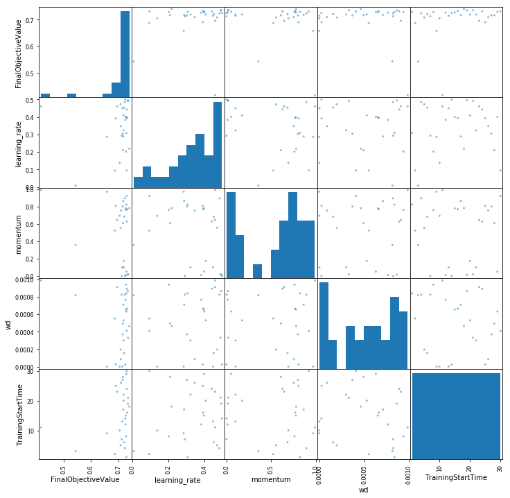

Gluon CIFAR-10 Hyperparameter Tuning
====================================

**ResNet model in Gluon trained with SageMaker Automatic Model Tuning
and Random Search Tuning**

--------------

--------------

*This notebook was created and tested on an ml.m4.xlarge notebook
instance. However, the tuning jobs use multiple ml.p3.8xlarge instances,
meaning re-running this test could cost approximately $400. Please do
not use Cell -> Run All. Certain cell outputs have not been cleared so
that you can see results without having to run the notebook yourself.*

Outline
-------

1. `Background <#Background>`__
2. `Setup <#Setup>`__
3. `Data <#Data>`__
4. `Script <#Script>`__
5. `Train: Initial <#Train:-Initial>`__
6. `Tune: Random <#Tune:-Random>`__
7. `Tune: Automatic Model Tuning <#Tune:-Automatic-Model-Tuning>`__
8. `Wrap-up <#Wrap-up>`__

Background
----------

Selecting the right hyperparameter values for your machine learning
model can be difficult. The right answer is dependent on your data; some
algorithms have many different hyperparameters that can be tweaked; some
are very sensitive to the hyperparameter values selected; and most have
a non-linear relationship between model fit and hyperparameter values.

There are a variety of strategies to select hyperparameter values. Some
scientists use domain knowledge, heuristics, intuition, or manual
experimentation; others use brute force searches; and some build meta
models to predict what performant hyperparameter values may be. But
regardless of the method, it usually requires a specialized skill set.
Meanwhile, most scientists themselves would prefer to be creating new
models rather than endlessly refining an old one.

Amazon SageMaker can ease this process with Automatic Model Tuning. This
technique uses Gaussian Process regression to predict which
hyperparameter values may be most effective at improving fit, and
Bayesian optimization to balance exploring the hyperparameter space (so
that a better predictive model for hyperparameters can be built) and
exploiting specific hyperparameter values when needed.

Other popular methods of hyperparameter optimization include brute force
methods like random search. Despite sounding naive, this is often very
competitive. However, we’ve found SageMaker’s Automatic Model Tuning to
provide better fits in fewer job runs, resulting in a better model with
less time spent and at a lower cost. This notebook will compare the two
methods in more detail.

SageMaker’s Automatic Model Tuning works with SageMaker’s built-in
algorithms, pre-built deep learning frameworks, and the bring your own
algorithm container options. But, for this example, let’s stick with the
MXNet framework, a ResNet-34 convolutional neural network, and the
`CIFAR-10 <https://www.cs.toronto.edu/~kriz/cifar.html>`__ image
dataset. For more background, please see the `MXNet CIFAR-10 example
notebook <https://github.com/awslabs/amazon-sagemaker-examples/blob/master/sagemaker-python-sdk/mxnet_gluon_cifar10/mxnet_cifar10_with_gluon.ipynb>`__.

Setup
-----

Install scikit-image==0.14.2

.. code:: ipython3

    # Install a scikit-image package in the current Jupyter kernel
    import sys
    !{sys.executable} -m pip install scikit-image==0.14.2 

Specify the IAM role for permission to access the dataset in S3 and
SageMaker functionality.

.. code:: ipython3

    import sagemaker
    
    sagemaker_session = sagemaker.Session()
    role = sagemaker.get_execution_role()

Let’s import the necessary libraries.

.. code:: ipython3

    from sagemaker.mxnet import MXNet
    from sagemaker.tuner import IntegerParameter, CategoricalParameter, ContinuousParameter, HyperparameterTuner
    import random_tuner as rt
    import pandas as pd
    import matplotlib.pyplot as plt

--------------

Data
----

We’ll use a helper script to download
`CIFAR-10 <https://www.cs.toronto.edu/~kriz/cifar.html>`__ training data
and sample images. CIFAR-10 consists of 60K 32x32 pixel color images
(50K train, 10K test) evenly distributed across 10 classes.

.. code:: ipython3

    from cifar10_utils import download_training_data
    download_training_data()

Next we’ll use the ``sagemaker.Session.upload_data`` function to upload
our datasets to an S3 location. The return value ``inputs`` identifies
the location – we will use this later when we start the training and
tuning jobs.

.. code:: ipython3

    inputs = sagemaker_session.upload_data(path='data', key_prefix='data/DEMO-gluon-cifar10')
    print('input spec (in this case, just an S3 path): {}'.format(inputs))

--------------

Script
------

We need to provide a training script that can run on the SageMaker
platform. This is idiomatic MXNet code arranged into a few key
functions: \* A ``train()`` function that takes in hyperparameters,
defines our neural net architecture, and trains our network. \* A
``save()`` function that saves our trained network as an MXNet model. \*
Helper functions ``get_data()``, ``get_train_data()``, and
``get_test_data()`` which prepare the CIFAR-10 image data for our
``train()`` function. \* A helper function called ``test()`` which
calculates our accuracy on the holdout datasets. \* Hosting functions
(which we keep for alignment with other MXNet CIFAR-10 notebooks, but
won’t dig into since the focus of this notebook is only on training).

The network itself is a ResNet-34 architecture imported from the `Gluon
Model
Zoo <https://mxnet.incubator.apache.org/versions/master/api/python/gluon/model_zoo.html>`__.

.. code:: ipython3

    !cat 'cifar10.py'

--------------

Train: Initial
--------------

Now that we’ve written our training script, we can submit it as a job to
SageMaker training. Normally, we might test locally to ensure our script
worked (See the `MXNet CIFAR-10 local mode
example <https://github.com/awslabs/amazon-sagemaker-examples/blob/master/sagemaker-python-sdk/mxnet_gluon_cifar10/mxnet_cifar10_local_mode.ipynb>`__),
but since we already know the script works, we’ll skip that step.

Let’s see how our model performs with a naive guess for hyperparameter
values. We’re training our network with stochastic gradient descent
(SGD), which is an iterative method to minimize our training loss by
finding the direction to change our network weights that improves
training loss and then taking a small step in that direction and
repeating. Since we’re using SGD, the three hyperparameters we’ll focus
on will be:

-  ``learning_rate``: which controls how large of steps we take.
-  ``momentum``: which uses information from the direction of our
   previous step to inform our current step.
-  ``wd``: which penalizes weights when they grow too large.

In this case, we’ll set the hyperparameters to MXNet’s default values.

.. code:: ipython3

    m = MXNet('cifar10.py',
              role=role,
              train_instance_count=1,
              train_instance_type='ml.p3.8xlarge',
              framework_version='1.4.1',
              py_version='py3',
              hyperparameters={'batch_size': 1024,
                               'epochs': 50,
                               'learning_rate': 0.01,
                               'momentum': 0.,
                               'wd': 0.})

Now that we’ve constructed our ``MXNet`` object, we can fit it using the
data we uploaded to S3.

.. code:: ipython3

    m.fit(inputs)

As we can see, our accuracy is only about 53% on our validation dataset.
CIFAR-10 can be challenging, but we’d want our accuracy much better than
just over half if users are depending on an accurate prediction.

--------------

Tune: Random
------------

One method of hyperparameter tuning that performs surprisingly well for
how simple it is, is randomly trying a variety of hyperparameter values
within set ranges. So, for this example, we’ve created a helper script
``random_tuner.py`` to help us do this.

We’ll need to supply:

-  A function that trains our MXNet model given a job name and list of
   hyperparameters. Note, ``wait`` is set to false in our ``fit()`` call
   so that we can train multiple jobs at once.
-  A dictionary of hyperparameters where the ones we want to tune are
   defined as one of three types (``ContinuousParameter``,
   ``IntegerParameter``, or ``CategoricalParameter``) and appropriate
   minimum and maximum ranges or a list of possible values are provided.

.. code:: ipython3

    def fit_random(job_name, hyperparameters):
        m = MXNet('cifar10.py',
                  role=role,
                  train_instance_count=1,
                  train_instance_type='ml.p3.8xlarge',
                  framework_version='1.4.1',
                  py_version='py3',
                  hyperparameters=hyperparameters)
        m.fit(inputs, wait=False, job_name=job_name)

.. code:: ipython3

    hyperparameters = {'batch_size': 1024,
                       'epochs': 50,
                       'learning_rate': rt.ContinuousParameter(0.001, 0.5),
                       'momentum': rt.ContinuousParameter(0., 0.99),
                       'wd': rt.ContinuousParameter(0., 0.001)}

Next, we can kick off our random search. We’ve defined the total number
of training jobs to be 120. This is a large amount and drives most of
the cost of this notebook. Also, we’ve specified up to 8 jobs to be run
in parallel. This exceeds the default concurrent instance limit for
ml.p3.8xlarge instances. If you’re just testing this notebook out,
decreasing both values will control costs and allow you to complete
successfully without requiring a service limit increase.

*Note, this step may take up to 2 hours to complete. Even if you loose
connection with the notebook in the middle, as long as the notebook
instance continues to run, ``jobs`` should still be successfully created
for future use.*

.. code:: ipython3

    %%time
    
    jobs = rt.random_search(fit_random,
                            hyperparameters,
                            max_jobs=120,
                            max_parallel_jobs=8)

Once our random search completes, we’ll want to compare our training
jobs (which may take a few extra minutes to finish) in order to
understand how our objective metric (% accuracy on our validation
dataset) varies by hyperparameter values. In this case, our helper
function includes two functions.

-  ``get_metrics()`` scrapes the CloudWatch logs for our training jobs
   and uses a regex to return any reported values of our objective
   metric.
-  ``table_metrics()`` joins on the hyperparameter values for each job,
   grabs the ending objective value, and converts the result to a Pandas
   DataFrame.

.. code:: ipython3

    random_metrics = rt.table_metrics(jobs, rt.get_metrics(jobs, 'validation: accuracy=([0-9\\.]+)'))
    random_metrics.sort_values(['objective'], ascending=False)

.. raw:: html

    

    
    <table border="1" class="dataframe">
      <thead>
        <tr style="text-align: right;">
          <th></th>
          <th>epochs</th>
          <th>wd</th>
          <th>batch_size</th>
          <th>objective</th>
          <th>learning_rate</th>
          <th>job_number</th>
          <th>momentum</th>
        </tr>
      </thead>
      <tbody>
        <tr>
          <th>random-hp-2018-07-08-20-06-10-189-17</th>
          <td>50</td>
          <td>0.000539</td>
          <td>1024</td>
          <td>0.736938</td>
          <td>0.346114</td>
          <td>17</td>
          <td>0.231219</td>
        </tr>
        <tr>
          <th>random-hp-2018-07-08-20-06-10-189-106</th>
          <td>50</td>
          <td>0.000658</td>
          <td>1024</td>
          <td>0.736572</td>
          <td>0.203518</td>
          <td>106</td>
          <td>0.808102</td>
        </tr>
        <tr>
          <th>random-hp-2018-07-08-20-06-10-189-78</th>
          <td>50</td>
          <td>0.000955</td>
          <td>1024</td>
          <td>0.735352</td>
          <td>0.044036</td>
          <td>78</td>
          <td>0.962561</td>
        </tr>
        <tr>
          <th>random-hp-2018-07-08-20-06-10-189-15</th>
          <td>50</td>
          <td>0.000304</td>
          <td>1024</td>
          <td>0.733887</td>
          <td>0.187376</td>
          <td>15</td>
          <td>0.954231</td>
        </tr>
        <tr>
          <th>random-hp-2018-07-08-20-06-10-189-16</th>
          <td>50</td>
          <td>0.000849</td>
          <td>1024</td>
          <td>0.733643</td>
          <td>0.381012</td>
          <td>16</td>
          <td>0.049903</td>
        </tr>
        <tr>
          <th>random-hp-2018-07-08-20-06-10-189-117</th>
          <td>50</td>
          <td>0.000708</td>
          <td>1024</td>
          <td>0.732544</td>
          <td>0.314118</td>
          <td>117</td>
          <td>0.817854</td>
        </tr>
        <tr>
          <th>random-hp-2018-07-08-20-06-10-189-70</th>
          <td>50</td>
          <td>0.000115</td>
          <td>1024</td>
          <td>0.732178</td>
          <td>0.396326</td>
          <td>70</td>
          <td>0.510912</td>
        </tr>
        <tr>
          <th>random-hp-2018-07-08-20-06-10-189-28</th>
          <td>50</td>
          <td>0.000593</td>
          <td>1024</td>
          <td>0.731689</td>
          <td>0.398318</td>
          <td>28</td>
          <td>0.394819</td>
        </tr>
        <tr>
          <th>random-hp-2018-07-08-20-06-10-189-2</th>
          <td>50</td>
          <td>0.000155</td>
          <td>1024</td>
          <td>0.731689</td>
          <td>0.144946</td>
          <td>2</td>
          <td>0.924371</td>
        </tr>
        <tr>
          <th>random-hp-2018-07-08-20-06-10-189-81</th>
          <td>50</td>
          <td>0.000810</td>
          <td>1024</td>
          <td>0.730103</td>
          <td>0.351694</td>
          <td>81</td>
          <td>0.731069</td>
        </tr>
        <tr>
          <th>random-hp-2018-07-08-20-06-10-189-104</th>
          <td>50</td>
          <td>0.000001</td>
          <td>1024</td>
          <td>0.729980</td>
          <td>0.450279</td>
          <td>104</td>
          <td>0.100731</td>
        </tr>
        <tr>
          <th>random-hp-2018-07-08-20-06-10-189-91</th>
          <td>50</td>
          <td>0.000324</td>
          <td>1024</td>
          <td>0.729980</td>
          <td>0.289774</td>
          <td>91</td>
          <td>0.705745</td>
        </tr>
        <tr>
          <th>random-hp-2018-07-08-20-06-10-189-80</th>
          <td>50</td>
          <td>0.000307</td>
          <td>1024</td>
          <td>0.729858</td>
          <td>0.242544</td>
          <td>80</td>
          <td>0.544332</td>
        </tr>
        <tr>
          <th>random-hp-2018-07-08-20-06-10-189-4</th>
          <td>50</td>
          <td>0.000478</td>
          <td>1024</td>
          <td>0.729736</td>
          <td>0.158774</td>
          <td>4</td>
          <td>0.793798</td>
        </tr>
        <tr>
          <th>random-hp-2018-07-08-20-06-10-189-20</th>
          <td>50</td>
          <td>0.000526</td>
          <td>1024</td>
          <td>0.729736</td>
          <td>0.394191</td>
          <td>20</td>
          <td>0.826365</td>
        </tr>
        <tr>
          <th>random-hp-2018-07-08-20-06-10-189-25</th>
          <td>50</td>
          <td>0.000636</td>
          <td>1024</td>
          <td>0.729126</td>
          <td>0.293751</td>
          <td>25</td>
          <td>0.304069</td>
        </tr>
        <tr>
          <th>random-hp-2018-07-08-20-06-10-189-40</th>
          <td>50</td>
          <td>0.000565</td>
          <td>1024</td>
          <td>0.728271</td>
          <td>0.150810</td>
          <td>40</td>
          <td>0.795445</td>
        </tr>
        <tr>
          <th>random-hp-2018-07-08-20-06-10-189-44</th>
          <td>50</td>
          <td>0.000305</td>
          <td>1024</td>
          <td>0.728271</td>
          <td>0.222650</td>
          <td>44</td>
          <td>0.744344</td>
        </tr>
        <tr>
          <th>random-hp-2018-07-08-20-06-10-189-77</th>
          <td>50</td>
          <td>0.000308</td>
          <td>1024</td>
          <td>0.727783</td>
          <td>0.412024</td>
          <td>77</td>
          <td>0.049680</td>
        </tr>
        <tr>
          <th>random-hp-2018-07-08-20-06-10-189-92</th>
          <td>50</td>
          <td>0.000830</td>
          <td>1024</td>
          <td>0.727295</td>
          <td>0.401129</td>
          <td>92</td>
          <td>0.514144</td>
        </tr>
        <tr>
          <th>random-hp-2018-07-08-20-06-10-189-101</th>
          <td>50</td>
          <td>0.000999</td>
          <td>1024</td>
          <td>0.726807</td>
          <td>0.299126</td>
          <td>101</td>
          <td>0.545094</td>
        </tr>
        <tr>
          <th>random-hp-2018-07-08-20-06-10-189-51</th>
          <td>50</td>
          <td>0.000371</td>
          <td>1024</td>
          <td>0.726074</td>
          <td>0.413220</td>
          <td>51</td>
          <td>0.472064</td>
        </tr>
        <tr>
          <th>random-hp-2018-07-08-20-06-10-189-10</th>
          <td>50</td>
          <td>0.000663</td>
          <td>1024</td>
          <td>0.726074</td>
          <td>0.266806</td>
          <td>10</td>
          <td>0.671921</td>
        </tr>
        <tr>
          <th>random-hp-2018-07-08-20-06-10-189-79</th>
          <td>50</td>
          <td>0.000176</td>
          <td>1024</td>
          <td>0.726074</td>
          <td>0.204075</td>
          <td>79</td>
          <td>0.921536</td>
        </tr>
        <tr>
          <th>random-hp-2018-07-08-20-06-10-189-66</th>
          <td>50</td>
          <td>0.000502</td>
          <td>1024</td>
          <td>0.724731</td>
          <td>0.269668</td>
          <td>66</td>
          <td>0.951994</td>
        </tr>
        <tr>
          <th>random-hp-2018-07-08-20-06-10-189-21</th>
          <td>50</td>
          <td>0.000166</td>
          <td>1024</td>
          <td>0.724487</td>
          <td>0.262985</td>
          <td>21</td>
          <td>0.726774</td>
        </tr>
        <tr>
          <th>random-hp-2018-07-08-20-06-10-189-75</th>
          <td>50</td>
          <td>0.000609</td>
          <td>1024</td>
          <td>0.724243</td>
          <td>0.239251</td>
          <td>75</td>
          <td>0.336703</td>
        </tr>
        <tr>
          <th>random-hp-2018-07-08-20-06-10-189-85</th>
          <td>50</td>
          <td>0.000403</td>
          <td>1024</td>
          <td>0.723267</td>
          <td>0.140760</td>
          <td>85</td>
          <td>0.790066</td>
        </tr>
        <tr>
          <th>random-hp-2018-07-08-20-06-10-189-105</th>
          <td>50</td>
          <td>0.000472</td>
          <td>1024</td>
          <td>0.723145</td>
          <td>0.276357</td>
          <td>105</td>
          <td>0.608669</td>
        </tr>
        <tr>
          <th>random-hp-2018-07-08-20-06-10-189-65</th>
          <td>50</td>
          <td>0.000160</td>
          <td>1024</td>
          <td>0.722900</td>
          <td>0.147761</td>
          <td>65</td>
          <td>0.745701</td>
        </tr>
        <tr>
          <th>...</th>
          <td>...</td>
          <td>...</td>
          <td>...</td>
          <td>...</td>
          <td>...</td>
          <td>...</td>
          <td>...</td>
        </tr>
        <tr>
          <th>random-hp-2018-07-08-20-06-10-189-96</th>
          <td>50</td>
          <td>0.000215</td>
          <td>1024</td>
          <td>0.676025</td>
          <td>0.142288</td>
          <td>96</td>
          <td>0.153832</td>
        </tr>
        <tr>
          <th>random-hp-2018-07-08-20-06-10-189-0</th>
          <td>50</td>
          <td>0.000354</td>
          <td>1024</td>
          <td>0.671997</td>
          <td>0.030509</td>
          <td>0</td>
          <td>0.861382</td>
        </tr>
        <tr>
          <th>random-hp-2018-07-08-20-06-10-189-112</th>
          <td>50</td>
          <td>0.000010</td>
          <td>1024</td>
          <td>0.671997</td>
          <td>0.135736</td>
          <td>112</td>
          <td>0.232466</td>
        </tr>
        <tr>
          <th>random-hp-2018-07-08-20-06-10-189-103</th>
          <td>50</td>
          <td>0.000895</td>
          <td>1024</td>
          <td>0.671265</td>
          <td>0.094724</td>
          <td>103</td>
          <td>0.477036</td>
        </tr>
        <tr>
          <th>random-hp-2018-07-08-20-06-10-189-27</th>
          <td>50</td>
          <td>0.000418</td>
          <td>1024</td>
          <td>0.670898</td>
          <td>0.051749</td>
          <td>27</td>
          <td>0.619780</td>
        </tr>
        <tr>
          <th>random-hp-2018-07-08-20-06-10-189-53</th>
          <td>50</td>
          <td>0.000646</td>
          <td>1024</td>
          <td>0.667236</td>
          <td>0.064741</td>
          <td>53</td>
          <td>0.519927</td>
        </tr>
        <tr>
          <th>random-hp-2018-07-08-20-06-10-189-39</th>
          <td>50</td>
          <td>0.000864</td>
          <td>1024</td>
          <td>0.665771</td>
          <td>0.147716</td>
          <td>39</td>
          <td>0.013635</td>
        </tr>
        <tr>
          <th>random-hp-2018-07-08-20-06-10-189-8</th>
          <td>50</td>
          <td>0.000274</td>
          <td>1024</td>
          <td>0.665649</td>
          <td>0.093428</td>
          <td>8</td>
          <td>0.490986</td>
        </tr>
        <tr>
          <th>random-hp-2018-07-08-20-06-10-189-116</th>
          <td>50</td>
          <td>0.000075</td>
          <td>1024</td>
          <td>0.660278</td>
          <td>0.099005</td>
          <td>116</td>
          <td>0.364318</td>
        </tr>
        <tr>
          <th>random-hp-2018-07-08-20-06-10-189-62</th>
          <td>50</td>
          <td>0.000040</td>
          <td>1024</td>
          <td>0.658936</td>
          <td>0.114799</td>
          <td>62</td>
          <td>0.237339</td>
        </tr>
        <tr>
          <th>random-hp-2018-07-08-20-06-10-189-54</th>
          <td>50</td>
          <td>0.000137</td>
          <td>1024</td>
          <td>0.658569</td>
          <td>0.117171</td>
          <td>54</td>
          <td>0.121602</td>
        </tr>
        <tr>
          <th>random-hp-2018-07-08-20-06-10-189-52</th>
          <td>50</td>
          <td>0.000580</td>
          <td>1024</td>
          <td>0.658447</td>
          <td>0.074876</td>
          <td>52</td>
          <td>0.431588</td>
        </tr>
        <tr>
          <th>random-hp-2018-07-08-20-06-10-189-69</th>
          <td>50</td>
          <td>0.000094</td>
          <td>1024</td>
          <td>0.656128</td>
          <td>0.122641</td>
          <td>69</td>
          <td>0.118055</td>
        </tr>
        <tr>
          <th>random-hp-2018-07-08-20-06-10-189-59</th>
          <td>50</td>
          <td>0.000820</td>
          <td>1024</td>
          <td>0.653442</td>
          <td>0.116648</td>
          <td>59</td>
          <td>0.006298</td>
        </tr>
        <tr>
          <th>random-hp-2018-07-08-20-06-10-189-48</th>
          <td>50</td>
          <td>0.000049</td>
          <td>1024</td>
          <td>0.652466</td>
          <td>0.048692</td>
          <td>48</td>
          <td>0.516305</td>
        </tr>
        <tr>
          <th>random-hp-2018-07-08-20-06-10-189-100</th>
          <td>50</td>
          <td>0.000995</td>
          <td>1024</td>
          <td>0.641968</td>
          <td>0.473007</td>
          <td>100</td>
          <td>0.063985</td>
        </tr>
        <tr>
          <th>random-hp-2018-07-08-20-06-10-189-64</th>
          <td>50</td>
          <td>0.000209</td>
          <td>1024</td>
          <td>0.640137</td>
          <td>0.465702</td>
          <td>64</td>
          <td>0.928012</td>
        </tr>
        <tr>
          <th>random-hp-2018-07-08-20-06-10-189-86</th>
          <td>50</td>
          <td>0.000641</td>
          <td>1024</td>
          <td>0.638550</td>
          <td>0.077085</td>
          <td>86</td>
          <td>0.130483</td>
        </tr>
        <tr>
          <th>random-hp-2018-07-08-20-06-10-189-82</th>
          <td>50</td>
          <td>0.000761</td>
          <td>1024</td>
          <td>0.638428</td>
          <td>0.073119</td>
          <td>82</td>
          <td>0.193865</td>
        </tr>
        <tr>
          <th>random-hp-2018-07-08-20-06-10-189-9</th>
          <td>50</td>
          <td>0.000321</td>
          <td>1024</td>
          <td>0.629272</td>
          <td>0.049321</td>
          <td>9</td>
          <td>0.335158</td>
        </tr>
        <tr>
          <th>random-hp-2018-07-08-20-06-10-189-58</th>
          <td>50</td>
          <td>0.000147</td>
          <td>1024</td>
          <td>0.617188</td>
          <td>0.027019</td>
          <td>58</td>
          <td>0.584695</td>
        </tr>
        <tr>
          <th>random-hp-2018-07-08-20-06-10-189-12</th>
          <td>50</td>
          <td>0.000417</td>
          <td>1024</td>
          <td>0.615845</td>
          <td>0.045045</td>
          <td>12</td>
          <td>0.261383</td>
        </tr>
        <tr>
          <th>random-hp-2018-07-08-20-06-10-189-7</th>
          <td>50</td>
          <td>0.000642</td>
          <td>1024</td>
          <td>0.606812</td>
          <td>0.033248</td>
          <td>7</td>
          <td>0.465235</td>
        </tr>
        <tr>
          <th>random-hp-2018-07-08-20-06-10-189-93</th>
          <td>50</td>
          <td>0.000527</td>
          <td>1024</td>
          <td>0.605591</td>
          <td>0.043833</td>
          <td>93</td>
          <td>0.199631</td>
        </tr>
        <tr>
          <th>random-hp-2018-07-08-20-06-10-189-95</th>
          <td>50</td>
          <td>0.000005</td>
          <td>1024</td>
          <td>0.568848</td>
          <td>0.380469</td>
          <td>95</td>
          <td>0.948769</td>
        </tr>
        <tr>
          <th>random-hp-2018-07-08-20-06-10-189-60</th>
          <td>50</td>
          <td>0.000769</td>
          <td>1024</td>
          <td>0.557129</td>
          <td>0.018272</td>
          <td>60</td>
          <td>0.184786</td>
        </tr>
        <tr>
          <th>random-hp-2018-07-08-20-06-10-189-84</th>
          <td>50</td>
          <td>0.000446</td>
          <td>1024</td>
          <td>0.530518</td>
          <td>0.005893</td>
          <td>84</td>
          <td>0.299194</td>
        </tr>
        <tr>
          <th>random-hp-2018-07-08-20-06-10-189-68</th>
          <td>50</td>
          <td>0.000088</td>
          <td>1024</td>
          <td>0.511475</td>
          <td>0.309750</td>
          <td>68</td>
          <td>0.968020</td>
        </tr>
        <tr>
          <th>random-hp-2018-07-08-20-06-10-189-83</th>
          <td>50</td>
          <td>0.000377</td>
          <td>1024</td>
          <td>0.233398</td>
          <td>0.466878</td>
          <td>83</td>
          <td>0.152383</td>
        </tr>
        <tr>
          <th>random-hp-2018-07-08-20-06-10-189-99</th>
          <td>50</td>
          <td>0.000059</td>
          <td>1024</td>
          <td>NaN</td>
          <td>0.310720</td>
          <td>99</td>
          <td>0.817482</td>
        </tr>
      </tbody>
    </table>
    
120 rows × 7 columns

    

As we can see, there’s a huge variation in percent accuracy. Had we
initially (unknowingly) set our learning rate near 0.5, momentum at
0.15, and weight decay to 0.0004, we would have an accuracy just over
20% (this is particularly bad considering random guessing would produce
10% accuracy).

But, we also found many successful hyperparameter value combinations,
and reached a peak validation accuracy of 73.7%. Note, this peak job
occurs relatively early in our search but, due to randomness, our next
best objective value occurred 89 jobs later. The actual peak could have
occurred anywhere within the 120 jobs and will change across multiple
runs. We can see that with hyperparameter tuning our accuracy is well
above the default value baseline of 53%.

To get a rough understanding of how the hyperparameter values relate to
one another and the objective metric, let’s quickly plot them.

.. code:: ipython3

    pd.plotting.scatter_matrix(random_metrics[['objective',
                                               'learning_rate',
                                               'momentum',
                                               'wd',
                                               'job_number']],
                               figsize=(12, 12))
    plt.show()

The hyperparameter’s correlation with themselves and over time is
essentially non-existent (which makes sense because we selected their
values randomly). However, in general, we notice:

-  Very low ``learning_rate``\ s tend to do worse, although too high
   seems to add variability.
-  ``momentum`` seems to have less impact, with potentially a non-linear
   sweet spot near 0.8.
-  ``wd`` has a less consistent impact on accuracy than the other two
   hyperparameters.

--------------

Tune: Automatic Model Tuning
----------------------------

Now, let’s try using Amazon SageMaker’s Automatic Model Tuning. Rather
than selecting hyperparameter values randomly, SageMaker builds a second
machine learning model which, based on previous hyperparameter and
objective metric values, predicts new values that might yield an
improvement. This should allow us to train better models, faster and
cheaper.

We’ll use the tuner functionality already built-in to the SageMaker
Python SDK. Let’s start by defining a new ``MXNet`` estimator.

.. code:: ipython3

    mt = MXNet('cifar10.py',
               role=role,
               train_instance_count=1,
               train_instance_type='ml.p3.8xlarge',
               framework_version='1.4.1',
               py_version='py3',
               hyperparameters={'batch_size': 1024,
                                'epochs': 50})

Now we can define our ranges (these take the same arguments as the
classes from ``random_tuner``).

.. code:: ipython3

    hyperparameter_ranges = {'learning_rate': ContinuousParameter(0.001, 0.5),
                             'momentum': ContinuousParameter(0., 0.99),
                             'wd': ContinuousParameter(0., 0.001)}

Now, we’ll define our objective metric and provide the regex needed to
scrape it from our training jobs’ CloudWatch logs.

.. code:: ipython3

    objective_metric_name = 'Validation-accuracy'
    metric_definitions = [{'Name': 'Validation-accuracy',
                           'Regex': 'validation: accuracy=([0-9\\.]+)'}]

Now we can create a ``HyperparameterTuner`` object and fit it by
pointing to our data in S3. This kicks our tuning job off in the
background.

Notice, we specify a much smaller number of total jobs, and a smaller
number of parallel jobs. Since our model uses previous training job runs
to predict where to test next, we get better results (although it takes
longer) when setting this to a smaller value.

.. code:: ipython3

    tuner = HyperparameterTuner(mt,
                                objective_metric_name,
                                hyperparameter_ranges,
                                metric_definitions,
                                max_jobs=30,
                                max_parallel_jobs=2)

.. code:: ipython3

    tuner.fit(inputs)

*You will be unable to successfully run the following cells until the
tuning job completes. This step may take up to 2 hours.*

Once the tuning job finishes, we can bring in a table of metrics.

.. code:: ipython3

    bayes_metrics = sagemaker.HyperparameterTuningJobAnalytics(tuner._current_job_name).dataframe()
    bayes_metrics.sort_values(['FinalObjectiveValue'], ascending=False)

.. raw:: html

    

    
    <table border="1" class="dataframe">
      <thead>
        <tr style="text-align: right;">
          <th></th>
          <th>FinalObjectiveValue</th>
          <th>TrainingElapsedTimeSeconds</th>
          <th>TrainingEndTime</th>
          <th>TrainingJobName</th>
          <th>TrainingJobStatus</th>
          <th>TrainingStartTime</th>
          <th>learning_rate</th>
          <th>momentum</th>
          <th>wd</th>
        </tr>
      </thead>
      <tbody>
        <tr>
          <th>12</th>
          <td>0.739868</td>
          <td>449.0</td>
          <td>2018-07-08 06:32:39+00:00</td>
          <td>sagemaker-mxnet-180708-0457-018-0672e23c</td>
          <td>Completed</td>
          <td>2018-07-08 06:25:10+00:00</td>
          <td>0.218998</td>
          <td>7.807712e-01</td>
          <td>0.000463</td>
        </tr>
        <tr>
          <th>8</th>
          <td>0.735352</td>
          <td>484.0</td>
          <td>2018-07-08 06:53:18+00:00</td>
          <td>sagemaker-mxnet-180708-0457-022-602fe997</td>
          <td>Completed</td>
          <td>2018-07-08 06:45:14+00:00</td>
          <td>0.491950</td>
          <td>2.074798e-02</td>
          <td>0.000330</td>
        </tr>
        <tr>
          <th>11</th>
          <td>0.734741</td>
          <td>527.0</td>
          <td>2018-07-08 06:42:58+00:00</td>
          <td>sagemaker-mxnet-180708-0457-019-510b97e9</td>
          <td>Completed</td>
          <td>2018-07-08 06:34:11+00:00</td>
          <td>0.495178</td>
          <td>1.530975e-02</td>
          <td>0.000864</td>
        </tr>
        <tr>
          <th>14</th>
          <td>0.732422</td>
          <td>484.0</td>
          <td>2018-07-08 06:22:48+00:00</td>
          <td>sagemaker-mxnet-180708-0457-016-3c3a8322</td>
          <td>Completed</td>
          <td>2018-07-08 06:14:44+00:00</td>
          <td>0.394037</td>
          <td>7.685146e-01</td>
          <td>0.000663</td>
        </tr>
        <tr>
          <th>7</th>
          <td>0.731079</td>
          <td>486.0</td>
          <td>2018-07-08 07:03:57+00:00</td>
          <td>sagemaker-mxnet-180708-0457-023-feac622d</td>
          <td>Completed</td>
          <td>2018-07-08 06:55:51+00:00</td>
          <td>0.443138</td>
          <td>6.272739e-01</td>
          <td>0.000891</td>
        </tr>
        <tr>
          <th>0</th>
          <td>0.730591</td>
          <td>423.0</td>
          <td>2018-07-08 07:35:16+00:00</td>
          <td>sagemaker-mxnet-180708-0457-030-b96d5377</td>
          <td>Completed</td>
          <td>2018-07-08 07:28:13+00:00</td>
          <td>0.095172</td>
          <td>9.210969e-01</td>
          <td>0.000408</td>
        </tr>
        <tr>
          <th>1</th>
          <td>0.729370</td>
          <td>468.0</td>
          <td>2018-07-08 07:35:32+00:00</td>
          <td>sagemaker-mxnet-180708-0457-029-25c7583d</td>
          <td>Completed</td>
          <td>2018-07-08 07:27:44+00:00</td>
          <td>0.400276</td>
          <td>5.187911e-02</td>
          <td>0.000631</td>
        </tr>
        <tr>
          <th>28</th>
          <td>0.729248</td>
          <td>485.0</td>
          <td>2018-07-08 05:07:29+00:00</td>
          <td>sagemaker-mxnet-180708-0457-002-65adfb1f</td>
          <td>Completed</td>
          <td>2018-07-08 04:59:24+00:00</td>
          <td>0.308497</td>
          <td>8.221134e-01</td>
          <td>0.000838</td>
        </tr>
        <tr>
          <th>22</th>
          <td>0.728027</td>
          <td>471.0</td>
          <td>2018-07-08 05:40:08+00:00</td>
          <td>sagemaker-mxnet-180708-0457-008-a1ecd004</td>
          <td>Completed</td>
          <td>2018-07-08 05:32:17+00:00</td>
          <td>0.202243</td>
          <td>7.614848e-01</td>
          <td>0.000937</td>
        </tr>
        <tr>
          <th>15</th>
          <td>0.727173</td>
          <td>490.0</td>
          <td>2018-07-08 06:19:35+00:00</td>
          <td>sagemaker-mxnet-180708-0457-015-305bc5d4</td>
          <td>Completed</td>
          <td>2018-07-08 06:11:25+00:00</td>
          <td>0.399027</td>
          <td>7.784146e-01</td>
          <td>0.000653</td>
        </tr>
        <tr>
          <th>18</th>
          <td>0.726196</td>
          <td>427.0</td>
          <td>2018-07-08 06:02:44+00:00</td>
          <td>sagemaker-mxnet-180708-0457-012-7dad3bd5</td>
          <td>Completed</td>
          <td>2018-07-08 05:55:37+00:00</td>
          <td>0.383464</td>
          <td>1.314750e-02</td>
          <td>0.000765</td>
        </tr>
        <tr>
          <th>16</th>
          <td>0.725098</td>
          <td>436.0</td>
          <td>2018-07-08 06:12:13+00:00</td>
          <td>sagemaker-mxnet-180708-0457-014-031a27ff</td>
          <td>Completed</td>
          <td>2018-07-08 06:04:57+00:00</td>
          <td>0.499998</td>
          <td>1.880845e-07</td>
          <td>0.000024</td>
        </tr>
        <tr>
          <th>26</th>
          <td>0.723877</td>
          <td>508.0</td>
          <td>2018-07-08 05:18:42+00:00</td>
          <td>sagemaker-mxnet-180708-0457-004-4cdcdee1</td>
          <td>Completed</td>
          <td>2018-07-08 05:10:14+00:00</td>
          <td>0.485280</td>
          <td>8.946790e-01</td>
          <td>0.000822</td>
        </tr>
        <tr>
          <th>24</th>
          <td>0.720825</td>
          <td>532.0</td>
          <td>2018-07-08 05:29:59+00:00</td>
          <td>sagemaker-mxnet-180708-0457-006-8a90d72d</td>
          <td>Completed</td>
          <td>2018-07-08 05:21:07+00:00</td>
          <td>0.453483</td>
          <td>6.834462e-01</td>
          <td>0.000155</td>
        </tr>
        <tr>
          <th>10</th>
          <td>0.719360</td>
          <td>457.0</td>
          <td>2018-07-08 06:42:14+00:00</td>
          <td>sagemaker-mxnet-180708-0457-020-8b0ac13f</td>
          <td>Completed</td>
          <td>2018-07-08 06:34:37+00:00</td>
          <td>0.408935</td>
          <td>1.748506e-01</td>
          <td>0.000529</td>
        </tr>
        <tr>
          <th>9</th>
          <td>0.719238</td>
          <td>426.0</td>
          <td>2018-07-08 06:52:40+00:00</td>
          <td>sagemaker-mxnet-180708-0457-021-9752b883</td>
          <td>Completed</td>
          <td>2018-07-08 06:45:34+00:00</td>
          <td>0.323677</td>
          <td>1.015553e-01</td>
          <td>0.000299</td>
        </tr>
        <tr>
          <th>13</th>
          <td>0.717773</td>
          <td>515.0</td>
          <td>2018-07-08 06:30:54+00:00</td>
          <td>sagemaker-mxnet-180708-0457-017-40ce6e41</td>
          <td>Completed</td>
          <td>2018-07-08 06:22:19+00:00</td>
          <td>0.288515</td>
          <td>8.637047e-01</td>
          <td>0.000709</td>
        </tr>
        <tr>
          <th>2</th>
          <td>0.716675</td>
          <td>497.0</td>
          <td>2018-07-08 07:25:28+00:00</td>
          <td>sagemaker-mxnet-180708-0457-028-0fd8fcda</td>
          <td>Completed</td>
          <td>2018-07-08 07:17:11+00:00</td>
          <td>0.210008</td>
          <td>6.103743e-01</td>
          <td>0.000493</td>
        </tr>
        <tr>
          <th>3</th>
          <td>0.715942</td>
          <td>530.0</td>
          <td>2018-07-08 07:25:56+00:00</td>
          <td>sagemaker-mxnet-180708-0457-027-99e8ad93</td>
          <td>Completed</td>
          <td>2018-07-08 07:17:06+00:00</td>
          <td>0.303875</td>
          <td>8.004766e-01</td>
          <td>0.000370</td>
        </tr>
        <tr>
          <th>17</th>
          <td>0.714722</td>
          <td>440.0</td>
          <td>2018-07-08 06:08:50+00:00</td>
          <td>sagemaker-mxnet-180708-0457-013-9338d9e2</td>
          <td>Completed</td>
          <td>2018-07-08 06:01:30+00:00</td>
          <td>0.449889</td>
          <td>1.005885e-01</td>
          <td>0.000002</td>
        </tr>
        <tr>
          <th>23</th>
          <td>0.712402</td>
          <td>473.0</td>
          <td>2018-07-08 05:39:19+00:00</td>
          <td>sagemaker-mxnet-180708-0457-007-8c6d6369</td>
          <td>Completed</td>
          <td>2018-07-08 05:31:26+00:00</td>
          <td>0.293129</td>
          <td>0.000000e+00</td>
          <td>0.000823</td>
        </tr>
        <tr>
          <th>4</th>
          <td>0.709473</td>
          <td>425.0</td>
          <td>2018-07-08 07:13:34+00:00</td>
          <td>sagemaker-mxnet-180708-0457-026-d328bcb0</td>
          <td>Completed</td>
          <td>2018-07-08 07:06:29+00:00</td>
          <td>0.347373</td>
          <td>7.542925e-01</td>
          <td>0.000085</td>
        </tr>
        <tr>
          <th>25</th>
          <td>0.708130</td>
          <td>504.0</td>
          <td>2018-07-08 05:29:14+00:00</td>
          <td>sagemaker-mxnet-180708-0457-005-6644667e</td>
          <td>Completed</td>
          <td>2018-07-08 05:20:50+00:00</td>
          <td>0.472519</td>
          <td>5.562326e-01</td>
          <td>0.000195</td>
        </tr>
        <tr>
          <th>20</th>
          <td>0.704956</td>
          <td>493.0</td>
          <td>2018-07-08 05:50:56+00:00</td>
          <td>sagemaker-mxnet-180708-0457-010-b43d406a</td>
          <td>Completed</td>
          <td>2018-07-08 05:42:43+00:00</td>
          <td>0.138131</td>
          <td>6.934573e-01</td>
          <td>0.000000</td>
        </tr>
        <tr>
          <th>6</th>
          <td>0.695679</td>
          <td>468.0</td>
          <td>2018-07-08 07:03:36+00:00</td>
          <td>sagemaker-mxnet-180708-0457-024-a1a9261a</td>
          <td>Completed</td>
          <td>2018-07-08 06:55:48+00:00</td>
          <td>0.460894</td>
          <td>6.460432e-01</td>
          <td>0.000909</td>
        </tr>
        <tr>
          <th>5</th>
          <td>0.690430</td>
          <td>516.0</td>
          <td>2018-07-08 07:15:03+00:00</td>
          <td>sagemaker-mxnet-180708-0457-025-bd0557c9</td>
          <td>Completed</td>
          <td>2018-07-08 07:06:27+00:00</td>
          <td>0.392321</td>
          <td>8.076493e-01</td>
          <td>0.000025</td>
        </tr>
        <tr>
          <th>29</th>
          <td>0.687378</td>
          <td>522.0</td>
          <td>2018-07-08 05:08:11+00:00</td>
          <td>sagemaker-mxnet-180708-0457-001-cb6d6b71</td>
          <td>Completed</td>
          <td>2018-07-08 04:59:29+00:00</td>
          <td>0.094162</td>
          <td>5.240358e-01</td>
          <td>0.000551</td>
        </tr>
        <tr>
          <th>21</th>
          <td>0.658325</td>
          <td>615.0</td>
          <td>2018-07-08 05:52:55+00:00</td>
          <td>sagemaker-mxnet-180708-0457-009-f12240b7</td>
          <td>Completed</td>
          <td>2018-07-08 05:42:40+00:00</td>
          <td>0.285951</td>
          <td>9.703842e-01</td>
          <td>0.000000</td>
        </tr>
        <tr>
          <th>27</th>
          <td>0.544189</td>
          <td>478.0</td>
          <td>2018-07-08 05:17:47+00:00</td>
          <td>sagemaker-mxnet-180708-0457-003-47aaa565</td>
          <td>Completed</td>
          <td>2018-07-08 05:09:49+00:00</td>
          <td>0.007274</td>
          <td>3.568501e-01</td>
          <td>0.000816</td>
        </tr>
        <tr>
          <th>19</th>
          <td>0.417725</td>
          <td>374.0</td>
          <td>2018-07-08 05:59:31+00:00</td>
          <td>sagemaker-mxnet-180708-0457-011-492642e3</td>
          <td>Completed</td>
          <td>2018-07-08 05:53:17+00:00</td>
          <td>0.460787</td>
          <td>9.900000e-01</td>
          <td>0.000985</td>
        </tr>
      </tbody>
    </table>
    

Looking at our results, we can see that, with one fourth the total
training jobs, SageMaker’s Automatic Model Tuning has produced a model
with better accuracy 74% than our random search. In addition, there’s no
guarantee that the effectiveness of random search wouldn’t change over
subsequent runs.

Let’s compare our hyperparameter’s relationship to eachother and the
objective metric.

.. code:: ipython3

    pd.plotting.scatter_matrix(pd.concat([bayes_metrics[['FinalObjectiveValue',
                                                         'learning_rate',
                                                         'momentum',
                                                         'wd']],
                                          bayes_metrics['TrainingStartTime'].rank()],
                               axis=1),
                               figsize=(12, 12))
    plt.show()

We can see that: \* There’s a range of reasonably good values for
``learning_rate``, ``momentum``, and ``wd``, but there seem to be some
very bad performers at both ends of the spectrum. \* Later training jobs
performed consistently better than early ones (SageMaker’s Automatic
Model Tuning was learning and effectively exploring the space). \* There
appears to be somewhat less of a random relationship between the
hyperparameter values our meta-model approach tested. This aligns with
the knowledge that these hyperparameters are connected and that changing
one can be offset by changing another.

--------------

Wrap-up
-------

In this notebook, we saw the importance of hyperparameter tuning and
discovered how much more effective Amazon SageMaker Automatic Model
Tuning can be than random search. We could extend this example by
testing another brute force method like grid search, tuning additional
hyperparameters, using this first round of hyperparameter tuning to
inform a secondary round of hyperparameter tuning where ranges have been
narrowed down further, or applying this same comparison to your own
problem.

For more information on using SageMaker’s Automatic Model Tuning, see
our other `example
notebooks <https://github.com/awslabs/amazon-sagemaker-examples/tree/master/hyperparameter_tuning>`__
and
`documentation <https://docs.aws.amazon.com/sagemaker/latest/dg/automatic-model-tuning.html>`__.
