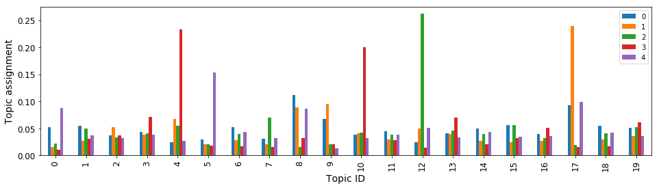

An Introduction to SageMaker Neural Topic Model
===============================================

**Unsupervised representation learning and topic extraction using Neural
Topic Model**

1. `Introduction <#Introduction>`__
2. `Data Preparation <#Data-Preparation>`__
3. `Model Training <#Model-Training>`__
4. `Model Hosting and Inference <#Model-Hosting-and-Inference>`__
5. `Model Exploration <#Model-Exploration>`__

--------------

Introduction
============

Amazon SageMaker Neural Topic Model (NTM) is an unsupervised learning
algorithm that attempts to describe a set of observations as a mixture
of distinct categories. NTM is most commonly used to discover a
user-specified number of topics shared by documents within a text
corpus. Here each observation is a document, the features are the
presence (or occurrence count) of each word, and the categories are the
topics. Since the method is unsupervised, the topics are not specified
upfront and are not guaranteed to align with how a human may naturally
categorize documents. The topics are learned as a probability
distribution over the words that occur in each document. Each document,
in turn, is described as a mixture of topics.

In this notebook, we will use the Amazon SageMaker NTM algorithm to
train a model on the
`20NewsGroups <https://archive.ics.uci.edu/ml/datasets/Twenty+Newsgroups>`__
data set. This data set has been widely used as a topic modeling
benchmark.

The main goals of this notebook are as follows:

1. learn how to obtain and store data for use in Amazon SageMaker,
2. create an AWS SageMaker training job on a data set to produce an NTM
   model,
3. use the model to perform inference with an Amazon SageMaker endpoint.
4. explore trained model and visualized learned topics

If you would like to know more please check out the `SageMaker Neural
Topic Model
Documentation <https://docs.aws.amazon.com/sagemaker/latest/dg/ntm.html>`__.

A Brief Overview of SageMaker NTM
~~~~~~~~~~~~~~~~~~~~~~~~~~~~~~~~~

Topic models are a classical example of probablistic graphical models
that involve challenging posterior inference problems. We implement
topic modeling under a neural-network based variational inference
framework. The difficult inference problem is framed as an optimization
problem solved by scalable methods such as stochastic gradient descent.
Compared to conventional inference schemes, the neural-network
implementation allows for scalable model training as well as low-latency
inference. Furthermore, the flexibility of the neural inference
framework allows us to more quickly add new functionalities and serve a
wider range of customer use cases.

The high-level diagram of SageMaker NTM is shown below:

.. math::


   \begin{equation}
   \begin{split}
   \textrm{Encoder} \ q(z\vert x): & \\
   & \pi = f_X^{MLP}(x), \quad \mu(x) = l_1(\pi), \quad \log \sigma(x) = l_2(\pi)\\
   & h(x, \epsilon) = \mu + \sigma \epsilon, \ \textrm{where} \ \epsilon \sim \mathcal{N}(0,I),\quad z=g(h), \ \textrm{where} \ h \sim \mathcal{N}(\mu, \sigma^2 I) \\
   \textrm{Decoder} \ p(x\vert z): & \\
   & y(z) = \textrm{softmax}(Wz+b), \quad \log p(x\vert z) = \sum x \odot \log(y(z))
   \end{split}
   \end{equation}

where :math:`l_1` and :math:`l_2` are linear transformations with bias.

Beyond Text Data
~~~~~~~~~~~~~~~~

In principle, topic models can be applied to types of data beyond text
documents. For example, topic modeling has been applied on network
traffice data to discover `peer-to-peer applications usage
patterns <http://isis.poly.edu/~baris/papers/GangsOfInternet-CNS13.pdf>`__.
We would be glad to hear about your novel use cases and are happy to
help provide additional information. Please feel free to post questions
or feedback at our `GitHub
repository <https://github.com/awslabs/amazon-sagemaker-examples>`__ or
in the `Amazon
SageMaker <https://forums.aws.amazon.com/forum.jspa?forumID=285>`__
section of AWS Developer Forum.

--------------

Data Preparation
================

The 20Newsgroups data set is a collection of approximately 20,000
newsgroup documents, partitioned (nearly) evenly across 20 different
newsgroups. This collection has become a popular data set for
experiments in text applications of machine learning techniques, such as
text classification and text clustering. Here, we will see what topics
we can learn from this set of documents with NTM. The data setis
available at the UCI Machine Learning Repository at this
`location <https://archive.ics.uci.edu/ml/datasets/Twenty+Newsgroups>`__.
Please aware of the following requirements about ackonwledge, copyright
and availability, cited from the `data set description
page <https://archive.ics.uci.edu/ml/machine-learning-databases/20newsgroups-mld/20newsgroups.data.html>`__.

   **Acknowledgements, Copyright Information, and Availability**

..

   You may use this material free of charge for any educational purpose,
   provided attribution is given in any lectures or publications that
   make use of this material.

Fetching Data Set
-----------------

First let’s define the folder to hold the data and clean the content in
it which might be from previous experiments.

.. code:: ipython3

    import os
    import shutil
    data_dir = '20_newsgroups'
    if os.path.exists(data_dir):  # cleanup existing data folder
        shutil.rmtree(data_dir)

Now we can download the data. *Please review the following
Acknowledgements, Copyright Information, and Availability notice before
downloading the data.*

.. code:: ipython3

    # **Acknowledgements, Copyright Information, and Availability**
    # You may use this material free of charge for any educational purpose, 
    # provided attribution is given in any lectures or publications that make use of this material.
    #
    # Source: https://archive.ics.uci.edu/ml/machine-learning-databases/20newsgroups-mld/20newsgroups.data.html
    
    !curl -O https://archive.ics.uci.edu/ml/machine-learning-databases/20newsgroups-mld/20_newsgroups.tar.gz

In the next 2 cells, we unpack the data set and extract a list of the
files

.. code:: ipython3

    !tar -xzf 20_newsgroups.tar.gz
    !ls 20_newsgroups

.. code:: ipython3

    folders = [os.path.join(data_dir,f) for f in sorted(os.listdir(data_dir)) if os.path.isdir(os.path.join(data_dir, f))]
    file_list = [os.path.join(d,f) for d in folders for f in os.listdir(d)]
    print('Number of documents:', len(file_list))

Here we read in the content of all the files and remove the header,
footer and quotes (of earlier messages in each email).

.. code:: ipython3

    from sklearn.datasets.twenty_newsgroups import strip_newsgroup_header, strip_newsgroup_quoting, strip_newsgroup_footer
    data = []
    for f in file_list:
        with open(f, 'rb') as fin:
            content = fin.read().decode('latin1')        
            # remove header, quoting and footer
            content = strip_newsgroup_header(content)
            content = strip_newsgroup_quoting(content)
            content = strip_newsgroup_footer(content)        
            data.append(content)

As we can see below, the entries in the data set are just plain text
paragraphs. We will need to process them into a suitable data format.

.. code:: ipython3

    data[10:13]

--------------

From Plain Text to Bag-of-Words (BOW)
-------------------------------------

The input documents to the algorithm, both in training and inference,
need to be vectors of integers representing word counts. This is
so-called bag-of-words (BOW) representation. To convert plain text to
BOW, we need to first “tokenize” our documents, i.e identify words and
assign an integer id to each of them.

.. math::


   \text{"cat"} \mapsto 0, \; \text{"dog"} \mapsto 1 \; \text{"bird"} \mapsto 2, \ldots

Then, we count the occcurence of each of the tokens in each document and
form BOW vectors as illustrated in the following example:

.. math::


   w = \text{"cat bird bird bird cat"} \quad \longmapsto \quad w = [2, 0, 3, 0, \ldots, 0]

Also, note that many real-world applications have large vocabulary
sizes. It may be necessary to represent the input documents in sparse
format. Finally, the use of stemming and lemmatization in data
preprocessing provides several benefits. Doing so can improve training
and inference compute time since it reduces the effective vocabulary
size. More importantly, though, it can improve the quality of learned
topic-word probability matrices and inferred topic mixtures. For
example, the words *“parliament”*, *“parliaments”*, *“parliamentary”*,
*“parliament’s”*, and *“parliamentarians”* are all essentially the same
word, *“parliament”*, but with different conjugations. For the purposes
of detecting topics, such as a *“politics”* or *governments"* topic, the
inclusion of all five does not add much additional value as they all
essentially describe the same feature.

In this example, we will use a simple lemmatizer from
```nltk`` <https://www.nltk.org/>`__ package and use ``CountVectorizer``
in ``scikit-learn`` to perform the token counting. For more details
please refer to their documentation respectively. Alternatively,
```spaCy`` <https://spacy.io/>`__ also offers easy-to-use tokenization
and lemmatization functions.

--------------

In the following cell, we use a tokenizer and a lemmatizer from
``nltk``. In the list comprehension, we implement a simple rule: only
consider words that are longer than 2 characters, start with a letter
and match the ``token_pattern``.

.. code:: ipython3

    !pip install nltk
    import nltk
    nltk.download('punkt')
    nltk.download('wordnet')
    from nltk import word_tokenize          
    from nltk.stem import WordNetLemmatizer 
    import re
    token_pattern = re.compile(r"(?u)\b\w\w+\b")
    class LemmaTokenizer(object):
        def __init__(self):
            self.wnl = WordNetLemmatizer()
        def __call__(self, doc):
            return [self.wnl.lemmatize(t) for t in word_tokenize(doc) if len(t) >= 2 and re.match("[a-z].*",t) 
                    and re.match(token_pattern, t)]

With the tokenizer defined we perform token counting next while limiting
the vocabulary size to ``vocab_size``

.. code:: ipython3

    import time
    import numpy as np
    from sklearn.feature_extraction.text import CountVectorizer
    vocab_size = 2000
    print('Tokenizing and counting, this may take a few minutes...')
    start_time = time.time()
    vectorizer = CountVectorizer(input='content', analyzer='word', stop_words='english',
                                 tokenizer=LemmaTokenizer(), max_features=vocab_size, max_df=0.95, min_df=2)
    vectors = vectorizer.fit_transform(data)
    vocab_list = vectorizer.get_feature_names()
    print('vocab size:', len(vocab_list))
    
    # random shuffle
    idx = np.arange(vectors.shape[0])
    np.random.shuffle(idx)
    vectors = vectors[idx]
    
    print('Done. Time elapsed: {:.2f}s'.format(time.time() - start_time))

Optionally, we may consider removing very short documents, the following
cell removes documents shorter than 25 words. This certainly depends on
the application, but there are also some general justifications. It is
hard to imagine very short documents express more than one topic. Topic
modeling tries to model each document as a mixture of multiple topics,
thus it may not be the best choice for modeling short documents.

.. code:: ipython3

    threshold = 25
    vectors = vectors[np.array(vectors.sum(axis=1)>threshold).reshape(-1,)]
    print('removed short docs (<{} words)'.format(threshold))        
    print(vectors.shape)

The output from ``CountVectorizer`` are sparse matrices with their
elements being integers.

.. code:: ipython3

    print(type(vectors), vectors.dtype)
    print(vectors[0])

Because all the parameters (weights and biases) in the NTM model are
``np.float32`` type we’d need the input data to also be in
``np.float32``. It is better to do this type-casting upfront rather than
repeatedly casting during mini-batch training.

.. code:: ipython3

    import scipy.sparse as sparse
    vectors = sparse.csr_matrix(vectors, dtype=np.float32)
    print(type(vectors), vectors.dtype)

As a common practice in modeling training, we should have a training
set, a validation set, and a test set. The training set is the set of
data the model is actually being trained on. But what we really care
about is not the model’s performance on training set but its performance
on future, unseen data. Therefore, during training, we periodically
calculate scores (or losses) on the validation set to validate the
performance of the model on unseen data. By assessing the model’s
ability to generalize we can stop the training at the optimal point via
early stopping to avoid over-training.

Note that when we only have a training set and no validation set, the
NTM model will rely on scores on the training set to perform early
stopping, which could result in over-training. Therefore, we recommend
always supply a validation set to the model.

Here we use 80% of the data set as the training set and the rest for
validation set and test set. We will use the validation set in training
and use the test set for demonstrating model inference.

.. code:: ipython3

    n_train = int(0.8 * vectors.shape[0])
    
    # split train and test
    train_vectors = vectors[:n_train, :]
    test_vectors = vectors[n_train:, :]
    
    # further split test set into validation set (val_vectors) and test  set (test_vectors)
    n_test = test_vectors.shape[0]
    val_vectors = test_vectors[:n_test//2, :]
    test_vectors = test_vectors[n_test//2:, :]

.. code:: ipython3

    print(train_vectors.shape, test_vectors.shape, val_vectors.shape)

--------------

Store Data on S3
----------------

The NTM algorithm, as well as other first-party SageMaker algorithms,
accepts data in
`RecordIO <https://mxnet.apache.org/api/python/io/io.html#module-mxnet.recordio>`__
`Protobuf <https://developers.google.com/protocol-buffers/>`__ format.
The SageMaker Python API provides helper functions for easily converting
your data into this format. Below we convert the from numpy/scipy data
and upload it to an Amazon S3 destination for the model to access it
during training.

Setup AWS Credentials
~~~~~~~~~~~~~~~~~~~~~

We first need to specify data locations and access roles. In particular,
we need the following data:

-  The S3 ``bucket`` and ``prefix`` that you want to use for training
   and model data. This should be within the same region as the Notebook
   Instance, training, and hosting.
-  The IAM ``role`` is used to give training and hosting access to your
   data. See the documentation for how to create these. Note, if more
   than one role is required for notebook instances, training, and/or
   hosting, please replace the boto regexp with a the appropriate full
   IAM role arn string(s).

.. code:: ipython3

    import os
    import sagemaker
    from sagemaker import get_execution_role
    
    role = get_execution_role()
    
    sess = sagemaker.Session()
    bucket=sess.default_bucket()

.. code:: ipython3

    prefix = '20newsgroups'
    
    train_prefix = os.path.join(prefix, 'train')
    val_prefix = os.path.join(prefix, 'val')
    output_prefix = os.path.join(prefix, 'output')
    
    s3_train_data = os.path.join('s3://', bucket, train_prefix)
    s3_val_data = os.path.join('s3://', bucket, val_prefix)
    output_path = os.path.join('s3://', bucket, output_prefix)
    print('Training set location', s3_train_data)
    print('Validation set location', s3_val_data)
    print('Trained model will be saved at', output_path)

Here we define a helper function to convert the data to RecordIO
Protobuf format and upload it to S3. In addition, we will have the
option to split the data into several parts specified by ``n_parts``.

The algorithm inherently supports multiple files in the training folder
(“channel”), which could be very helpful for large data set. In
addition, when we use distributed training with multiple workers
(compute instances), having multiple files allows us to distribute
different portions of the training data to different workers
conveniently.

Inside this helper function we use ``write_spmatrix_to_sparse_tensor``
function provided by `SageMaker Python
SDK <https://github.com/aws/sagemaker-python-sdk>`__ to convert scipy
sparse matrix into RecordIO Protobuf format.

.. code:: ipython3

    # update sagemake package, in order to use write_spmatrix_to_sparse_tensor in the next cell
    # !pip install -U sagemaker

.. code:: ipython3

    def split_convert_upload(sparray, bucket, prefix, fname_template='data_part{}.pbr', n_parts=2):
        import io
        import boto3
        import sagemaker.amazon.common as smac
        
        chunk_size = sparray.shape[0]// n_parts
        for i in range(n_parts):
    
            # Calculate start and end indices
            start = i*chunk_size
            end = (i+1)*chunk_size
            if i+1 == n_parts:
                end = sparray.shape[0]
            
            # Convert to record protobuf
            buf = io.BytesIO()
            smac.write_spmatrix_to_sparse_tensor(array=sparray[start:end], file=buf, labels=None)
            buf.seek(0)
            
            # Upload to s3 location specified by bucket and prefix
            fname = os.path.join(prefix, fname_template.format(i))
            boto3.resource('s3').Bucket(bucket).Object(fname).upload_fileobj(buf)
            print('Uploaded data to s3://{}'.format(os.path.join(bucket, fname)))

.. code:: ipython3

    split_convert_upload(train_vectors, bucket=bucket, prefix=train_prefix, fname_template='train_part{}.pbr', n_parts=8)
    split_convert_upload(val_vectors, bucket=bucket, prefix=val_prefix, fname_template='val_part{}.pbr', n_parts=1)

--------------

Model Training
==============

We have created the training and validation data sets and uploaded them
to S3. Next, we configure a SageMaker training job to use the NTM
algorithm on the data we prepared

SageMaker uses Amazon Elastic Container Registry (ECR) docker container
to host the NTM training image. The following ECR containers are
currently available for SageMaker NTM training in different regions. For
the latest Docker container registry please refer to `Amazon SageMaker:
Common
Parameters <https://docs.aws.amazon.com/sagemaker/latest/dg/sagemaker-algo-docker-registry-paths.html>`__.

.. code:: ipython3

    import boto3
    from sagemaker.amazon.amazon_estimator import get_image_uri
    container = get_image_uri(boto3.Session().region_name, 'ntm')

The code in the cell below automatically chooses an algorithm container
based on the current region. In the API call to
``sagemaker.estimator.Estimator`` we also specify the type and count of
instances for the training job. Because the 20NewsGroups data set is
relatively small, we have chosen a CPU only instance (``ml.c4.xlarge``),
but do feel free to change to `other instance
types <https://aws.amazon.com/sagemaker/pricing/instance-types/>`__. NTM
fully takes advantage of GPU hardware and in general trains roughly an
order of magnitude faster on a GPU than on a CPU. Multi-GPU or
multi-instance training further improves training speed roughly linearly
if communication overhead is low compared to compute time.

.. code:: ipython3

    import sagemaker
    sess = sagemaker.Session()
    ntm = sagemaker.estimator.Estimator(container,
                                        role, 
                                        train_instance_count=2, 
                                        train_instance_type='ml.c4.xlarge',
                                        output_path=output_path,
                                        sagemaker_session=sess)

Hyperparameters
---------------

Here we highlight a few hyperparameters. For information about the full
list of available hyperparameters, please refer to `NTM
Hyperparameters <https://docs.aws.amazon.com/sagemaker/latest/dg/ntm_hyperparameters.html>`__.

-  **feature_dim** - the “feature dimension”, it should be set to the
   vocabulary size
-  **num_topics** - the number of topics to extract
-  **mini_batch_size** - this is the batch size for each worker
   instance. Note that in multi-GPU instances, this number will be
   further divided by the number of GPUs. Therefore, for example, if we
   plan to train on an 8-GPU machine (such as ``ml.p2.8xlarge``) and
   wish each GPU to have 1024 training examples per batch,
   ``mini_batch_size`` should be set to 8196.
-  **epochs** - the maximal number of epochs to train for, training may
   stop early
-  **num_patience_epochs** and **tolerance** controls the early stopping
   behavior. Roughly speaking, the algorithm will stop training if
   within the last ``num_patience_epochs`` epochs there have not been
   improvements on validation loss. Improvements smaller than
   ``tolerance`` will be considered non-improvement.
-  **optimizer** and **learning_rate** - by default we use ``adadelta``
   optimizer and ``learning_rate`` does not need to be set. For other
   optimizers, the choice of an appropriate learning rate may require
   experimentation.

.. code:: ipython3

    num_topics = 20
    ntm.set_hyperparameters(num_topics=num_topics, feature_dim=vocab_size, mini_batch_size=128, 
                            epochs=100, num_patience_epochs=5, tolerance=0.001)

Next, we need to specify how the training data and validation data will
be distributed to the workers during training. There are two modes for
data channels:

-  ``FullyReplicated``: all data files will be copied to all workers
-  ``ShardedByS3Key``: data files will be sharded to different workers,
   i.e. each worker will receive a different portion of the full data
   set.

At the time of writing, by default, the Python SDK will use
``FullyReplicated`` mode for all data channels. This is desirable for
validation (test) channel but not suitable for training channel. The
reason is that when we use multiple workers we would like to go through
the full data set by each of them going through a different portion of
the data set, so as to provide different gradients within epochs. Using
``FullyReplicated`` mode on training data not only results in slower
training time per epoch (nearly 1.5X in this example), but also defeats
the purpose of distributed training. To set the training data channel
correctly we specify ``distribution`` to be ``ShardedByS3Key`` for the
training data channel as follows.

.. code:: ipython3

    from sagemaker.session import s3_input
    s3_train = s3_input(s3_train_data, distribution='ShardedByS3Key') 

Now we are ready to train. The following cell takes a few minutes to
run. The command below will first provision the required hardware. You
will see a series of dots indicating the progress of the hardware
provisioning process. Once the resources are allocated, training logs
will be displayed. With multiple workers, the log color and the ID
following ``INFO`` identifies logs emitted by different workers.

.. code:: ipython3

    ntm.fit({'train': s3_train, 'validation': s3_val_data})

If you see the message

   ``===== Job Complete =====``

at the bottom of the output logs then that means training successfully
completed and the output NTM model was stored in the specified output
path. You can also view information about and the status of a training
job using the AWS SageMaker console. Just click on the “Jobs” tab and
select training job matching the training job name, below:

.. code:: ipython3

    print('Training job name: {}'.format(ntm.latest_training_job.job_name))

Model Hosting and Inference
===========================

A trained NTM model does nothing on its own. We now want to use the
model we computed to perform inference on data. For this example, that
means predicting the topic mixture representing a given document.

We create an inference endpoint using the SageMaker Python SDK
``deploy()`` function from the job we defined above. We specify the
instance type where inference is computed as well as an initial number
of instances to spin up.

.. code:: ipython3

    ntm_predictor = ntm.deploy(initial_instance_count=1, instance_type='ml.m4.xlarge')

Congratulations! You now have a functioning SageMaker NTM inference
endpoint. You can confirm the endpoint configuration and status by
navigating to the “Endpoints” tab in the AWS SageMaker console and
selecting the endpoint matching the endpoint name, below:

.. code:: ipython3

    print('Endpoint name: {}'.format(ntm_predictor.endpoint))

--------------

Data Serialization/Deserialization
----------------------------------

We can pass data in a variety of formats to our inference endpoint.
First, we will demonstrate passing CSV-formatted data. We make use of
the SageMaker Python SDK utilities ``csv_serializer`` and
``json_deserializer`` when configuring the inference endpoint.

Inference with CSV
~~~~~~~~~~~~~~~~~~

.. code:: ipython3

    from sagemaker.predictor import csv_serializer, json_deserializer
    
    ntm_predictor.content_type = 'text/csv'
    ntm_predictor.serializer = csv_serializer
    ntm_predictor.deserializer = json_deserializer

Let’s pass 5 examples from the test set to the inference endpoint

.. code:: ipython3

    test_data = np.array(test_vectors.todense())
    results = ntm_predictor.predict(test_data[:5])
    print(results)

We can see the output format of SageMaker NTM inference endpoint is a
Python dictionary with the following format.

::

   {
     'predictions': [
       {'topic_weights': [ ... ] },
       {'topic_weights': [ ... ] },
       {'topic_weights': [ ... ] },
       ...
     ]
   }

We extract the topic weights, themselves, corresponding to each of the
input documents.

.. code:: ipython3

    predictions = np.array([prediction['topic_weights'] for prediction in results['predictions']])
    print(predictions)

--------------

Inference with RecordIO Protobuf
~~~~~~~~~~~~~~~~~~~~~~~~~~~~~~~~

The inference endpoint also supports JSON-formatted and RecordIO
Protobuf, see `Common Data
Formats—Inference <https://docs.aws.amazon.com/sagemaker/latest/dg/cdf-inference.html>`__
for more information.

At the time of writing SageMaker Python SDK does not yet have a RecordIO
Protobuf serializer, but it is fairly straightforward to create one as
follows.

.. code:: ipython3

    def recordio_protobuf_serializer(spmatrix):
        import io
        import sagemaker.amazon.common as smac
        buf = io.BytesIO()
        smac.write_spmatrix_to_sparse_tensor(array=spmatrix, file=buf, labels=None)
        buf.seek(0)
        return buf

Now we specify the serializer to be the one we just crated and
``content_type`` to be ‘application/x-recordio-protobuf’ and inference
can be carried out with RecordIO Protobuf format

.. code:: ipython3

    ntm_predictor.content_type = 'application/x-recordio-protobuf'
    ntm_predictor.serializer = recordio_protobuf_serializer
    ntm_predictor.deserializer = json_deserializer
    results = ntm_predictor.predict(test_vectors[:5])
    print(results)

If you decide to compare these results to the known topic weights
generated above keep in mind that SageMaker NTM discovers topics in no
particular order. That is, the approximate topic mixtures computed above
may be (approximate) permutations of the known topic mixtures
corresponding to the same documents.

--------------

Now we can take a look at how the 20 topics are assigned to the 5 test
documents with a bar plot.

.. code:: ipython3

    import pandas as pd
    import matplotlib.pyplot as plt
    %matplotlib inline
    
    fs = 12
    df=pd.DataFrame(predictions.T)
    df.plot(kind='bar', figsize=(16,4), fontsize=fs)
    plt.ylabel('Topic assignment', fontsize=fs+2)
    plt.xlabel('Topic ID', fontsize=fs+2)


.. parsed-literal::

    Text(0.5,0,'Topic ID')





Stop / Close the Endpoint
-------------------------

Finally, we should delete the endpoint before we close the notebook.

To restart the endpoint you can follow the code above using the same
``endpoint_name`` we created or you can navigate to the “Endpoints” tab
in the SageMaker console, select the endpoint with the name stored in
the variable ``endpoint_name``, and select “Delete” from the “Actions”
dropdown menu.

.. code:: ipython3

    sagemaker.Session().delete_endpoint(ntm_predictor.endpoint)

Model Exploration
=================

**Note: The following section is meant as a deeper dive into exploring
the trained models. The demonstrated functionalities may not be fully
supported or guaranteed. For example, the parameter names may change
without notice.**

The trained model artifact is a compressed package of MXNet models from
the two workers. To explore the model, we first need to install mxnet.

.. code:: ipython3

    # If you use conda_mxnet_p36 kernel, mxnet is already installed, otherwise, uncomment the following line to install.
    # !pip install mxnet 
    import mxnet as mx

Here we download unpack the artifact

.. code:: ipython3

    model_path = os.path.join(output_prefix, ntm._current_job_name, 'output/model.tar.gz')
    model_path

.. code:: ipython3

    boto3.resource('s3').Bucket(bucket).download_file(model_path, 'downloaded_model.tar.gz')

.. code:: ipython3

    !tar -xzvf 'downloaded_model.tar.gz'

.. code:: ipython3

    # use flag -o to overwrite previous unzipped content
    !unzip -o model_algo-1

We can load the model parameters and extract the weight matrix :math:`W`
in the decoder as follows

.. code:: ipython3

    model = mx.ndarray.load('params')
    W = model['arg:projection_weight']

Matrix :math:`W` corresponds to the :math:`W` in the NTM digram at the
beginning of this notebook. Each column of :math:`W` corresponds to a
learned topic. The elements in the columns of :math:`W` corresponds to
the pseudo-probability of a word within a topic. We can visualize each
topic as a word cloud with the size of each word be proportional to the
pseudo-probability of the words appearing under each topic.

.. code:: ipython3

    !pip install wordcloud
    import wordcloud as wc

.. code:: ipython3

    word_to_id = dict()
    for i, v in enumerate(vocab_list):
        word_to_id[v] = i
    
    limit = 24
    n_col = 4
    counter = 0
    
    plt.figure(figsize=(20,16))
    for ind in range(num_topics):
    
        if counter >= limit:
            break
    
        title_str = 'Topic{}'.format(ind)
    
        #pvals = mx.nd.softmax(W[:, ind]).asnumpy()
        pvals = mx.nd.softmax(mx.nd.array(W[:, ind])).asnumpy()
    
        word_freq = dict()
        for k in word_to_id.keys():
            i = word_to_id[k]
            word_freq[k] =pvals[i]
    
        wordcloud = wc.WordCloud(background_color='white').fit_words(word_freq)
    
        plt.subplot(limit // n_col, n_col, counter+1)
        plt.imshow(wordcloud, interpolation='bilinear')
        plt.axis("off")
        plt.title(title_str)
        #plt.close()
    
        counter +=1


