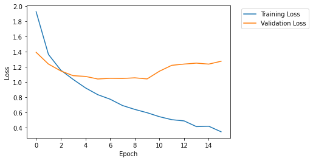

Build a Custom Training Container and Debug Training Jobs with Amazon SageMaker Debugger
========================================================================================

Amazon SageMaker Debugger enables you to debug your model through its
built-in rules and tools (``smdebug`` hook and core features) to store
and retrieve output tensors in Amazon Simple Storage Service (S3). To
run your customized machine learning/deep learning (ML/DL) models, use
Amazon Elastic Container Registry (ECR) to build and push your
customized training container. Use SageMaker Debugger for training jobs
run on Amazon EC2 instance and take the benefit of its built-in
functionalities.

You can bring your own model customized with state-of-the-art ML/DL
frameworks, such as TensorFlow, PyTorch, MXNet, and XGBoost. You can
also use your Docker base image or AWS Deep Learning Container base
images to build a custom training container. To run and debug your
training script using SageMaker Debugger, you need to register the
Debugger hook to the script. Using the ``smdebug`` trial feature, you
can retrieve the output tensors and visualize it for analysis.

By monitoring the output tensors, the Debugger rules detect training
issues and invoke a ``IssueFound`` rule job status. The rule job status
also returns at which step or epoch the training job started having the
issues. You can send this invoked status to Amazon CloudWatch and AWS
Lambda to stop the training job when the Debugger rule triggers the
``IssueFound`` status.

The workflow is as follows:

-  `Step 1: Prepare prerequisites <#step1>`__
-  `Step 2: Prepare a Dockerfile and register the Debugger hook to you
   training script <#step2>`__
-  `Step 3: Create a Docker image, build the Docker training container,
   and push to Amazon ECR <#step3>`__
-  `Step 4: Use Amazon SageMaker to set the Debugger hook and rule
   configuration <#step4>`__
-  `Step 5: Define a SageMaker Estimator object with Debugger and
   initiate a training job <#step5>`__
-  `Step 6: Retrieve output tensors using the smdebug trials
   class <#step6>`__
-  `Step 7: Analyze the training job using the smdebug trial methods and
   rule job status <#step7>`__

**Important:** You can run this notebook only on SageMaker Notebook
instances. You cannot run this in SageMaker Studio. Studio does not
support Docker container build.

Step 1: Prepare prerequisites
-----------------------------

Install the SageMaker Python SDK v2 and the smdebug library
~~~~~~~~~~~~~~~~~~~~~~~~~~~~~~~~~~~~~~~~~~~~~~~~~~~~~~~~~~~

This notebook runs on the latest version of the SageMaker Python SDK and
the ``smdebug`` client library. If you want to use one of the previous
version, specify the version number for installation. For example,
``pip install sagemaker==x.xx.0``.

.. code:: ipython3

    import sys
    !{sys.executable} -m pip install "sagemaker==1.72.0" smdebug

[Optional Step] Restart the kernel to apply the update
~~~~~~~~~~~~~~~~~~~~~~~~~~~~~~~~~~~~~~~~~~~~~~~~~~~~~~

**Note:** If you are using **Jupyter Notebook**, the previous cell
automatically installs and updates the libraries. If you are using
**JupyterLab**, you have to manually choose the “Restart Kernel” under
the **Kernel** tab in the top menu bar.

Check the SageMaker Python SDK version by running the following cell.

.. code:: ipython3

    import sagemaker
    sagemaker.__version__

Step 2: Prepare a Dockerfile and register the Debugger hook to you training script
----------------------------------------------------------------------------------

You need to put your **Dockerfile** and training script
(**tf_keras_resnet_byoc.py** in this case) in the **docker** folder.
Specify the location of the training script in the **Dockerfile** script
in the line for ``COPY`` and ``ENV``.

Prepare a Dockerfile
~~~~~~~~~~~~~~~~~~~~

The following cell prints the **Dockerfile** in the **docker** folder.
You must install ``sagemaker-training`` and ``smdebug`` libraries to
fully access the SageMaker Debugger features.

.. code:: ipython3

    ! pygmentize docker/Dockerfile

.. parsed-literal::

    FROM tensorflow/tensorflow:2.2.0rc2-py3-jupyter
    
    # Install Amazon SageMaker training toolkit and smdebug libraries
    RUN pip install sagemaker-training
    RUN pip install smdebug
    
    # Copies the training code inside the container
    COPY tf_keras_resnet_byoc.py /opt/ml/code/tf_keras_resnet_byoc.py
    
    # Defines train.py as script entrypoint
    ENV SAGEMAKER_PROGRAM tf_keras_resnet_byoc.py

Prepare a training script
~~~~~~~~~~~~~~~~~~~~~~~~~

The following cell prints an example training script
**tf_keras_resnet_byoc.py** in the **docker** folder. To register the
Debugger hook, you need to use the Debugger client library ``smdebug``.

In the ``main`` function, a Keras hook is registered after the line
where the ``model`` object is defined and before the line where the
``model.compile()`` function is called.

In the ``train`` function, you pass the Keras hook and set it as a Keras
callback for the ``model.fit()`` function. The ``hook.save_scalar()``
method is used to save scalar parameters for mini batch settings, such
as epoch, batch size, and the number of steps per epoch in training and
validation modes.

.. code:: ipython3

    ! pygmentize docker/tf_keras_resnet_byoc.py

.. parsed-literal::

    """
    This script is a ResNet training script which uses Tensorflow's Keras interface, and provides an example of how to use SageMaker Debugger when you use your own custom container in SageMaker or your own script outside SageMaker.
    It has been orchestrated with SageMaker Debugger hooks to allow saving tensors during training.
    These hooks have been instrumented to read from a JSON configuration that SageMaker puts in the training container.
    Configuration provided to the SageMaker python SDK when creating a job will be passed on to the hook.
    This allows you to use the same script with different configurations across different runs.
    
    If you use an official SageMaker Framework container (i.e. AWS Deep Learning Container), you do not have to orchestrate your script as below. Hooks are automatically added in those environments. This experience is called a "zero script change". For more information, see https://github.com/awslabs/sagemaker-debugger/blob/master/docs/sagemaker.md#zero-script-change. An example of the same is provided at https://github.com/awslabs/amazon-sagemaker-examples/sagemaker-debugger/tensorflow2/tensorflow2_zero_code_change.
    """
    
    # Standard Library
    import argparse
    import random
    
    # Third Party
    import numpy as np
    import tensorflow.compat.v2 as tf
    from tensorflow.keras.applications.resnet50 import ResNet50
    from tensorflow.keras.datasets import cifar10
    from tensorflow.keras.utils import to_categorical
    
    # smdebug modification: Import smdebug support for Tensorflow
    import smdebug.tensorflow as smd
    
    
    def train(batch_size, epoch, model, hook):
        (X_train, y_train), (X_valid, y_valid) = cifar10.load_data()
    
        Y_train = to_categorical(y_train, 10)
        Y_valid = to_categorical(y_valid, 10)
    
        X_train = X_train.astype('float32')
        X_valid = X_valid.astype('float32')
    
        mean_image = np.mean(X_train, axis=0)
        X_train -= mean_image
        X_valid -= mean_image
        X_train /= 128.
        X_valid /= 128.
        
        # register hook to save the following scalar values
        hook.save_scalar("epoch", epoch)
        hook.save_scalar("batch_size", batch_size)
        hook.save_scalar("train_steps_per_epoch", len(X_train)/batch_size)
        hook.save_scalar("valid_steps_per_epoch", len(X_valid)/batch_size)
        
        model.fit(X_train, Y_train,
                  batch_size=batch_size,
                  epochs=epoch,
                  validation_data=(X_valid, Y_valid),
                  shuffle=False,
                  # smdebug modification: Pass the hook as a Keras callback
                  callbacks=[hook])
    
    
    def main():
        parser = argparse.ArgumentParser(description="Train resnet50 cifar10")
        parser.add_argument("--batch_size", type=int, default=50)
        parser.add_argument("--epoch", type=int, default=15)
        parser.add_argument("--model_dir", type=str, default="./model_keras_resnet")
        parser.add_argument("--lr", type=float, default=0.001)
        parser.add_argument("--random_seed", type=bool, default=False)
        
        args = parser.parse_args()
    
        if args.random_seed:
            tf.random.set_seed(2)
            np.random.seed(2)
            random.seed(12)
    
            
        mirrored_strategy = tf.distribute.MirroredStrategy()
        with mirrored_strategy.scope():
            
            model = ResNet50(weights=None, input_shape=(32,32,3), classes=10)
    
            # smdebug modification:
            # Create hook from the configuration provided through sagemaker python sdk.
            # This configuration is provided in the form of a JSON file.
            # Default JSON configuration file:
            # {
            #     "LocalPath": <path on device where tensors will be saved>
            # }"
            # Alternatively, you could pass custom debugger configuration (using DebuggerHookConfig)
            # through SageMaker Estimator. For more information, https://github.com/aws/sagemaker-python-sdk/blob/master/doc/amazon_sagemaker_debugger.rst
            hook = smd.KerasHook.create_from_json_file()
    
            opt = tf.keras.optimizers.Adam(learning_rate=args.lr)
            model.compile(loss='categorical_crossentropy',
                          optimizer=opt,
                          metrics=['accuracy'])
    
        # start the training.
        train(args.batch_size, args.epoch, model, hook)
    
    if __name__ == "__main__":
        main()

Step 3: Create a Docker image, build the Docker training container, and push to Amazon ECR
------------------------------------------------------------------------------------------

Create a Docker image
~~~~~~~~~~~~~~~~~~~~~

AWS Boto3 Python SDK provides tools to automatically locate your region
and account information to create a Docker image uri.

.. code:: ipython3

    import boto3
    
    account_id = boto3.client('sts').get_caller_identity().get('Account')
    ecr_repository = 'sagemaker-debugger-mnist-byoc-tf2'
    tag = ':latest'
    
    region = boto3.session.Session().region_name
    
    uri_suffix = 'amazonaws.com'
    if region in ['cn-north-1', 'cn-northwest-1']:
        uri_suffix = 'amazonaws.com.cn'
    byoc_image_uri = '{}.dkr.ecr.{}.{}/{}'.format(account_id, region, uri_suffix, ecr_repository + tag)

Print the image URI address.

.. code:: ipython3

    byoc_image_uri

[Optional Step] Login to access the Deep Learning Containers image repository
~~~~~~~~~~~~~~~~~~~~~~~~~~~~~~~~~~~~~~~~~~~~~~~~~~~~~~~~~~~~~~~~~~~~~~~~~~~~~

If you use one of the AWS Deep Learning Container base images, uncomment
the following cell and execute to login to the image repository.

.. code:: ipython3

    # ! aws ecr get-login-password --region us-east-1 | docker login --username AWS --password-stdin 763104351884.dkr.ecr.us-east-1.amazonaws.com

Build the Docker container and push it to Amazon ECR
~~~~~~~~~~~~~~~~~~~~~~~~~~~~~~~~~~~~~~~~~~~~~~~~~~~~

The following code cell builds a Docker container based on the
Dockerfile, create an Amazon ECR repository, and push the container to
the ECR repository.

.. code:: ipython3

    !docker build -t $ecr_repository docker
    !$(aws ecr get-login --region $region --registry-ids $account_id --no-include-email)
    !aws ecr create-repository --repository-name $ecr_repository
    !docker tag {ecr_repository + tag} $byoc_image_uri
    !docker push $byoc_image_uri

**Note:** If this returns a permission error, see the `Get Started with
Custom Training
Containers <https://docs.aws.amazon.com/sagemaker/latest/dg/build-container-to-train-script-get-started.html#byoc-training-step5>`__
in the Amazon SageMaker developer guide. Follow the note in Step 5 to
register the **AmazonEC2ContainerRegistryFullAccess** policy to your IAM
role.

Step 4: Use Amazon SageMaker to set the Debugger hook and rule configuration
----------------------------------------------------------------------------

Define Debugger hook configuration
~~~~~~~~~~~~~~~~~~~~~~~~~~~~~~~~~~

Now you have the custom training container with the Debugger hooks
registered to your training script. In this section, you import the
SageMaker Debugger API operations, ``Debugger hook Config`` and
``CollectionConfig``, to define the hook configuration. You can choose
Debugger pre-configured tensor collections, adjust ``save_interval``
parameters, or configure custom collections.

In the following notebook cell, the ``hook_config`` object is configured
with the pre-configured tensor collections, ``losses``. This will save
the tensor outputs to the default S3 bucket. At the end of this
notebook, we will retrieve the ``loss`` values to plot the overfitting
problem that the example training job will be experiencing.

.. code:: ipython3

    import sagemaker
    from sagemaker.debugger import DebuggerHookConfig, CollectionConfig
    
    sagemaker_session = sagemaker.Session()
    
    train_save_interval=100
    eval_save_interval=10
    
    hook_config = DebuggerHookConfig(
    
        collection_configs=[
            CollectionConfig(name="losses", 
                             parameters={
                              "train.save_interval": str(train_save_interval),
                              "eval.save_interval": str(eval_save_interval)}
                            )
        ]
    )

Select Debugger built-in rules
~~~~~~~~~~~~~~~~~~~~~~~~~~~~~~

The following cell shows how to directly use the Debugger built-in
rules. The maximum number of rules you can run in parallel is 20.

.. code:: ipython3

    from sagemaker.debugger import Rule, rule_configs
    
    rules = [
        Rule.sagemaker(rule_configs.vanishing_gradient()),
        Rule.sagemaker(rule_configs.overfit()),
        Rule.sagemaker(rule_configs.overtraining()),
        Rule.sagemaker(rule_configs.saturated_activation()),
        Rule.sagemaker(rule_configs.weight_update_ratio())
    ]

Step 5. Define a SageMaker Estimator object with Debugger and initiate a training job
-------------------------------------------------------------------------------------

Construct a SageMaker Estimator using the image URI of the custom
training container you created in **Step 3**.

**Note:** This example uses the SageMaker Python SDK v1. If you want to
use the SageMaker Python SDK v2, you need to change the parameter names.
You can find the SageMaker Estimator parameters at `Get Started with
Custom Training
Containers <https://docs.aws.amazon.com/sagemaker/latest/dg/build-container-to-train-script-get-started.html#byoc-training-step5>`__
in the AWS SageMaker Developer Guide or at `the SageMaker Estimator
API <https://sagemaker.readthedocs.io/en/stable/api/training/estimators.html>`__
in one of the older version of SageMaker Python SDK documentation.

.. code:: ipython3

    from sagemaker.estimator import Estimator
    from sagemaker import get_execution_role
    
    role = get_execution_role()
    
    estimator = Estimator(
                    image_name=byoc_image_uri,
                    role=role,
                    train_instance_count=1,
                    train_instance_type="ml.p3.16xlarge",
    
                    # Debugger-specific parameters
                    rules = rules,
                    debugger_hook_config=hook_config
                )

Initiate the training job in the background
~~~~~~~~~~~~~~~~~~~~~~~~~~~~~~~~~~~~~~~~~~~

With the ``wait=False`` option, the ``estimator.fit()`` function will
run the training job in the background. You can proceed to the next
cells. If you want to see logs in real time, go to the `CloudWatch
console <https://console.aws.amazon.com/cloudwatch/home>`__, choose
**Log Groups** in the left navigation pane, and choose
**/aws/sagemaker/TrainingJobs** for training job logs and
**/aws/sagemaker/ProcessingJobs** for Debugger rule job logs.

.. code:: ipython3

    estimator.fit(wait=False)

Print the training job name
~~~~~~~~~~~~~~~~~~~~~~~~~~~

The following cell outputs the training job running in the background.

.. code:: ipython3

    job_name = estimator.latest_training_job.name
    print('Training job name: {}'.format(job_name))
    
    client = estimator.sagemaker_session.sagemaker_client
    
    description = client.describe_training_job(TrainingJobName=job_name)

Output the current job status
~~~~~~~~~~~~~~~~~~~~~~~~~~~~~

The following cell tracks the status of training job until the
``SecondaryStatus`` changes to ``Training``. While training, Debugger
collects output tensors from the training job and monitors the training
job with the rules.

.. code:: ipython3

    import time
    
    if description['TrainingJobStatus'] != 'Completed':
        while description['SecondaryStatus'] not in {'Training', 'Completed'}:
            description = client.describe_training_job(TrainingJobName=job_name)
            primary_status = description['TrainingJobStatus']
            secondary_status = description['SecondaryStatus']
            print('Current job status: [PrimaryStatus: {}, SecondaryStatus: {}]'.format(primary_status, secondary_status))
            time.sleep(15)

Step 6: Retrieve output tensors using the smdebug trials class
--------------------------------------------------------------

Call the latest Debugger artifact and create a smdebug trial
~~~~~~~~~~~~~~~~~~~~~~~~~~~~~~~~~~~~~~~~~~~~~~~~~~~~~~~~~~~~

The following smdebug ``trial`` object calls the output tensors once
they become available in the default S3 bucket. You can use the
``estimator.latest_job_debugger_artifacts_path()`` method to
automatically detect the default S3 bucket that is currently being used
while the training job is running.

Once the tensors are available in the dafault S3 bucket, you can plot
the loss curve in the next sections.

.. code:: ipython3

    from smdebug.trials import create_trial
    
    trial = create_trial(estimator.latest_job_debugger_artifacts_path())  

**Note:** If you want to re-visit tensor data from a previous training
job that has already done, you can retrieve them by specifying the exact
S3 bucket location. The S3 bucket path is configured in a similar way to
the following sample:
``trial="s3://sagemaker-us-east-1-111122223333/sagemaker-debugger-mnist-byoc-tf2-2020-08-27-05-49-34-037/debug-output"``.

Print the hyperparameter configuration saved as scalar values
~~~~~~~~~~~~~~~~~~~~~~~~~~~~~~~~~~~~~~~~~~~~~~~~~~~~~~~~~~~~~

.. code:: ipython3

    trial.tensor_names(regex="scalar")

Print the size of the ``steps`` list to check the training progress
~~~~~~~~~~~~~~~~~~~~~~~~~~~~~~~~~~~~~~~~~~~~~~~~~~~~~~~~~~~~~~~~~~~

.. code:: ipython3

    from smdebug.core.modes import ModeKeys
    
    len(trial.tensor('loss').steps(mode=ModeKeys.TRAIN))

.. code:: ipython3

    len(trial.tensor('loss').steps(mode=ModeKeys.EVAL))

Step 7: Analyze the training job using the smdebug ``trial`` methods and the Debugger rule job status
-----------------------------------------------------------------------------------------------------

Plot training and validation loss curves in real time
~~~~~~~~~~~~~~~~~~~~~~~~~~~~~~~~~~~~~~~~~~~~~~~~~~~~~

The following cell retrieves the ``loss`` tensor from training and
evaluation mode and plots the loss curves.

In this notebook example, the dataset was ``cifar10`` that divided into
50,000 32x32 color training images and 10,000 test images, labeled over
10 categories. (See the `TensorFlow Keras Datasets cifar10 load data
documentation <https://www.tensorflow.org/api_docs/python/tf/keras/datasets/cifar10/load_data>`__
for more details.) In the Debugger configuration step (Step 4), the save
interval was set to 100 for training mode and 10 for evaluation mode.
Since the batch size is set to 100, there are 1,000 training steps and
200 validation steps in each epoch.

The following cell includes scripts to call those mini batch parameters
saved by ``smdebug``, computes the average loss in each epoch, and
renders the loss curve in a single plot.

As the training job proceeds, you will be able to observe that the
validation loss curve starts deviating from the training loss curve,
which is a clear indication of overfitting problem.

.. code:: ipython3

    import matplotlib.pyplot as plt
    import numpy as np
    
    # Retrieve the loss tensors collected in training mode
    y = []
    for step in trial.tensor('loss').steps(mode=ModeKeys.TRAIN):
        y.append(trial.tensor('loss').value(step,mode=ModeKeys.TRAIN)[0])
    y=np.asarray(y)
    
    # Retrieve the loss tensors collected in evaluation mode
    y_val=[]
    for step in trial.tensor('loss').steps(mode=ModeKeys.EVAL):
        y_val.append(trial.tensor('loss').value(step,mode=ModeKeys.EVAL)[0])
    y_val=np.asarray(y_val)
    
    train_save_points=int(trial.tensor('scalar/train_steps_per_epoch').value(0)[0]/train_save_interval)
    val_save_points=int(trial.tensor('scalar/valid_steps_per_epoch').value(0)[0]/eval_save_interval)
    
    y_mean=[]
    x_epoch=[]
    for e in range(int(trial.tensor('scalar/epoch').value(0)[0])):
        ei=e*train_save_points
        ef=(e+1)*train_save_points-1
        y_mean.append(np.mean(y[ei:ef]))
        x_epoch.append(e)
        
    y_val_mean=[]
    for e in range(int(trial.tensor('scalar/epoch').value(0)[0])):
        ei=e*val_save_points
        ef=(e+1)*val_save_points-1
        y_val_mean.append(np.mean(y_val[ei:ef]))
        
    plt.plot(x_epoch, y_mean, label='Training Loss')
    plt.plot(x_epoch, y_val_mean, label='Validation Loss')
    
    plt.legend(bbox_to_anchor=(1.04,1), loc='upper left')
    plt.xlabel('Epoch')
    plt.ylabel('Loss')
    plt.show()

Check the rule job summary
~~~~~~~~~~~~~~~~~~~~~~~~~~

The following cell returns the Debugger rule job summary. In this
example notebook, we used the five built-in rules:
``VanishingGradient``, ``Overfit``, ``Overtraining``,
``SaturationActivation``, and ``WeightUpdateRatio``. For more
information about what each of the rules evaluate on the on-going
training job, see the `List of Debugger built-in
rules <https://docs.aws.amazon.com/sagemaker/latest/dg/debugger-built-in-rules.html>`__
documentation in the Amazon SageMaker developer guide. Define the
following ``rule_status`` object to retrieve Debugger rule job
summaries.

.. code:: ipython3

    rule_status=estimator.latest_training_job.rule_job_summary()

In the following cells, you can print the Debugger rule job summaries
and the latest logs. The outputs are in the following format:

::

   {'RuleConfigurationName': 'Overfit',
    'RuleEvaluationJobArn': 'arn:aws:sagemaker:us-east-1:111122223333:processing-job/sagemaker-debugger-mnist-b-overfit-e841d0bf',
    'RuleEvaluationStatus': 'IssuesFound',
    'StatusDetails': 'RuleEvaluationConditionMet: Evaluation of the rule Overfit at step 7200 resulted in the condition being met\n',
    'LastModifiedTime': datetime.datetime(2020, 8, 27, 18, 17, 4, 789000, tzinfo=tzlocal())}

The ``Overfit`` rule job summary above is an actual output example of
the training job in this notebook. It changes ``RuleEvaluationStatus``
to the ``IssuesFound`` status when it reaches the global step 7200 (in
the 6th epoch). The ``Overfit`` rule algorithm determines if the
training job is having Overfit issue based on its criteria. The default
criteria to invoke the overfitting issue is to have at least 10 percent
deviation between the training loss and validation loss.

Another issue that the training job has is the ``WeightUpdateRatio``
issue at the global step 500 in the first epoch, as shown in the
following log.

::

   {'RuleConfigurationName': 'WeightUpdateRatio',
    'RuleEvaluationJobArn': 'arn:aws:sagemaker:us-east-1:111122223333:processing-job/sagemaker-debugger-mnist-b-weightupdateratio-e9c353fe',
    'RuleEvaluationStatus': 'IssuesFound',
    'StatusDetails': 'RuleEvaluationConditionMet: Evaluation of the rule WeightUpdateRatio at step 500 resulted in the condition being met\n',
    'LastModifiedTime': datetime.datetime(2020, 8, 27, 18, 17, 4, 789000, tzinfo=tzlocal())}

This rule monitors the weight update ratio between two consecutive
global steps and determines if it is too small (less than 0.00000001) or
too large (above 10). In other words, this rule can identify if the
weight parameters are updated abnormally during the forward and backward
pass in each step, not being able to start converging and improving the
model.

In combination of the two issues, it is clear that the model is not well
setup to improve from the early stage of training.

Run the following cells to track the rule job summaries.

**``VanishingGradient`` rule job summary**

.. code:: ipython3

    rule_status[0]

**``Overfit`` rule job summary**

.. code:: ipython3

    rule_status[1]

**``Overtraining`` rule job summary**

.. code:: ipython3

    rule_status[2]

**``SaturationActivation`` rule job summary**

.. code:: ipython3

    rule_status[3]

**``WeightUpdateRatio`` rule job summary**

.. code:: ipython3

    rule_status[4]

Notebook Summary and Other Applications
---------------------------------------

This notebook presented how you can have insights into training jobs by
using SageMaker Debugger for any of your model running in a customized
training container. The AWS cloud infrastructure, the SageMaker
ecosystem, and the SageMaker Debugger tools make debugging process more
convenient and transparent. The Debugger rule’s ``RuleEvaluationStatus``
invocation system can be further extended to the Amazon CloudWatch
Events and AWS Lambda function to take automatic actions, such as
stopping training jobs once issues are detected. A sample notebook to
set the combination of Debugger, CloudWatch, and Lambda is provided at
`Amazon SageMaker Debugger - Reacting to CloudWatch Events from
Rules <https://github.com/awslabs/amazon-sagemaker-examples/blob/master/sagemaker-debugger/tensorflow_action_on_rule/tf-mnist-stop-training-job.ipynb>`__.

