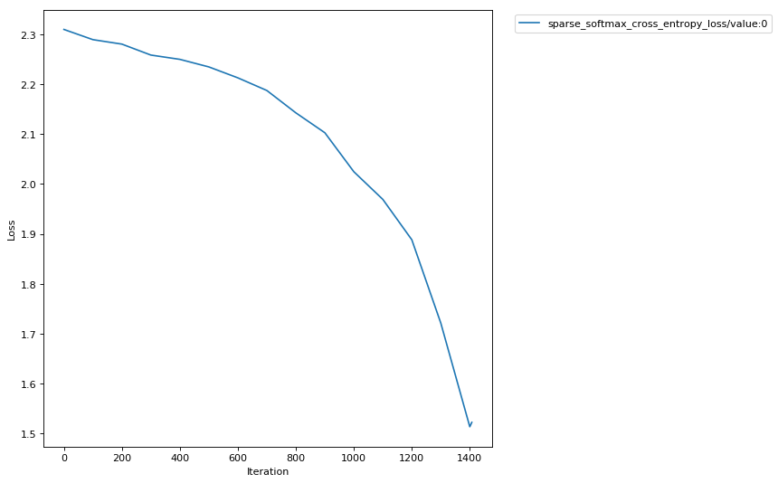

Amazon SageMaker Debugger - Using built-in rule
===============================================

`Amazon SageMaker <https://aws.amazon.com/sagemaker/>`__ is managed
platform to build, train and host maching learning models. Amazon
SageMaker Debugger is a new feature which offers the capability to debug
machine learning models during training by identifying and detecting
problems with the models in near real-time.

In this notebook you’ll be looking at how to use a SageMaker provided
built in rule during a TensorFlow training job.

How does Amazon SageMaker Debugger work?
----------------------------------------

Amazon SageMaker Debugger lets you go beyond just looking at scalars
like losses and accuracies during training and gives you full visibility
into all tensors ‘flowing through the graph’ during training.
Furthermore, it helps you monitor your training in near real-time using
rules and provides you alerts, once it has detected inconsistency in
training flow.

Concepts
~~~~~~~~

-  **Tensors**: These represent the state of the training network at
   intermediate points during its execution
-  **Debug Hook**: Hook is the construct with which Amazon SageMaker
   Debugger looks into the training process and captures the tensors
   requested at the desired step intervals
-  **Rule**: A logical construct, implemented as Python code, which
   helps analyze the tensors captured by the hook and report anomalies,
   if at all

With these concepts in mind, let’s understand the overall flow of things
that Amazon SageMaker Debugger uses to orchestrate debugging

Saving tensors during training
~~~~~~~~~~~~~~~~~~~~~~~~~~~~~~

The tensors captured by the debug hook are stored in the S3 location
specified by you. There are two ways you can configure Amazon SageMaker
Debugger to save tensors:

With no changes to your training script
^^^^^^^^^^^^^^^^^^^^^^^^^^^^^^^^^^^^^^^

If you use one of Amazon SageMaker provided `Deep Learning
Containers <https://docs.aws.amazon.com/sagemaker/latest/dg/pre-built-containers-frameworks-deep-learning.html>`__
for 1.15, then you don’t need to make any changes to your training
script for the tensors to be stored. Amazon SageMaker Debugger will use
the configuration you provide through Amazon SageMaker SDK’s Tensorflow
``Estimator`` when creating your job to save the tensors in the fashion
you specify. You can review the script we are going to use at
`src/mnist_zerocodechange.py <src/mnist_zerocodechange.py>`__. You will
note that this is an untouched TensorFlow script which uses the
``tf.estimator`` interface. Please note that Amazon SageMaker Debugger
only supports ``tf.keras``, ``tf.Estimator`` and ``tf.MonitoredSession``
interfaces. Full description of support is available at `Amazon
SageMaker Debugger with
TensorFlow <https://github.com/awslabs/sagemaker-debugger/tree/master/docs/tensorflow.md>`__

Orchestrating your script to store tensors
^^^^^^^^^^^^^^^^^^^^^^^^^^^^^^^^^^^^^^^^^^

For other containers, you need to make couple of lines of changes to
your training script. The Amazon SageMaker Debugger exposes a library
``smdebug`` which allows you to capture these tensors and save them for
analysis. It’s highly customizable and allows to save the specific
tensors you want at different frequencies and possibly with other
configurations. Refer
`DeveloperGuide <https://github.com/awslabs/sagemaker-debugger/tree/master/docs>`__
for details on how to use the Debugger library with your choice of
framework in your training script. Here we have an example script
orchestrated at `src/mnist_byoc <src/mnist_byoc.py>`__. You also need to
ensure that your container has the ``smdebug`` library installed.

Analysis of tensors
~~~~~~~~~~~~~~~~~~~

Once the tensors are saved, Amazon SageMaker Debugger can be configured
to run debugging **Rules** on them. At a very broad level, a rule is
python code used to detect certain conditions during training. Some of
the conditions that a data scientist training an algorithm may care
about are monitoring for gradients getting too large or too small,
detecting overfitting, and so on. Amazon Sagemaker Debugger will come
pre-packaged with certain first-party (1P) rules. Users can write their
own rules using Amazon Sagemaker Debugger APIs. You can also analyze raw
tensor data outside of the Rules construct in say, a Sagemaker notebook,
using Amazon Sagemaker Debugger’s full set of APIs. This notebook will
show you how to use a built in SageMaker Rule with your training job as
well as provide a sneak peak into these APIs for interactive
exploration. Please refer `Analysis Developer
Guide <https://github.com/awslabs/sagemaker-debugger/blob/master/docs/api.md>`__
for more on these APIs.

Setup
-----

Follow this one time setup to get your notebook up and running to use
Amazon SageMaker Debugger. This is only needed because we plan to
perform interactive analysis using this library in the notebook.

.. code:: ipython3

    ! pip install smdebug

With the setup out of the way let’s start training our TensorFlow model
in SageMaker with the debugger enabled.

Training TensorFlow models in SageMaker with Amazon SageMaker Debugger
----------------------------------------------------------------------

SageMaker TensorFlow as a framework
~~~~~~~~~~~~~~~~~~~~~~~~~~~~~~~~~~~

We’ll train a TensorFlow model in this notebook with Amazon Sagemaker
Debugger enabled and monitor the training jobs with Amazon Sagemaker
Debugger Rules. This will be done using Amazon SageMaker `TensorFlow
1.15.0 <https://docs.aws.amazon.com/sagemaker/latest/dg/pre-built-containers-frameworks-deep-learning.html>`__
Container as a framework.

.. code:: ipython3

    import boto3
    import os
    import sagemaker
    from sagemaker.tensorflow import TensorFlow

Let’s import the libraries needed for our demo of Amazon SageMaker
Debugger.

.. code:: ipython3

    from sagemaker.debugger import Rule, DebuggerHookConfig, TensorBoardOutputConfig, CollectionConfig, rule_configs

Now we’ll define the configuration for our training to run. We’ll using
image recognition using MNIST dataset as our training example.

.. code:: ipython3

    # define the entrypoint script
    entrypoint_script='src/mnist_zerocodechange.py'
    
    hyperparameters = {
        "num_epochs": 3
    }

Setting up the Estimator
~~~~~~~~~~~~~~~~~~~~~~~~

Now it’s time to setup our TensorFlow estimator. We’ve added new
parameters to the estimator to enable your training job for debugging
through Amazon SageMaker Debugger. These new parameters are explained
below.

-  **debugger_hook_config**: This new parameter accepts a local path
   where you wish your tensors to be written to and also accepts the S3
   URI where you wish your tensors to be uploaded to. SageMaker will
   take care of uploading these tensors transparently during execution.
-  **rules**: This new parameter will accept a list of rules you wish to
   evaluate against the tensors output by this training job. For rules,
   Amazon SageMaker Debugger supports two types:
-  **SageMaker Rules**: These are rules specially curated by the data
   science and engineering teams in Amazon SageMaker which you can opt
   to evaluate against your training job.
-  **Custom Rules**: You can optionally choose to write your own rule as
   a Python source file and have it evaluated against your training job.
   To provide Amazon SageMaker Debugger to evaluate this rule, you would
   have to provide the S3 location of the rule source and the evaluator
   image.

Using Amazon SageMaker Rules
^^^^^^^^^^^^^^^^^^^^^^^^^^^^

In this example we’ll demonstrate how to use SageMaker rules to be
evaluated against your training. You can find the list of SageMaker
rules and the configurations best suited for using them
`here <https://github.com/awslabs/sagemaker-debugger-rulesconfig>`__.

The rules we’ll use are **VanishingGradient** and **LossNotDecreasing**.
As the names suggest, the rules will attempt to evaluate if there are
vanishing gradients in the tensors captured by the debugging hook during
training and also if the loss is not decreasing.

.. code:: ipython3

    rules = [
        Rule.sagemaker(rule_configs.vanishing_gradient()), 
        Rule.sagemaker(rule_configs.loss_not_decreasing())
    ]
    
    estimator = TensorFlow(
        role=sagemaker.get_execution_role(),
        base_job_name='smdebugger-demo-mnist-tensorflow',
        train_instance_count=1,
        train_instance_type='ml.m4.xlarge',
        train_volume_size=400,
        entry_point=entrypoint_script,
        framework_version='1.15',
        py_version='py3',
        train_max_run=3600,
        script_mode=True,
        hyperparameters=hyperparameters,
        ## New parameter
        rules = rules
    )

*Note that Amazon Sagemaker Debugger is only supported for
py_version=‘py3’ currently.*

Let’s start the training by calling ``fit()`` on the TensorFlow
estimator.

.. code:: ipython3

    estimator.fit(wait=True)

Result
------

As a result of calling the ``fit()`` Amazon SageMaker Debugger kicked
off two rule evaluation jobs to monitor vanishing gradient and loss
decrease, in parallel with the training job. The rule evaluation
status(es) will be visible in the training logs at regular intervals. As
you can see, in the summary, there was no step in the training which
reported vanishing gradients in the tensors. Although, the loss was not
found to be decreasing at step 1900.

.. code:: ipython3

    estimator.latest_training_job.rule_job_summary()

.. parsed-literal::

    [{'RuleConfigurationName': 'VanishingGradient',
      'RuleEvaluationJobArn': 'arn:aws:sagemaker:us-west-2:072677473360:processing-job/smdebugger-demo-mnist-tens-vanishinggradient-1db16b4d',
      'RuleEvaluationStatus': 'NoIssuesFound',
      'LastModifiedTime': datetime.datetime(2019, 12, 1, 23, 47, 32, 186000, tzinfo=tzlocal())},
     {'RuleConfigurationName': 'LossNotDecreasing',
      'RuleEvaluationJobArn': 'arn:aws:sagemaker:us-west-2:072677473360:processing-job/smdebugger-demo-mnist-tens-lossnotdecreasing-d6176866',
      'RuleEvaluationStatus': 'NoIssuesFound',
      'LastModifiedTime': datetime.datetime(2019, 12, 1, 23, 47, 32, 186000, tzinfo=tzlocal())}]

Let’s try and look at the logs of the rule job for loss not decreasing.
To do that, we’ll use this utlity function to get a link to the rule job
logs.

.. code:: ipython3

    def _get_rule_job_name(training_job_name, rule_configuration_name, rule_job_arn):
            """Helper function to get the rule job name with correct casing"""
            return "{}-{}-{}".format(
                training_job_name[:26], rule_configuration_name[:26], rule_job_arn[-8:]
            )
        
    def _get_cw_url_for_rule_job(rule_job_name, region):
        return "https://{}.console.aws.amazon.com/cloudwatch/home?region={}#logStream:group=/aws/sagemaker/ProcessingJobs;prefix={};streamFilter=typeLogStreamPrefix".format(region, region, rule_job_name)
    
    
    def get_rule_jobs_cw_urls(estimator):
        region = boto3.Session().region_name
        training_job = estimator.latest_training_job
        training_job_name = training_job.describe()["TrainingJobName"]
        rule_eval_statuses = training_job.describe()["DebugRuleEvaluationStatuses"]
        
        result={}
        for status in rule_eval_statuses:
            if status.get("RuleEvaluationJobArn", None) is not None:
                rule_job_name = _get_rule_job_name(training_job_name, status["RuleConfigurationName"], status["RuleEvaluationJobArn"])
                result[status["RuleConfigurationName"]] = _get_cw_url_for_rule_job(rule_job_name, region)
        return result
    
    get_rule_jobs_cw_urls(estimator)

.. parsed-literal::

    {'VanishingGradient': 'https://us-west-2.console.aws.amazon.com/cloudwatch/home?region=us-west-2#logStream:group=/aws/sagemaker/ProcessingJobs;prefix=smdebugger-demo-mnist-tens-VanishingGradient-1db16b4d;streamFilter=typeLogStreamPrefix',
     'LossNotDecreasing': 'https://us-west-2.console.aws.amazon.com/cloudwatch/home?region=us-west-2#logStream:group=/aws/sagemaker/ProcessingJobs;prefix=smdebugger-demo-mnist-tens-LossNotDecreasing-d6176866;streamFilter=typeLogStreamPrefix'}

Data Analysis - Interactive Exploration
---------------------------------------

Now that we have trained a job, and looked at automated analysis through
rules, let us also look at another aspect of Amazon SageMaker Debugger.
It allows us to perform interactive exploration of the tensors saved in
real time or after the job. Here we focus on after-the-fact analysis of
the above job. We import the ``smdebug`` library, which defines a
concept of Trial that represents a single training run. Note how we
fetch the path to debugger artifacts for the above job.

.. code:: ipython3

    from smdebug.trials import create_trial
    trial = create_trial(estimator.latest_job_debugger_artifacts_path())

.. parsed-literal::

    [2019-12-01 23:47:58.201 ip-172-16-62-176:30695 INFO s3_trial.py:42] Loading trial debug-output at path s3://sagemaker-us-west-2-072677473360/smdebugger-demo-mnist-tensorflow-2019-12-01-23-41-02-486/debug-output

We can list all the tensors that were recorded to know what we want to
plot. Each one of these names is the name of a tensor, which is
auto-assigned by TensorFlow. In some frameworks where such names are not
available, we try to create a name based on the layer’s name and whether
it is weight, bias, gradient, input or output.

.. code:: ipython3

    trial.tensor_names()

.. parsed-literal::

    [2019-12-01 23:49:10.433 ip-172-16-62-176:30695 INFO trial.py:197] Training has ended, will refresh one final time in 1 sec.
    [2019-12-01 23:49:11.471 ip-172-16-62-176:30695 INFO trial.py:209] Loaded all steps

.. parsed-literal::

    ['gradients/conv2d/BiasAdd_grad/tuple/control_dependency_1:0',
     'gradients/conv2d/Conv2D_grad/tuple/control_dependency_1:0',
     'gradients/conv2d_1/BiasAdd_grad/tuple/control_dependency_1:0',
     'gradients/conv2d_1/Conv2D_grad/tuple/control_dependency_1:0',
     'gradients/dense/BiasAdd_grad/tuple/control_dependency_1:0',
     'gradients/dense/MatMul_grad/tuple/control_dependency_1:0',
     'gradients/dense_1/BiasAdd_grad/tuple/control_dependency_1:0',
     'gradients/dense_1/MatMul_grad/tuple/control_dependency_1:0',
     'sparse_softmax_cross_entropy_loss/value:0']

We can also retrieve tensors by some default collections that
``smdebug`` creates from your training job. Here we are interested in
the losses collection, so we can retrieve the names of tensors in losses
collection as follows. Amazon SageMaker Debugger creates default
collections such as weights, gradients, biases, losses automatically.
You can also create custom collections from your tensors.

.. code:: ipython3

    trial.tensor_names(collection="losses")

.. parsed-literal::

    ['sparse_softmax_cross_entropy_loss/value:0']

.. code:: ipython3

    import matplotlib.pyplot as plt
    import re
    
    # Define a function that, for the given tensor name, walks through all 
    # the iterations for which we have data and fetches the value.
    # Returns the set of steps and the values
    def get_data(trial, tname):
        tensor = trial.tensor(tname)
        steps = tensor.steps()
        vals = [tensor.value(s) for s in steps]
        return steps, vals
    
    def plot_tensors(trial, collection_name, ylabel=''):
        """
        Takes a `trial` and plots all tensors that match the given regex.
        """
        plt.figure(
            num=1, figsize=(8, 8), dpi=80,
            facecolor='w', edgecolor='k')
    
        tensors = trial.tensor_names(collection=collection_name)
    
        for tensor_name in sorted(tensors):
            steps, data = get_data(trial, tensor_name)
            plt.plot(steps, data, label=tensor_name)
    
        plt.legend(bbox_to_anchor=(1.04,1), loc='upper left')
        plt.xlabel('Iteration')
        plt.ylabel(ylabel)
        plt.show()
        
    plot_tensors(trial, "losses", ylabel="Loss")

