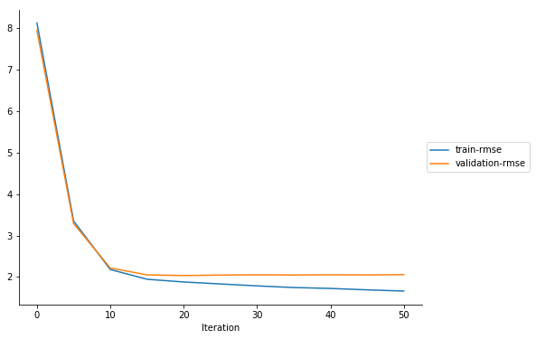
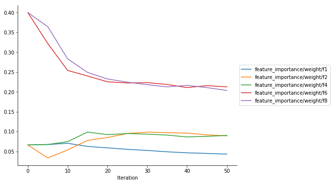
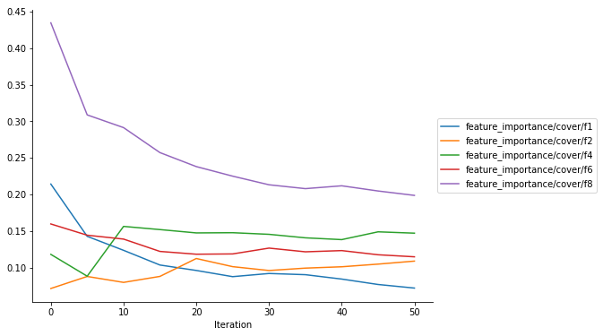
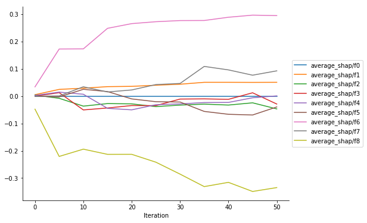

Debugging XGBoost Training Jobs with Amazon SageMaker Debugger Using Rules
==========================================================================

This notebook was created and tested on an ml.m5.4xlarge notebook
instance.

Overview
--------

Amazon SageMaker Debugger is a new capability of Amazon SageMaker that
allows debugging machine learning training. Amazon SageMaker Debugger
helps you to monitor your training in near real time using rules and
would provide you alerts, once it has detected inconsistency in
training.

Using Amazon SageMaker Debugger is a two step process: Saving tensors
and Analysis. Let’s look at each one of them closely.

Saving tensors
~~~~~~~~~~~~~~

In deep learning algorithms, tensors define the state of the training
job at any particular instant in its lifecycle. Amazon SageMaker
Debugger exposes a library which allows you to capture these tensors and
save them for analysis. Although XGBoost is not a deep learning
algorithm, Amazon SageMaker Debugger is highly customizable and can help
provide interpretability by saving insightful metrics, such as
performance metrics or feature importances, at different frequencies.
Refer to
`documentation <https://github.com/awslabs/sagemaker-debugger/blob/master/docs/xgboost.md>`__
for details on how to save the metrics you want.

Analysis
~~~~~~~~

After the tensors are saved, perform automatic analysis by running
debugging **Rules**. On a very broad level, a rule is Python code used
to detect certain conditions during training. Some of the conditions
that a data scientist training an algorithm may care about are
monitoring for gradients getting too large or too small, detecting
overfitting, and so on. Amazon SageMaker Debugger comes pre-packaged
with certain rules that can be invoked on Amazon SageMaker. Users can
also write their own rules using the Amazon SageMaker Debugger APIs. For
more information about automatic analysis using a rule, see the `rules
documentation <https://github.com/awslabs/sagemaker-debugger/blob/master/docs/analysis.md>`__.

.. code:: ipython3

    ! python -m pip install smdebug

.. code:: ipython3

    import boto3
    import sagemaker

Amazon SageMaker Debugger is available in Amazon SageMaker XGBoost
container version 0.90-2 or later. If you want to use XGBoost with
Amazon SageMaker Debugger, you have to specify ``repo_version='0.90-2'``
in the ``get_image_uri`` function.

.. code:: ipython3

    from sagemaker.amazon.amazon_estimator import get_image_uri
    
    # Below changes the Region to be one where this notebook is running
    region = boto3.Session().region_name
    
    container = get_image_uri(region, "xgboost", repo_version="0.90-2")

Training XGBoost models in Amazon SageMaker with Amazon SageMaker Debugger
--------------------------------------------------------------------------

Now train an XGBoost model with Amazon SageMaker Debugger enabled and
monitor the training jobs. This is done using the Amazon SageMaker
Estimator API. While the training job is running, use Amazon SageMaker
Debugger API to access saved tensors in real time and visualize them.
You can rely on Amazon SageMaker Debugger to take care of downloading a
fresh set of tensors every time you query for them.

This example is adapted from `XGBoost for
Regression <https://github.com/awslabs/amazon-sagemaker-examples/tree/master/introduction_to_amazon_algorithms/xgboost_abalone>`__.
Refer to `XGBoost for
Regression <https://github.com/awslabs/amazon-sagemaker-examples/tree/master/introduction_to_amazon_algorithms/xgboost_abalone>`__
for an example of using classification from Amazon SageMaker’s
implementation of `XGBoost <https://github.com/dmlc/xgboost>`__.

Data preparation
~~~~~~~~~~~~~~~~

Use the `Abalone
data <https://www.csie.ntu.edu.tw/~cjlin/libsvmtools/datasets/regression.html>`__
originally from the `UCI data
repository <https://archive.ics.uci.edu/ml/datasets/abalone>`__. More
details about the original dataset can be found
`here <https://archive.ics.uci.edu/ml/machine-learning-databases/abalone/abalone.names>`__.
In the libsvm converted
`version <https://www.csie.ntu.edu.tw/~cjlin/libsvmtools/datasets/regression.html>`__,
the nominal feature (Male/Female/Infant) has been converted into a real
valued feature. Age of abalone is to be predicted from eight physical
measurements.

Following methods download the Abalone data, split the data into
training and validation sets, and upload files to Amazon Simple Storage
Service (Amazon S3).

.. code:: ipython3

    from data_utils import load_abalone, upload_to_s3
    
    bucket = sagemaker.Session().default_bucket()
    prefix = "DEMO-smdebug-xgboost-abalone"

.. code:: ipython3

    %%time
    
    train_file, validation_file = load_abalone()
    upload_to_s3(train_file, bucket, f"{prefix}/train/abalone.train.libsvm")
    upload_to_s3(validation_file, bucket, f"{prefix}/validation/abalone.validation.libsvm")

.. code:: ipython3

    from sagemaker import get_execution_role
    
    role = get_execution_role()
    base_job_name = "demo-smdebug-xgboost-classification"
    bucket_path = 's3://{}'.format(bucket)
    
    hyperparameters={
        "max_depth": "5",
        "eta": "0.2",
        "gamma": "4",
        "min_child_weight": "6",
        "subsample": "0.7",
        "silent": "0",
        "objective": "reg:squarederror",
        "num_round": "51",
    }
    
    save_interval = 5
    
    base_job_name = "demo-smdebug-xgboost-regression"

Enabling Debugger in Estimator object
~~~~~~~~~~~~~~~~~~~~~~~~~~~~~~~~~~~~~

DebuggerHookConfig
^^^^^^^^^^^^^^^^^^

Enabling Amazon SageMaker Debugger in training job can be accomplished
by adding its configuration into Estimator object constructor:

.. code:: python

   from sagemaker.debugger import DebuggerHookConfig, CollectionConfig

   estimator = Estimator(
       ...,
       debugger_hook_config = DebuggerHookConfig(
           s3_output_path="s3://{bucket_name}/{location_in_bucket}",  # Required
           collection_configs=[
               CollectionConfig(
                   name="metrics",
                   parameters={
                       "save_interval": "10"
                   }
               )
           ]
       )
   )

Here, the ``DebuggerHookConfig`` object instructs ``Estimator`` what
data we are interested in. Two parameters are provided in the example:

-  ``s3_output_path``: it points to S3 bucket/path where we intend to
   store our debugging tensors. Amount of data saved depends on multiple
   factors, major ones are: training job / data set / model / frequency
   of saving tensors. This bucket should be in your AWS account, and you
   should have full access control over it. **Important Note**: this s3
   bucket should be originally created in the same region where your
   training job will be running, otherwise you might run into problems
   with cross region access.

-  ``collection_configs``: it enumerates named collections of tensors we
   want to save. Collections are a convinient way to organize relevant
   tensors under same umbrella to make it easy to navigate them during
   analysis. In this particular example, you are instructing Amazon
   SageMaker Debugger that you are interested in a single collection
   named ``metrics``. We also instructed Amazon SageMaker Debugger to
   save metrics every 10 iteration. See
   `Collection <https://github.com/awslabs/sagemaker-debugger/blob/master/docs/api.md#collection>`__
   documentation for all parameters that are supported by Collections
   and DebuggerConfig documentation for more details about all
   parameters DebuggerConfig supports.

Rules
^^^^^

Enabling Rules in training job can be accomplished by adding the
``rules`` configuration into Estimator object constructor.

-  ``rules``: This new parameter will accept a list of rules you wish to
   evaluate against the tensors output by this training job. For rules,
   Amazon SageMaker Debugger supports two types:

   -  SageMaker Rules: These are rules specially curated by the data
      science and engineering teams in Amazon SageMaker which you can
      opt to evaluate against your training job.
   -  Custom Rules: You can optionally choose to write your own rule as
      a Python source file and have it evaluated against your training
      job. To provide Amazon SageMaker Debugger to evaluate this rule,
      you would have to provide the S3 location of the rule source and
      the evaluator image.

In this example, you will use a Amazon SageMaker’s LossNotDecreasing
rule, which helps you identify if you are running into a situation where
the training loss is not going down.

.. code:: python

   from sagemaker.debugger import rule_configs, Rule

   estimator = Estimator(
       ...,
       rules=[
           Rule.sagemaker(
               rule_configs.loss_not_decreasing(),
               rule_parameters={
                   "collection_names": "metrics",
                   "num_steps": "10",
               },
           ),
       ],
   )

-  ``rule_parameters``: In this parameter, you provide the runtime
   values of the parameter in your constructor. You can still choose to
   pass in other values which may be necessary for your rule to be
   evaluated. In this example, you will use Amazon SageMaker’s
   LossNotDecreasing rule to monitor the ``metircs`` collection. The
   rule will alert you if the tensors in ``metrics`` has not decreased
   for more than 10 steps.

.. code:: ipython3

    from sagemaker.debugger import rule_configs, Rule, DebuggerHookConfig, CollectionConfig
    from sagemaker.estimator import Estimator
    
    algorithm_mode_default_estimator = Estimator(
        role=role,
        base_job_name=base_job_name,
        train_instance_count=1,
        train_instance_type='ml.m5.xlarge',
        image_name=container,
        hyperparameters=hyperparameters,
        train_max_run=1800,
    
        debugger_hook_config=DebuggerHookConfig(
            s3_output_path=bucket_path,  # Required
            collection_configs=[
                CollectionConfig(
                    name="metrics",
                    parameters={
                        "save_interval": str(save_interval)
                    }
                ),
                CollectionConfig(
                    name="feature_importance",
                    parameters={
                        "save_interval": str(save_interval)
                    }
                ),
                CollectionConfig(
                    name="average_shap",
                    parameters={
                        "save_interval": str(save_interval)
                    }
                ),
            ],
        ),
    
        rules=[
            Rule.sagemaker(
                rule_configs.loss_not_decreasing(),
                rule_parameters={
                    "collection_names": "metrics",
                    "num_steps": str(save_interval * 2),
                },
            ),
        ],
    )

With the next step, start a training job by using the Estimator object
you created above. This job is started in an asynchronous, non-blocking
way. This means that control is passed back to the notebook and further
commands can be run while the training job is progressing.

.. code:: ipython3

    from sagemaker.session import s3_input
    
    train_s3_input = s3_input("s3://{}/{}/{}".format(bucket, prefix, "train"), content_type="libsvm")
    validation_s3_input = s3_input( "s3://{}/{}/{}".format(bucket, prefix, "validation"), content_type="libsvm")
    algorithm_mode_default_estimator.fit(
        {"train": train_s3_input, "validation": validation_s3_input},
        # This is a fire and forget event. By setting wait=False, you just submit the job to run in the background.
        # Amazon SageMaker starts one training job and release control to next cells in the notebook.
        # Follow this notebook to see status of the training job.
        wait=False
    )

Result
~~~~~~

As a result of the above command, Amazon SageMaker starts one training
job and one rule job for you. The first one is the job that produces the
tensors to be analyzed. The second one analyzes the tensors to check if
``train-rmse`` and ``validation-rmse`` are not decreasing at any point
during training.

Check the status of the training job below. After your training job is
started, Amazon SageMaker starts a rule-execution job to run the
LossNotDecreasing rule.

**Note that the next cell blocks until the rule execution job ends. You
can stop it at any point to proceed to the rest of the notebook. Once it
says Rule Evaluation Status is Started, and shows the
``RuleEvaluationJobArn``, you can look at the status of the rule being
monitored.**

.. code:: ipython3

    import time
    
    for _ in range(360):
        job_name = algorithm_mode_default_estimator.latest_training_job.name
        client = algorithm_mode_default_estimator.sagemaker_session.sagemaker_client
        description = client.describe_training_job(TrainingJobName=job_name)
        training_job_status = description["TrainingJobStatus"]
        rule_job_summary = algorithm_mode_default_estimator.latest_training_job.rule_job_summary()
        rule_evaluation_status = rule_job_summary[0]["RuleEvaluationStatus"]
        print("Training job status: {}, Rule Evaluation Status: {}".format(training_job_status, rule_evaluation_status))
    
        if rule_evaluation_status in ["Stopped", "IssuesFound", "NoIssuesFound"]:
            break
    
        time.sleep(10)

Check the status of the Rule Evaluation Job
~~~~~~~~~~~~~~~~~~~~~~~~~~~~~~~~~~~~~~~~~~~

To get the rule evaluation job that Amazon SageMaker started for you,
run the command below. The results show you the
``RuleConfigurationName``, ``RuleEvaluationJobArn``,
``RuleEvaluationStatus``, ``StatusDetails``, and
``RuleEvaluationJobArn``. If the tensors meets a rule evaluation
condition, the rule execution job throws a client error with
``RuleEvaluationConditionMet``.

The logs of the rule evaluation job are available in the Cloudwatch
Logstream ``/aws/sagemaker/ProcessingJobs`` with
``RuleEvaluationJobArn``.

You can see that once the rule execution job starts, it identifies the
loss not decreasing situation in the training job, it raises the
``RuleEvaluationConditionMet`` exception, and it ends the job.

.. code:: ipython3

    algorithm_mode_default_estimator.latest_training_job.rule_job_summary()

Making this a good run
----------------------

In previous example, you saw how a LossNotDecreasing rule was run that
analyzed the tensors when training was running and produced an alert.

You can go back and change the hyperparameters passed to the estimator
to ``hyperparameters`` and start a new training job (e.g., use a smaller
learning rate ``eta=0.05``). You can see that the LossNotDecreasing rule
is not fired in that case as both ``train-rmse`` and ``validation-rmse``
keep decreasing steadily throughout the entire training duration.

Data Analysis - Manual
----------------------

Now that you’ve trained the system, analyze the data. Here, you focus on
after-the-fact analysis.

You import a basic analysis library, which defines the concept of trial,
which represents a single training run.

.. code:: ipython3

    from smdebug.trials import create_trial
    
    s3_output_path = algorithm_mode_default_estimator.latest_job_debugger_artifacts_path()
    trial = create_trial(s3_output_path)

You can list all the tensors that you know something about. Each one of
these names is the name of a tensor. The name is a combination of the
feature name, which in these cases, is auto-assigned by XGBoost, and
whether it’s an evaluation metric, feature importance, or SHAP value.

.. code:: ipython3

    trial.tensor_names()

For each tensor, ask for the steps where you have data. In this case,
every five steps

.. code:: ipython3

    trial.tensor("train-rmse").steps()

You can obtain each tensor at each step as a NumPy array.

.. code:: ipython3

    type(trial.tensor("train-rmse").value(10))

Performance metrics
~~~~~~~~~~~~~~~~~~~

You can also create a simple function that visualizes the training and
validation errors as the training progresses. Each gradient should get
smaller over time, as the system converges to a good solution. Remember
that this is an interactive analysis. You are showing these tensors to
give an idea of the data.

.. code:: ipython3

    import matplotlib.pyplot as plt
    import seaborn as sns
    import re
    
    
    def get_data(trial, tname):
        """
        For the given tensor name, walks though all the iterations
        for which you have data and fetches the values.
        Returns the set of steps and the values.
        """
        tensor = trial.tensor(tname)
        steps = tensor.steps()
        vals = [tensor.value(s) for s in steps]
        return steps, vals
    
    def plot_collection(trial, collection_name, regex='.*', figsize=(8, 6)):
        """
        Takes a `trial` and a collection name, and 
        plots all tensors that match the given regex.
        """
        fig, ax = plt.subplots(figsize=figsize)
        sns.despine()
    
        tensors = trial.collection(collection_name).tensor_names
    
        for tensor_name in sorted(tensors):
            if re.match(regex, tensor_name):
                steps, data = get_data(trial, tensor_name)
                ax.plot(steps, data, label=tensor_name)
    
        ax.legend(loc='center left', bbox_to_anchor=(1, 0.5))
        ax.set_xlabel('Iteration')

.. code:: ipython3

    plot_collection(trial, "metrics")

Feature importances
~~~~~~~~~~~~~~~~~~~

You can also visualize the feature priorities as determined by
`xgboost.get_score() <https://xgboost.readthedocs.io/en/latest/python/python_api.html#xgboost.Booster.get_score>`__.
If you instructed Estimator to log the ``feature_importance``
collection, all five importance types supported by
``xgboost.get_score()`` will be available in the collection.

.. code:: ipython3

    def plot_feature_importance(trial, importance_type="weight"):
        SUPPORTED_IMPORTANCE_TYPES = ["weight", "gain", "cover", "total_gain", "total_cover"]
        if importance_type not in SUPPORTED_IMPORTANCE_TYPES:
            raise ValueError(f"{importance_type} is not one of the supported importance types.")
        plot_collection(
            trial,
            "feature_importance",
            regex=f"feature_importance/{importance_type}/.*")

.. code:: ipython3

    plot_feature_importance(trial)

.. code:: ipython3

    plot_feature_importance(trial, importance_type="cover")

SHAP
~~~~

`SHAP <https://github.com/slundberg/shap>`__ (SHapley Additive
exPlanations) is another approach to explain the output of machine
learning models. SHAP values represent a feature’s contribution to a
change in the model output. You instructed Estimator to log the average
SHAP values in this example so the SHAP values (as calculated by
`xgboost.predict(pred_contribs=True) <https://xgboost.readthedocs.io/en/latest/python/python_api.html#xgboost.Booster.predict>`__)
will be available the ``average_shap`` collection.

.. code:: ipython3

    plot_collection(trial,"average_shap")

