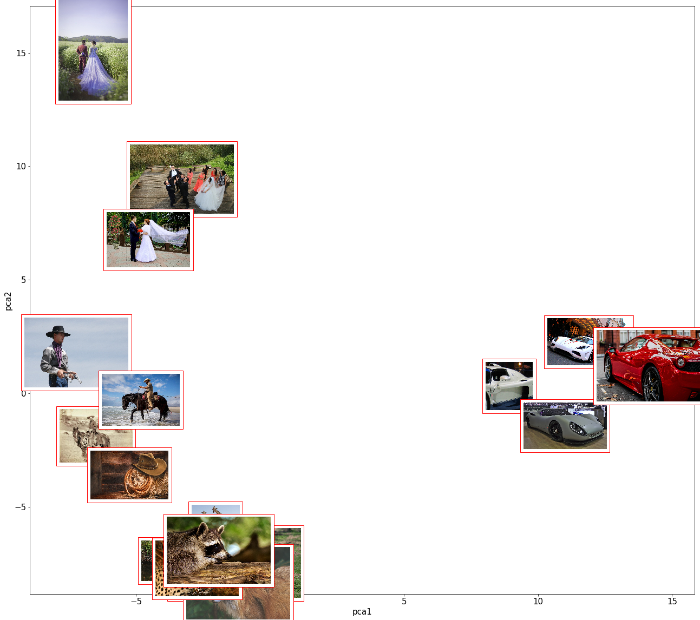

Building an image embedding server with Gluon
=============================================

In this notebook, we use a pre-trained model to extract image
embeddings. \* **Image embeddings** are dense, high-semantic,
low-dimension vector representation of images learnt by neural networks.
They can directly by learnt by a model, or obtained as a byproduct of a
downstream task. In this demo, we use a pre-trained classifier from the
gluon model zoo to obtain those embeddings: 1. We first import a model
from the gluon model zoo locally on the notebook, that we then compress
and send to S3 1. We then use the SageMaker MXNet Serving feature to
deploy the embedding model to a real-time managed endpoint. It uses the
model artifact that we previously loaded to S3. 1. We query the endpoint
and visualize embeddings in a 2D scatter plot using PCA

-  **More on gluon:**
   `gluon <https://mxnet.incubator.apache.org/api/python/docs/api/gluon/index.html>`__
   is the imperative python front-end of the Apache MXNet deep learning
   framework. Gluon notably features specialized toolkits helping
   reproducing state-of-the-art architectures:
   `gluon-cv <https://gluon-cv.mxnet.io/>`__,
   `gluon-nlp <https://gluon-nlp.mxnet.io/>`__,
   `gluon-ts <https://gluon-ts.mxnet.io/>`__. Gluon also features a
   number of excellent end-to-end tutorial mixing science with code such
   as `D2L.ai <https://classic.d2l.ai/>`__ and `The Straight
   Dope <https://gluon.mxnet.io/>`__
-  This specific demo has been developed on the ``conda_mxnet_p36``
   kernel of a SageMaker ``ml.t2.medium`` Notebook instance
-  For a more advanced, fully-deployed demo and an embedding server +
   approximate kNN pipeline see the excellent
   https://thomasdelteil.github.io/VisualSearch_MXNet/ from Thomas
   Delteil.

**This sample is provided for demonstration purposes, make sure to
conduct appropriate testing if derivating this code for your own
use-cases!**

.. code:: ipython3

    import datetime
    import json
    import os
    import subprocess as sb
    import tarfile
    
    import boto3
    from matplotlib import pyplot as plt
    from matplotlib.offsetbox import AnnotationBbox, OffsetImage
    import mxnet as mx
    from mxnet import image, nd
    from mxnet.gluon.model_zoo import vision as models
    import numpy as np
    import pandas as pd
    from sklearn.decomposition import PCA
    
    # import SageMaker tools
    import sagemaker
    from sagemaker import get_execution_role
    from sagemaker.mxnet.model import MXNetModel
    
    sess = sagemaker.Session()
    
    bucket = sess.default_bucket()  # We use this bucket to store model weights - don't hesitate to change.
    print('using bucket ' + bucket)

.. code:: javascript

    %%javascript
    
    //disable autoscroll
    IPython.OutputArea.prototype._should_scroll = function(lines) {
        return false;
    }

.. code:: ipython3

    # find couple open pics
    pics = [
        'https://cdn.pixabay.com/photo/2016/02/16/03/42/lasso-1202578_960_720.jpg',
        'https://cdn.pixabay.com/photo/2015/09/14/20/52/cowboy-940083_1280.jpg',
        'https://upload.wikimedia.org/wikipedia/commons/d/d3/Cowboy.1887.ws.jpg',
        'https://cdn.pixabay.com/photo/2015/05/08/05/33/cowboy-757575_960_720.jpg',
        'https://cdn.pixabay.com/photo/2017/12/03/19/08/wedding-2995641_1280.jpg',
        'https://www.maxpixel.net/static/photo/2x/Bride-And-Groom-Wedding-Ceremony-2729673.jpg',
        'https://cdn12.picryl.com/photo/2016/12/31/wedding-the-groom-bride-nature-landscapes-2c6338-1024.jpg',
        'https://upload.wikimedia.org/wikipedia/commons/a/a4/%22_04_-_ITALIAN_Hypercar_GT_1_-_sport_car_racing_airscoop_intake.JPG',
        'https://upload.wikimedia.org/wikipedia/commons/thumb/c/cb/Corbellati_Missile_Genf_2018.jpg/1024px-Corbellati_Missile_Genf_2018.jpg',
        'https://upload.wikimedia.org/wikipedia/commons/7/77/JAGUAR_C-X75_HYBRID_SUPERCAR_%289098871512%29.jpg',
        'https://upload.wikimedia.org/wikipedia/commons/1/1c/Girafeskoure.jpg',
        'https://upload.wikimedia.org/wikipedia/commons/thumb/5/50/African_Leopard_Chitwa_South_Africa_Luca_Galuzzi_2004.JPG/1024px-African_Leopard_Chitwa_South_Africa_Luca_Galuzzi_2004.JPG',
        'https://www.maxpixel.net/static/photo/2x/Animal-Portrait-Fuchs-Animal-World-Wild-Animal-3532084.jpg',
        'https://upload.wikimedia.org/wikipedia/commons/thumb/e/e9/Papio_papio_and_juvenile_Port_Lympne_Wild_Animal_Park.jpg/1600px-Papio_papio_and_juvenile_Port_Lympne_Wild_Animal_Park.jpg',
        'https://cdn.pixabay.com/photo/2018/07/10/22/09/raccoon-3529806_1280.jpg',
        'https://www.nps.gov/katm/learn/nature/images/bear-cubs-intro-pic.jpg?maxwidth=1200&maxheight=1200&autorotate=false',
        'https://upload.wikimedia.org/wikipedia/commons/5/52/Koenigsegg_Agera_R.jpg',
        'https://cdn.pixabay.com/photo/2017/11/09/01/49/ferrari-458-spider-2932191_1280.jpg'
    ]

.. code:: ipython3

    # download pics
    sb.call(['mkdir', 'pics'])
    
    path = '/home/ec2-user/SageMaker/pics/'
    
    for p in pics:
        sb.call(['wget', p, '-P', path])

.. code:: ipython3

    # reading couple images with mxnet
    for p in os.listdir(path)[:3]:
        
        picture = mx.image.imread(os.path.join(path, p))
        plt.imshow(picture.asnumpy())
        plt.show()

Getting embeddings from a pre-trained classifier, locally
---------------------------------------------------------

We take models from the gluon model zoo
https://mxnet.incubator.apache.org/api/python/gluon/model_zoo.html

.. code:: ipython3

    modelname = 'resnet152_v2'  # Other interesting options: resnet34_v2, mobilenetv2_0.5
    
    net = models.get_model(name=modelname, pretrained=True)
    emb = net.features  # get embeddings, not final probas

.. code:: ipython3

    def transform(data):
        """resize, crop, normalize"""
        data = mx.image.resize_short(data, 256)  # resize
        data, _ = mx.image.center_crop(data, (224,224))  # crop
        data = data.transpose((2,0,1)).expand_dims(axis=0)  # channels-first and batch size 1
        rgb_mean = nd.array([0.485, 0.456, 0.406]).reshape((1,3,1,1))
        rgb_std = nd.array([0.229, 0.224, 0.225]).reshape((1,3,1,1))
        return (data.astype('float32') / 255 - rgb_mean) / rgb_std   # ImageNet-normalize
    
    
    def embeddings(embmodel, pic):
        """get the image embeddings, returns an NDArray"""
        return embmodel(transform(pic)).squeeze()  # flatten if nested dimensions

.. code:: ipython3

    # test locally
    embeddings(emb, mx.image.imread(path + 'Girafeskoure.jpg'))[:10]  # 10 first coefficients

Write the embedding model in the SageMaker MXNet specification
--------------------------------------------------------------

https://github.com/aws/sagemaker-python-sdk/blob/master/src/sagemaker/mxnet/README.rst#deploying-mxnet-models

Amazon SageMaker provides serving container for Sklearn, TensorFlow,
PyTorch, Apache MXNet and Chainer. This is convenient, because we don’t
have to write web server code: the server is already written, in the
case of MXNet it is Multi Model Server
(`MMS <https://github.com/awslabs/multi-model-server>`__, also used to
server PyTorch in SageMaker) . We just have to provide model
deserialization code and serving logic.

The SageMaker MXNet model server breaks request handling into three
steps. Each step involves invoking a python function, with information
about the request and the return-value from the previous function in the
chain:

-  input processing, with
   ``input_fn(request_body, request_content_type, model)``
-  prediction, with ``predict_fn(input_object, model)``
-  output processing, with ``output_fn(prediction, content_type)``

The full serving specification is documented here
https://sagemaker.readthedocs.io/en/stable/using_mxnet.html#deploy-mxnet-models

In our specific example we don’t write an ``output_fn``, because
``predict_fn`` outputs an NDArray that can be handled to CSV or JSON by
the default ``output_fn``

Create a serving script containing model deserialization and serving logic
~~~~~~~~~~~~~~~~~~~~~~~~~~~~~~~~~~~~~~~~~~~~~~~~~~~~~~~~~~~~~~~~~~~~~~~~~~

.. code:: ipython3

    %%writefile embedding_server.py
    
    import argparse
    import logging
    import os
    
    import mxnet as mx
    from mxnet import nd, gluon
    from mxnet.gluon.model_zoo import vision as models
    
    
    
    
    # couple utilities * * * * * * * * * * * * * * * * * * * *
    
    def transform(data):
        """resize, crop, normalize"""
        data = mx.image.resize_short(data, 256)
        data, _ = mx.image.center_crop(data, (224,224))
        data = data.transpose((2,0,1)).expand_dims(axis=0)
        rgb_mean = nd.array([0.485, 0.456, 0.406]).reshape((1,3,1,1))
        rgb_std = nd.array([0.229, 0.224, 0.225]).reshape((1,3,1,1))
        return (data.astype('float32') / 255 - rgb_mean) / rgb_std
    
    
    def embeddings(embmodel, pic):
        """get the image embeddings, returns an NDArray"""
        return embmodel(transform(pic)).squeeze()  # flatten if nested dimensions
    
    
    # SageMaker serving functions* * * * * * * * * * * * * * *
    
    def model_fn(model_dir):
        """
        Load the gluon model. Called once when hosting service starts.
        :param: model_dir The directory where model files are stored.
        :return: a model (in this case a Gluon network)
        
        assumes that the parameters artifact is {model_name}.params
        """
        modelname = os.environ['modelname']
        net = models.get_model(name=modelname, pretrained=False, ctx=mx.cpu())
        net.load_parameters(os.path.join(model_dir, modelname + '.params'))
        logging.info('loaded parameters into model ' + modelname)
    
        return net
    
    
    def input_fn(request_body, request_content_type):
        """prepares the input"""
        output = mx.image.imdecode(request_body)
        logging.info('input_fn returns NDArray of shape ' + str(output.shape))
        return output
    
    
    def predict_fn(input_object, model):
        """function used for prediction"""
        emb = model.features
        return embeddings(emb, input_object)

Deploy the embedding server
---------------------------

We first need to send model weights to S3, as we will provide the S3
model path to Amazon SageMaker endpoint creation API

save local model, compress and send to S3
~~~~~~~~~~~~~~~~~~~~~~~~~~~~~~~~~~~~~~~~~

.. code:: ipython3

    # save weights
    weights = modelname + '.params'
    net.save_parameters(weights)

.. code:: ipython3

    # compress (takes couple minutes with the resnet152)
    packname = 'model.tar.gz'
    tar = tarfile.open(packname, 'w:gz')
    tar.add(weights)
    tar.close()

.. code:: ipython3

    # send to s3
    s3 = boto3.client('s3')
    s3key = 'embedding-artifact'
    s3.upload_file(packname, bucket, s3key + '/' + packname)

Instantiate model and deploy
~~~~~~~~~~~~~~~~~~~~~~~~~~~~

.. code:: ipython3

    # instantiate model
    model = MXNetModel(
        model_data='s3://{}/{}/{}'.format(bucket, s3key, packname),
        role=get_execution_role(),
        py_version='py3',
        entry_point='embedding_server.py',
        framework_version='1.6.0',
        env={'modelname': modelname})  # we pass model name via an environment variable

.. code:: ipython3

    endpoint_key = ((modelname + '-embedding').replace('_', '-').replace('.', '') + '-' 
                    + datetime.datetime.now().strftime('%Y-%m-%d-%H-%M-%S'))
    
    # this may take over 10min
    model.deploy(
        initial_instance_count=1,
        instance_type='ml.t2.medium',
        endpoint_name=endpoint_key)

Submit requests to the embedding server
---------------------------------------

Produce embeddings of images
~~~~~~~~~~~~~~~~~~~~~~~~~~~~

.. code:: ipython3

    # instantiate a predictor
    predictor = sagemaker.predictor.RealTimePredictor(
        endpoint=endpoint_key,
        content_type='image/jpeg')

.. code:: ipython3

    def get_emb(pic, predictor):
        """elementary function to send a picture to a predictor"""
        
        with open(pic, 'rb') as image:
            f = image.read()
    
        return json.loads(predictor.predict(f))

.. code:: ipython3

    # test with the same image as the local inference on top of notebook
    
    get_emb(path + 'Girafeskoure.jpg', predictor)[:10]  # first 10 coefficents of the embedding

.. code:: ipython3

    # loop through images to create embeddings of all images
    
    picnames = os.listdir(path)
    
    image_embs = np.expand_dims(get_emb(os.path.join(path, picnames[0]), predictor), axis=0)
    
    for p in picnames[1:]:
        print('getting embedding for ' + p)
        image_embs = np.concatenate(
            (image_embs, np.expand_dims(get_emb(os.path.join(path, p), predictor), axis=0)))

Visualize the semantic similarity in the embedding space
~~~~~~~~~~~~~~~~~~~~~~~~~~~~~~~~~~~~~~~~~~~~~~~~~~~~~~~~

.. code:: ipython3

    # PCA of embedding matrix
    X_pca = PCA(2).fit_transform(image_embs)
    emb = pd.DataFrame(X_pca, columns=['pca1', 'pca2'])
    emb['pic'] = picnames
    emb['url'] = [os.path.join(path, p) for p in picnames]

.. code:: ipython3

    def scatter(data, x, y, pic_url, pic_zoom):
        """plots a scatter plot with image thumbnails"""
        
        temp = data[[x, y, pic_url]].dropna().reset_index()
        
        ax = temp.plot(kind='scatter', x=x, y=y)
    
        for i in range(len(temp)):
            imagebox = OffsetImage(plt.imread(temp[pic_url][i]), zoom=pic_zoom)
            ab = AnnotationBbox(imagebox, [temp[x][i], temp[y][i]],
                xybox=(30., -30.),
                xycoords='data',
                boxcoords='offset points',
                bboxprops =dict(edgecolor='r'))                                 
            ax.add_artist(ab)  

.. code:: ipython3

    # some settings for visualisations
    %matplotlib inline
    plt.style.use('seaborn-pastel')  # set style
    plt.rcParams['figure.figsize'] = [22,20]
    plt.rcParams['font.size'] = 15
    
    scatter(data=emb, x='pca1', y='pca2', pic_url='url', pic_zoom=0.15)

Don’t forget to delete the endpoint after the demo!
~~~~~~~~~~~~~~~~~~~~~~~~~~~~~~~~~~~~~~~~~~~~~~~~~~~

.. code:: ipython3

    sess.delete_endpoint(endpoint_key)
