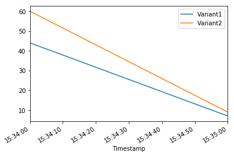

A/B Testing with Amazon SageMaker
=================================

In production ML workflows, data scientists and data engineers
frequently try to improve their models in various ways, such as by
performing `Perform Automatic Model
Tuning <https://docs.aws.amazon.com/sagemaker/latest/dg/automatic-model-tuning.html>`__,
training on additional or more-recent data, and improving feature
selection. Performing A/B testing between a new model and an old model
with production traffic can be an effective final step in the validation
process for a new model. In A/B testing, you test different variants of
your models and compare how each variant performs relative to each
other. You then choose the best-performing model to replace a
previously-existing model new version delivers better performance than
the previously-existing version.

Amazon SageMaker enables you to test multiple models or model versions
behind the same endpoint using production variants. Each production
variant identifies a machine learning (ML) model and the resources
deployed for hosting the model. You can distribute endpoint invocation
requests across multiple production variants by providing the traffic
distribution for each variant, or you can invoke a specific variant
directly for each request.

In this notebook we’ll: \* Evaluate models by invoking specific variants
\* Gradually release a new model by specifying traffic distribution

Prerrequisites
~~~~~~~~~~~~~~

First we ensure we have an updated version of boto3, which includes the
latest SageMaker features:

.. code:: ipython3

    !pip install -U awscli

.. parsed-literal::

    Collecting awscli
    [?25l  Downloading https://files.pythonhosted.org/packages/4a/63/97b815b7752895c93fd99b548c530dfa84d62b1d4ef8d9ab2f6db01449a2/awscli-1.18.75.tar.gz (1.2MB)
        100% |████████████████████████████████| 1.2MB 10.2MB/s ta 0:00:01
    [?25hCollecting botocore==1.16.25 (from awscli)
    [?25l  Downloading https://files.pythonhosted.org/packages/38/ea/7e41f120d364b3e8f854336c900bd80abd74e6d72b2280e195e3195027a4/botocore-1.16.25-py2.py3-none-any.whl (6.2MB)
        100% |████████████████████████████████| 6.2MB 6.9MB/s eta 0:00:01
    [?25hRequirement not upgraded as not directly required: docutils<0.16,>=0.10 in /home/ec2-user/anaconda3/envs/python3/lib/python3.6/site-packages (from awscli) (0.14)
    Requirement not upgraded as not directly required: rsa<=3.5.0,>=3.1.2 in /home/ec2-user/anaconda3/envs/python3/lib/python3.6/site-packages (from awscli) (3.4.2)
    Requirement not upgraded as not directly required: s3transfer<0.4.0,>=0.3.0 in /home/ec2-user/anaconda3/envs/python3/lib/python3.6/site-packages (from awscli) (0.3.3)
    Requirement not upgraded as not directly required: PyYAML<5.4,>=3.10 in /home/ec2-user/anaconda3/envs/python3/lib/python3.6/site-packages (from awscli) (5.3.1)
    Requirement not upgraded as not directly required: colorama<0.4.4,>=0.2.5 in /home/ec2-user/anaconda3/envs/python3/lib/python3.6/site-packages (from awscli) (0.3.9)
    Requirement not upgraded as not directly required: urllib3<1.26,>=1.20; python_version != "3.4" in /home/ec2-user/anaconda3/envs/python3/lib/python3.6/site-packages (from botocore==1.16.25->awscli) (1.23)
    Requirement not upgraded as not directly required: jmespath<1.0.0,>=0.7.1 in /home/ec2-user/anaconda3/envs/python3/lib/python3.6/site-packages (from botocore==1.16.25->awscli) (0.9.4)
    Requirement not upgraded as not directly required: python-dateutil<3.0.0,>=2.1 in /home/ec2-user/anaconda3/envs/python3/lib/python3.6/site-packages (from botocore==1.16.25->awscli) (2.7.3)
    Requirement not upgraded as not directly required: pyasn1>=0.1.3 in /home/ec2-user/anaconda3/envs/python3/lib/python3.6/site-packages (from rsa<=3.5.0,>=3.1.2->awscli) (0.4.8)
    Requirement not upgraded as not directly required: six>=1.5 in /home/ec2-user/anaconda3/envs/python3/lib/python3.6/site-packages (from python-dateutil<3.0.0,>=2.1->botocore==1.16.25->awscli) (1.11.0)
    Building wheels for collected packages: awscli
      Running setup.py bdist_wheel for awscli ... [?25ldone
    [?25h  Stored in directory: /home/ec2-user/.cache/pip/wheels/bc/e9/d0/12224e13d50ce061eaf262fdf0237c24d80b306133c3f200be
    Successfully built awscli
    boto3 1.12.47 has requirement botocore<1.16.0,>=1.15.47, but you'll have botocore 1.16.25 which is incompatible.
    Installing collected packages: botocore, awscli
      Found existing installation: botocore 1.15.47
        Uninstalling botocore-1.15.47:
          Successfully uninstalled botocore-1.15.47
      Found existing installation: awscli 1.18.47
        Uninstalling awscli-1.18.47:
          Successfully uninstalled awscli-1.18.47
    Successfully installed awscli-1.18.75 botocore-1.16.25
    You are using pip version 10.0.1, however version 20.2b1 is available.
    You should consider upgrading via the 'pip install --upgrade pip' command.

Configuration
-------------

Let’s set up some required imports and basic initial variables:

.. code:: ipython3

    %%time
    %matplotlib inline
    from datetime import datetime, timedelta
    import time
    import os
    import boto3
    import re
    import json
    from sagemaker import get_execution_role, session
    from sagemaker.s3 import S3Downloader, S3Uploader
    
    region= boto3.Session().region_name
    role = get_execution_role()
    sm_session = session.Session(boto3.Session())
    sm = boto3.Session().client("sagemaker")
    sm_runtime = boto3.Session().client("sagemaker-runtime")
    
    # You can use a different bucket, but make sure the role you chose for this notebook
    # has the s3:PutObject permissions. This is the bucket into which the model artifacts will be uploaded
    bucket =  sm_session.default_bucket()
    prefix = 'sagemaker/DEMO-VariantTargeting'

.. parsed-literal::

    CPU times: user 1.09 s, sys: 109 ms, total: 1.2 s
    Wall time: 1.31 s

Step 1: Create and deploy the models
------------------------------------

First, we upload our pre-trained models to Amazon S3
~~~~~~~~~~~~~~~~~~~~~~~~~~~~~~~~~~~~~~~~~~~~~~~~~~~~

This code uploads two pre-trained XGBoost models that are ready for you
to deploy. These models were trained using the XGB Churn Prediction
Notebook in SageMaker. You can also use your own pre-trained models in
this step. If you already have a pretrained model in Amazon S3, you can
add it by specifying the s3_key.

The models in this example are used to predict the probability of a
mobile customer leaving their current mobile operator. The dataset we
use is publicly available and was mentioned in the book `Discovering
Knowledge in Data <https://www.amazon.com/dp/0470908742/>`__ by Daniel
T. Larose. It is attributed by the author to the University of
California Irvine Repository of Machine Learning Datasets.

.. code:: ipython3

    model_url = S3Uploader.upload(local_path="model/xgb-churn-prediction-model.tar.gz",
                                  desired_s3_uri=f"s3://{bucket}/{prefix}")
    model_url2 = S3Uploader.upload(local_path="model/xgb-churn-prediction-model2.tar.gz",
                                  desired_s3_uri=f"s3://{bucket}/{prefix}")
    model_url, model_url2

.. parsed-literal::

    ('s3://sagemaker-us-east-2-799622031015/sagemaker/DEMO-VariantTargeting/xgb-churn-prediction-model.tar.gz',
     's3://sagemaker-us-east-2-799622031015/sagemaker/DEMO-VariantTargeting/xgb-churn-prediction-model2.tar.gz')

Next, we create our model definitions
~~~~~~~~~~~~~~~~~~~~~~~~~~~~~~~~~~~~~

Start with deploying the pre-trained churn prediction models. Here, you
create the model objects with the image and model data.

.. code:: ipython3

    from sagemaker.amazon.amazon_estimator import get_image_uri
    
    model_name = f"DEMO-xgb-churn-pred-{datetime.now():%Y-%m-%d-%H-%M-%S}"
    model_name2 = f"DEMO-xgb-churn-pred2-{datetime.now():%Y-%m-%d-%H-%M-%S}"
    image_uri = get_image_uri(boto3.Session().region_name, 'xgboost', '0.90-1')
    image_uri2 = get_image_uri(boto3.Session().region_name, 'xgboost', '0.90-2')
    
    sm_session.create_model(name=model_name, role=role, container_defs={
        'Image': image_uri,
        'ModelDataUrl': model_url
    })
    
    sm_session.create_model(name=model_name2, role=role, container_defs={
        'Image': image_uri2,
        'ModelDataUrl': model_url2
    })

.. parsed-literal::

    WARNING:root:There is a more up to date SageMaker XGBoost image. To use the newer image, please set 'repo_version'='0.90-2'. For example:
    	get_image_uri(region, 'xgboost', '0.90-2').

.. parsed-literal::

    'DEMO-xgb-churn-pred2-2020-06-05-15-27-29'

Create variants
~~~~~~~~~~~~~~~

We now create two variants, each with its own different model (these
could also have different instance types and counts).

We set an initial_weight of “1” for both variants: this means 50% of our
requests go to Variant1, and the remaining 50% of all requests to
Variant2. (The sum of weights across both variants is 2 and each variant
has weight assignment of 1. This implies each variant receives 1/2, or
50%, of the total traffic.)

.. code:: ipython3

    from sagemaker.session import production_variant
    
    variant1 = production_variant(model_name=model_name,
                                  instance_type="ml.m5.xlarge",
                                  initial_instance_count=1,
                                  variant_name='Variant1',
                                  initial_weight=1)
    variant2 = production_variant(model_name=model_name2,
                                  instance_type="ml.m5.xlarge",
                                  initial_instance_count=1,
                                  variant_name='Variant2',
                                  initial_weight=1)
    
    (variant1, variant2)

.. parsed-literal::

    ({'ModelName': 'DEMO-xgb-churn-pred-2020-06-05-15-27-29',
      'InstanceType': 'ml.m5.xlarge',
      'InitialInstanceCount': 1,
      'VariantName': 'Variant1',
      'InitialVariantWeight': 1},
     {'ModelName': 'DEMO-xgb-churn-pred2-2020-06-05-15-27-29',
      'InstanceType': 'ml.m5.xlarge',
      'InitialInstanceCount': 1,
      'VariantName': 'Variant2',
      'InitialVariantWeight': 1})

Deploy
~~~~~~

Let’s go ahead and deploy our two variants to a SageMaker endpoint:

.. code:: ipython3

    endpoint_name = f"DEMO-xgb-churn-pred-{datetime.now():%Y-%m-%d-%H-%M-%S}"
    print(f"EndpointName={endpoint_name}")
    
    sm_session.endpoint_from_production_variants(
        name=endpoint_name,
        production_variants=[variant1, variant2]
    )

.. parsed-literal::

    EndpointName=DEMO-xgb-churn-pred-2020-06-05-15-27-31
    -------------!

.. parsed-literal::

    'DEMO-xgb-churn-pred-2020-06-05-15-27-31'

Step 2: Invoke the deployed models
----------------------------------

You can now send data to this endpoint to get inferences in real time.

This step invokes the endpoint with included sample data for about 2
minutes.

.. code:: ipython3

    # get a subset of test data for a quick test
    !tail -120 test_data/test-dataset-input-cols.csv > test_data/test_sample_tail_input_cols.csv
    print(f"Sending test traffic to the endpoint {endpoint_name}. \nPlease wait...")
    
    with open('test_data/test_sample_tail_input_cols.csv', 'r') as f:
        for row in f:
            print(".", end="", flush=True)
            payload = row.rstrip('\n')
            sm_runtime.invoke_endpoint(EndpointName=endpoint_name,
                                       ContentType="text/csv",
                                       Body=payload)
            time.sleep(0.5)
            
    print("Done!")        

.. parsed-literal::

    Sending test traffic to the endpoint DEMO-xgb-churn-pred-2020-06-05-15-27-31. 
    Please wait...
    ........................................................................................................................Done!

Invocations per variant
~~~~~~~~~~~~~~~~~~~~~~~

Amazon SageMaker emits metrics such as Latency and Invocations (full
list of metrics
`here <https://alpha-docs-aws.amazon.com/sagemaker/latest/dg/monitoring-cloudwatch.html>`__)
for each variant in Amazon CloudWatch. Let’s query CloudWatch to get
number of Invocations per variant, to show how invocations are split
across variants:

.. code:: ipython3

    import pandas as pd
    cw = boto3.Session().client("cloudwatch")
    
    def get_invocation_metrics_for_endpoint_variant(endpoint_name,
                                                    variant_name,
                                                    start_time,
                                                    end_time):
        metrics = cw.get_metric_statistics(
            Namespace="AWS/SageMaker",
            MetricName="Invocations",
            StartTime=start_time,
            EndTime=end_time,
            Period=60,
            Statistics=["Sum"],
            Dimensions=[
                {
                    "Name": "EndpointName",
                    "Value": endpoint_name
                },
                {
                    "Name": "VariantName",
                    "Value": variant_name
                }
            ]
        )
        return pd.DataFrame(metrics["Datapoints"])\
                .sort_values("Timestamp")\
                .set_index("Timestamp")\
                .drop("Unit", axis=1)\
                .rename(columns={"Sum": variant_name})
    
    def plot_endpoint_metrics(start_time=None):
        start_time = start_time or datetime.now() - timedelta(minutes=60)
        end_time = datetime.now()
        metrics_variant1 = get_invocation_metrics_for_endpoint_variant(endpoint_name, variant1["VariantName"], start_time, end_time)
        metrics_variant2 = get_invocation_metrics_for_endpoint_variant(endpoint_name, variant2["VariantName"], start_time, end_time)
        metrics_variants = metrics_variant1.join(metrics_variant2, how="outer")
        metrics_variants.plot()
        return metrics_variants

.. code:: ipython3

    print("Waiting a minute for initial metric creation...")
    time.sleep(60)
    plot_endpoint_metrics()

.. parsed-literal::

    Waiting two minutes for initial metric creation...

.. raw:: html

    

    
    <table border="1" class="dataframe">
      <thead>
        <tr style="text-align: right;">
          <th></th>
          <th>Variant1</th>
          <th>Variant2</th>
        </tr>
        <tr>
          <th>Timestamp</th>
          <th></th>
          <th></th>
        </tr>
      </thead>
      <tbody>
        <tr>
          <th>2020-06-05 15:34:00+00:00</th>
          <td>44.0</td>
          <td>60.0</td>
        </tr>
        <tr>
          <th>2020-06-05 15:35:00+00:00</th>
          <td>7.0</td>
          <td>9.0</td>
        </tr>
      </tbody>
    </table>
    

Invoke a specific variant
~~~~~~~~~~~~~~~~~~~~~~~~~

Now, let’s use the new feature that was released today to invoke a
specific variant. For this, we simply use the new parameter to define
which specific ProductionVariant we want to invoke. Let us use this to
invoke Variant1 for all requests.

.. code:: ipython3

    import numpy as np
    predictions = ''
    
    print(f"Sending test traffic to the endpoint {endpoint_name}. \nPlease wait...")
    with open('test_data/test_sample_tail_input_cols.csv', 'r') as f:
        for row in f:
            print(".", end="", flush=True)
            payload = row.rstrip('\n')
            response = sm_runtime.invoke_endpoint(EndpointName=endpoint_name,
                                       ContentType="text/csv",
                                       Body=payload,
                                       TargetVariant=variant1["VariantName"])
            predictions = ','.join([predictions, response['Body'].read().decode('utf-8')])
            time.sleep(0.5)
    
    # Convert our predictions to a numpy array
    pred_np = np.fromstring(predictions[1:], sep=',')
            
    # Convert the prediction probabilities to binary predictions of either 1 or 0
    threshold = 0.5
    preds = np.where(pred_np > threshold, 1, 0)    
    print("Done!") 

.. parsed-literal::

    Sending test traffic to the endpoint DEMO-xgb-churn-pred-2020-06-05-15-27-31. 
    Please wait...
    ........................................................................................................................Done!

When we again check the traffic per variant, this time we see that the
number of invocations only incremented for Variant1, because all
invocations were targeted at that variant:

.. code:: ipython3

    time.sleep(20) #let metrics catch up
    plot_endpoint_metrics()

.. parsed-literal::

    /home/ec2-user/anaconda3/envs/python3/lib/python3.6/site-packages/pandas/core/arrays/datetimes.py:1172: UserWarning: Converting to PeriodArray/Index representation will drop timezone information.
      "will drop timezone information.", UserWarning)

.. raw:: html

    

    
    <table border="1" class="dataframe">
      <thead>
        <tr style="text-align: right;">
          <th></th>
          <th>Variant1</th>
          <th>Variant2</th>
        </tr>
        <tr>
          <th>Timestamp</th>
          <th></th>
          <th></th>
        </tr>
      </thead>
      <tbody>
        <tr>
          <th>2020-06-05 15:34:00+00:00</th>
          <td>44.0</td>
          <td>60.0</td>
        </tr>
        <tr>
          <th>2020-06-05 15:35:00+00:00</th>
          <td>7.0</td>
          <td>9.0</td>
        </tr>
        <tr>
          <th>2020-06-05 15:36:00+00:00</th>
          <td>99.0</td>
          <td>NaN</td>
        </tr>
      </tbody>
    </table>
    

Step 3: Evaluate variant performance
------------------------------------

Evaluating Variant 1
~~~~~~~~~~~~~~~~~~~~

Using the new targeting feature, let us evaluate the accuracy,
precision, recall, F1 score, and ROC/AUC for Variant1:

.. code:: ipython3

    import matplotlib.pyplot as plt
    import pandas as pd
    from sklearn import metrics
    from sklearn.metrics import roc_auc_score
    
    # Let's get the labels of our test set; we will use these to evaluate our predictions
    !tail -121 test_data/test-dataset.csv > test_data/test_dataset_sample_tail.csv
    df_with_labels = pd.read_csv('test_data/test_dataset_sample_tail.csv')
    test_labels = df_with_labels.iloc[:, 0]
    labels = test_labels.to_numpy()
    
    # Calculate accuracy
    accuracy = sum(preds == labels) / len(labels)
    print(f'Accuracy: {accuracy}')
    
    # Calculate precision
    precision = sum(preds[preds == 1] == labels[preds == 1]) / len(preds[preds == 1])
    print(f'Precision: {precision}')
    
    # Calculate recall
    recall = sum(preds[preds == 1] == labels[preds == 1]) / len(labels[labels == 1])
    print(f'Recall: {recall}')
    
    # Calculate F1 score
    f1_score = 2 * (precision * recall) / (precision + recall)
    print(f'F1 Score: {f1_score}')
    
    # Calculate AUC
    auc = round(roc_auc_score(labels, preds), 4)
    print('AUC is ' + repr(auc))
    
    fpr, tpr, _ = metrics.roc_curve(labels, preds)
    
    plt.title('ROC Curve')
    plt.plot(fpr, tpr, 'b',
    label='AUC = %0.2f'% auc)
    plt.legend(loc='lower right')
    plt.plot([0,1],[0,1],'r--')
    plt.xlim([-0.1,1.1])
    plt.ylim([-0.1,1.1])
    plt.ylabel('True Positive Rate')
    plt.xlabel('False Positive Rate')
    plt.show()

.. parsed-literal::

    Accuracy: 0.9583333333333334
    Precision: 0.9411764705882353
    Recall: 0.8
    F1 Score: 0.8648648648648648
    AUC is 0.895

Next, we collect data for Variant2
~~~~~~~~~~~~~~~~~~~~~~~~~~~~~~~~~~

.. code:: ipython3

    predictions2 = ''
    print(f"Sending test traffic to the endpoint {endpoint_name}. \nPlease wait...")
    with open('test_data/test_sample_tail_input_cols.csv', 'r') as f:
        for row in f:
            print(".", end="", flush=True)
            payload = row.rstrip('\n')
            response = sm_runtime.invoke_endpoint(EndpointName=endpoint_name,
                                       ContentType="text/csv",
                                       Body=payload,
                                       TargetVariant=variant2["VariantName"])
            predictions2 = ','.join([predictions2, response['Body'].read().decode('utf-8')])
            time.sleep(0.5)
    
    # Convert to numpy array        
    pred_np2 = np.fromstring(predictions2[1:], sep=',')
            
    # Convert to binary predictions
    thresh = 0.5
    preds2 = np.where(pred_np2 > threshold, 1, 0)    
    
    print("Done!") 

.. parsed-literal::

    Sending test traffic to the endpoint DEMO-xgb-churn-pred-2020-06-05-15-27-31. 
    Please wait...
    ........................................................................................................................Done!

When we again check the traffic per variant, this time we see that the
number of invocations only incremented for Variant2, because all
invocations were targeted at that variant:

.. code:: ipython3

    time.sleep(60) # give metrics time to catch up
    plot_endpoint_metrics()

.. parsed-literal::

    /home/ec2-user/anaconda3/envs/python3/lib/python3.6/site-packages/pandas/core/arrays/datetimes.py:1172: UserWarning: Converting to PeriodArray/Index representation will drop timezone information.
      "will drop timezone information.", UserWarning)

.. raw:: html

    

    
    <table border="1" class="dataframe">
      <thead>
        <tr style="text-align: right;">
          <th></th>
          <th>Variant1</th>
          <th>Variant2</th>
        </tr>
        <tr>
          <th>Timestamp</th>
          <th></th>
          <th></th>
        </tr>
      </thead>
      <tbody>
        <tr>
          <th>2020-06-05 15:34:00+00:00</th>
          <td>44.0</td>
          <td>60.0</td>
        </tr>
        <tr>
          <th>2020-06-05 15:35:00+00:00</th>
          <td>7.0</td>
          <td>9.0</td>
        </tr>
        <tr>
          <th>2020-06-05 15:36:00+00:00</th>
          <td>99.0</td>
          <td>NaN</td>
        </tr>
        <tr>
          <th>2020-06-05 15:37:00+00:00</th>
          <td>21.0</td>
          <td>55.0</td>
        </tr>
        <tr>
          <th>2020-06-05 15:38:00+00:00</th>
          <td>NaN</td>
          <td>65.0</td>
        </tr>
      </tbody>
    </table>
    

Evaluating Variant2
~~~~~~~~~~~~~~~~~~~

.. code:: ipython3

    # Calculate accuracy
    accuracy2 = sum(preds2 == labels) / len(labels)
    print(f'Accuracy: {accuracy2}')
    
    # Calculate precision
    precision2 = sum(preds2[preds2 == 1] == labels[preds2 == 1]) / len(preds2[preds2 == 1])
    print(f'Precision: {precision2}')
    
    # Calculate recall
    recall2 = sum(preds2[preds2 == 1] == labels[preds2 == 1]) / len(labels[labels == 1])
    print(f'Recall: {recall2}')
    
    # Calculate F1 score
    f1_score2 = 2 * (precision2 * recall2) / (precision2 + recall2)
    print(f'F1 Score: {f1_score2}')
    
    auc2 = round(roc_auc_score(labels, preds2), 4)
    print('AUC is ' + repr(auc2))
    
    fpr2, tpr2, _ = metrics.roc_curve(labels, preds2)
    
    plt.title('ROC Curve')
    plt.plot(fpr2, tpr2, 'b',
    label='AUC = %0.2f'% auc2)
    plt.legend(loc='lower right')
    plt.plot([0,1],[0,1],'r--')
    plt.xlim([-0.1,1.1])
    plt.ylim([-0.1,1.1])
    plt.ylabel('True Positive Rate')
    plt.xlabel('False Positive Rate')
    plt.show()

.. parsed-literal::

    Accuracy: 0.9583333333333334
    Precision: 0.8947368421052632
    Recall: 0.85
    F1 Score: 0.8717948717948718
    AUC is 0.915

We see that Variant2 is performing better for most of our defined
metrics, so this is the one we’re likely to choose to dial up in
production.

Step 4: Dialing up our chosen variant in production
---------------------------------------------------

Now that we have determined Variant2 to be better as compared to
Variant1, we will shift more traffic to it.

We can continue to use TargetVariant to continue invoking a chosen
variant. A simpler approach is to update the weights assigned to each
variant using UpdateEndpointWeightsAndCapacities. This changes the
traffic distribution to your production variants without requiring
updates to your endpoint.

Recall our variant weights are as follows:

.. code:: ipython3

    {
        variant["VariantName"]: variant["CurrentWeight"]
        for variant in sm.describe_endpoint(EndpointName=endpoint_name)["ProductionVariants"]
    }

.. parsed-literal::

    {'Variant1': 1.0, 'Variant2': 1.0}

We’ll first write a method to easily invoke our endpoint (a copy of what
we had been previously doing):

.. code:: ipython3

    def invoke_endpoint_for_two_minutes():
        with open('test_data/test-dataset-input-cols.csv', 'r') as f:
            for row in f:
                print(".", end="", flush=True)
                payload = row.rstrip('\n')
                response = sm_runtime.invoke_endpoint(EndpointName=endpoint_name,
                                                      ContentType='text/csv', 
                                                      Body=payload)
                response['Body'].read()
                time.sleep(1)

We invoke our endpoint for a bit, to show the even split in invocations:

.. code:: ipython3

    invocation_start_time = datetime.now()
    invoke_endpoint_for_two_minutes()
    time.sleep(20) # give metrics time to catch up
    plot_endpoint_metrics(invocation_start_time)

.. parsed-literal::

    ..............................................................................................................................................................................................................................................................................................................................................

.. parsed-literal::

    /home/ec2-user/anaconda3/envs/python3/lib/python3.6/site-packages/pandas/core/arrays/datetimes.py:1172: UserWarning: Converting to PeriodArray/Index representation will drop timezone information.
      "will drop timezone information.", UserWarning)

.. raw:: html

    

    
    <table border="1" class="dataframe">
      <thead>
        <tr style="text-align: right;">
          <th></th>
          <th>Variant1</th>
          <th>Variant2</th>
        </tr>
        <tr>
          <th>Timestamp</th>
          <th></th>
          <th></th>
        </tr>
      </thead>
      <tbody>
        <tr>
          <th>2020-06-05 15:39:00+00:00</th>
          <td>11.0</td>
          <td>15.0</td>
        </tr>
        <tr>
          <th>2020-06-05 15:40:00+00:00</th>
          <td>37.0</td>
          <td>22.0</td>
        </tr>
        <tr>
          <th>2020-06-05 15:41:00+00:00</th>
          <td>35.0</td>
          <td>24.0</td>
        </tr>
        <tr>
          <th>2020-06-05 15:42:00+00:00</th>
          <td>28.0</td>
          <td>31.0</td>
        </tr>
        <tr>
          <th>2020-06-05 15:43:00+00:00</th>
          <td>35.0</td>
          <td>24.0</td>
        </tr>
        <tr>
          <th>2020-06-05 15:44:00+00:00</th>
          <td>24.0</td>
          <td>17.0</td>
        </tr>
      </tbody>
    </table>
    

.. image:: a_b_testing_files/a_b_testing_37_3.png

Now let us shift 75% of the traffic to Variant2 by assigning new weights
to each variant using UpdateEndpointWeightsAndCapacities. Amazon
SageMaker will now send 75% of the inference requests to Variant2 and
remaining 25% of requests to Variant1.

.. code:: ipython3

    sm.update_endpoint_weights_and_capacities(
        EndpointName=endpoint_name,
        DesiredWeightsAndCapacities=[
            {
                "DesiredWeight": 25,
                "VariantName": variant1["VariantName"]
            },
            {
                "DesiredWeight": 75,
                "VariantName": variant2["VariantName"]
            }
        ]
    )

.. parsed-literal::

    {'EndpointArn': 'arn:aws:sagemaker:us-east-2:799622031015:endpoint/demo-xgb-churn-pred-2020-06-05-15-27-31',
     'ResponseMetadata': {'RequestId': '43463972-7344-491b-9067-f260ad30b2e2',
      'HTTPStatusCode': 200,
      'HTTPHeaders': {'x-amzn-requestid': '43463972-7344-491b-9067-f260ad30b2e2',
       'content-type': 'application/x-amz-json-1.1',
       'content-length': '107',
       'date': 'Fri, 05 Jun 2020 15:45:33 GMT'},
      'RetryAttempts': 0}}

.. code:: ipython3

    print("Waiting for update to complete")
    while True:
        status = sm.describe_endpoint(EndpointName=endpoint_name)["EndpointStatus"]
        if status in ["InService", "Failed"]:
            print("Done")
            break
        print(".", end="", flush=True)
        time.sleep(1)
    
    {
        variant["VariantName"]: variant["CurrentWeight"]
        for variant in sm.describe_endpoint(EndpointName=endpoint_name)["ProductionVariants"]
    }

.. parsed-literal::

    Waiting for update to complete
    ..........................................................Done

.. parsed-literal::

    {'Variant1': 25.0, 'Variant2': 75.0}

Now let’s check how that has impacted invocation metrics:

.. code:: ipython3

    invoke_endpoint_for_two_minutes()
    time.sleep(20) # give metrics time to catch up
    plot_endpoint_metrics(invocation_start_time)

.. parsed-literal::

    ..............................................................................................................................................................................................................................................................................................................................................

.. parsed-literal::

    /home/ec2-user/anaconda3/envs/python3/lib/python3.6/site-packages/pandas/core/arrays/datetimes.py:1172: UserWarning: Converting to PeriodArray/Index representation will drop timezone information.
      "will drop timezone information.", UserWarning)

.. raw:: html

    

    
    <table border="1" class="dataframe">
      <thead>
        <tr style="text-align: right;">
          <th></th>
          <th>Variant1</th>
          <th>Variant2</th>
        </tr>
        <tr>
          <th>Timestamp</th>
          <th></th>
          <th></th>
        </tr>
      </thead>
      <tbody>
        <tr>
          <th>2020-06-05 15:39:00+00:00</th>
          <td>11.0</td>
          <td>15.0</td>
        </tr>
        <tr>
          <th>2020-06-05 15:40:00+00:00</th>
          <td>37.0</td>
          <td>22.0</td>
        </tr>
        <tr>
          <th>2020-06-05 15:41:00+00:00</th>
          <td>35.0</td>
          <td>24.0</td>
        </tr>
        <tr>
          <th>2020-06-05 15:42:00+00:00</th>
          <td>28.0</td>
          <td>31.0</td>
        </tr>
        <tr>
          <th>2020-06-05 15:43:00+00:00</th>
          <td>35.0</td>
          <td>24.0</td>
        </tr>
        <tr>
          <th>2020-06-05 15:44:00+00:00</th>
          <td>33.0</td>
          <td>26.0</td>
        </tr>
        <tr>
          <th>2020-06-05 15:45:00+00:00</th>
          <td>8.0</td>
          <td>5.0</td>
        </tr>
        <tr>
          <th>2020-06-05 15:46:00+00:00</th>
          <td>2.0</td>
          <td>22.0</td>
        </tr>
        <tr>
          <th>2020-06-05 15:47:00+00:00</th>
          <td>19.0</td>
          <td>41.0</td>
        </tr>
        <tr>
          <th>2020-06-05 15:48:00+00:00</th>
          <td>10.0</td>
          <td>49.0</td>
        </tr>
        <tr>
          <th>2020-06-05 15:49:00+00:00</th>
          <td>12.0</td>
          <td>47.0</td>
        </tr>
        <tr>
          <th>2020-06-05 15:50:00+00:00</th>
          <td>19.0</td>
          <td>40.0</td>
        </tr>
        <tr>
          <th>2020-06-05 15:51:00+00:00</th>
          <td>14.0</td>
          <td>41.0</td>
        </tr>
      </tbody>
    </table>
    

We can continue to monitor our metrics and when we’re satisfied with a
variant’s performance, we can route 100% of the traffic over the
variant. We used UpdateEndpointWeightsAndCapacities to update the
traffic assignments for the variants. The weight for Variant1 is set to
0 and the weight for Variant2 is set to 1. Therefore, Amazon SageMaker
will send 100% of all inference requests to Variant2.

.. code:: ipython3

    sm.update_endpoint_weights_and_capacities(
        EndpointName=endpoint_name,
        DesiredWeightsAndCapacities=[
            {
                "DesiredWeight": 0,
                "VariantName": variant1["VariantName"]
            },
            {
                "DesiredWeight": 1,
                "VariantName": variant2["VariantName"]
            }
        ]
    )
    print("Waiting for update to complete")
    while True:
        status = sm.describe_endpoint(EndpointName=endpoint_name)["EndpointStatus"]
        if status in ["InService", "Failed"]:
            print("Done")
            break
        print(".", end="", flush=True)
        time.sleep(1)
    
    {
        variant["VariantName"]: variant["CurrentWeight"]
        for variant in sm.describe_endpoint(EndpointName=endpoint_name)["ProductionVariants"]
    }

.. parsed-literal::

    Waiting for update to complete
    ...........................................................Done

.. parsed-literal::

    {'Variant1': 0.0, 'Variant2': 1.0}

.. code:: ipython3

    invoke_endpoint_for_two_minutes()
    time.sleep(20) # give metrics time to catch up
    plot_endpoint_metrics(invocation_start_time)

.. parsed-literal::

    ..............................................................................................................................................................................................................................................................................................................................................

.. parsed-literal::

    /home/ec2-user/anaconda3/envs/python3/lib/python3.6/site-packages/pandas/core/arrays/datetimes.py:1172: UserWarning: Converting to PeriodArray/Index representation will drop timezone information.
      "will drop timezone information.", UserWarning)

.. raw:: html

    

    
    <table border="1" class="dataframe">
      <thead>
        <tr style="text-align: right;">
          <th></th>
          <th>Variant1</th>
          <th>Variant2</th>
        </tr>
        <tr>
          <th>Timestamp</th>
          <th></th>
          <th></th>
        </tr>
      </thead>
      <tbody>
        <tr>
          <th>2020-06-05 15:39:00+00:00</th>
          <td>11.0</td>
          <td>15.0</td>
        </tr>
        <tr>
          <th>2020-06-05 15:40:00+00:00</th>
          <td>37.0</td>
          <td>22.0</td>
        </tr>
        <tr>
          <th>2020-06-05 15:41:00+00:00</th>
          <td>35.0</td>
          <td>24.0</td>
        </tr>
        <tr>
          <th>2020-06-05 15:42:00+00:00</th>
          <td>28.0</td>
          <td>31.0</td>
        </tr>
        <tr>
          <th>2020-06-05 15:43:00+00:00</th>
          <td>35.0</td>
          <td>24.0</td>
        </tr>
        <tr>
          <th>2020-06-05 15:44:00+00:00</th>
          <td>33.0</td>
          <td>26.0</td>
        </tr>
        <tr>
          <th>2020-06-05 15:45:00+00:00</th>
          <td>8.0</td>
          <td>5.0</td>
        </tr>
        <tr>
          <th>2020-06-05 15:46:00+00:00</th>
          <td>2.0</td>
          <td>22.0</td>
        </tr>
        <tr>
          <th>2020-06-05 15:47:00+00:00</th>
          <td>19.0</td>
          <td>41.0</td>
        </tr>
        <tr>
          <th>2020-06-05 15:48:00+00:00</th>
          <td>10.0</td>
          <td>49.0</td>
        </tr>
        <tr>
          <th>2020-06-05 15:49:00+00:00</th>
          <td>12.0</td>
          <td>47.0</td>
        </tr>
        <tr>
          <th>2020-06-05 15:50:00+00:00</th>
          <td>19.0</td>
          <td>40.0</td>
        </tr>
        <tr>
          <th>2020-06-05 15:51:00+00:00</th>
          <td>14.0</td>
          <td>45.0</td>
        </tr>
        <tr>
          <th>2020-06-05 15:52:00+00:00</th>
          <td>1.0</td>
          <td>13.0</td>
        </tr>
        <tr>
          <th>2020-06-05 15:53:00+00:00</th>
          <td>NaN</td>
          <td>22.0</td>
        </tr>
        <tr>
          <th>2020-06-05 15:54:00+00:00</th>
          <td>NaN</td>
          <td>60.0</td>
        </tr>
        <tr>
          <th>2020-06-05 15:55:00+00:00</th>
          <td>NaN</td>
          <td>59.0</td>
        </tr>
        <tr>
          <th>2020-06-05 15:56:00+00:00</th>
          <td>NaN</td>
          <td>59.0</td>
        </tr>
        <tr>
          <th>2020-06-05 15:57:00+00:00</th>
          <td>NaN</td>
          <td>59.0</td>
        </tr>
        <tr>
          <th>2020-06-05 15:58:00+00:00</th>
          <td>NaN</td>
          <td>53.0</td>
        </tr>
      </tbody>
    </table>
    

The Amazon CloudWatch metrics for the total invocations for each variant
below shows us that all inference requests are being processed by
Variant2 and there are no inference requests processed by Variant1.

You can now safely update your endpoint and delete Variant1 from your
endpoint. You can also continue testing new models in production by
adding new variants to your endpoint and following steps 2 - 4.

Delete the endpoint
-------------------

If you do not plan to use this endpoint further, you should delete the
endpoint to avoid incurring additional charges.

.. code:: ipython3

    sm_session.delete_endpoint(endpoint_name)

